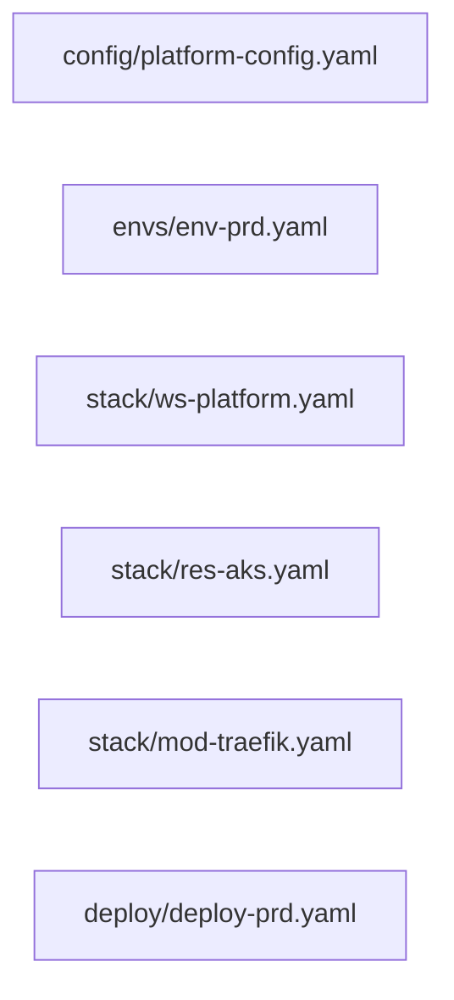
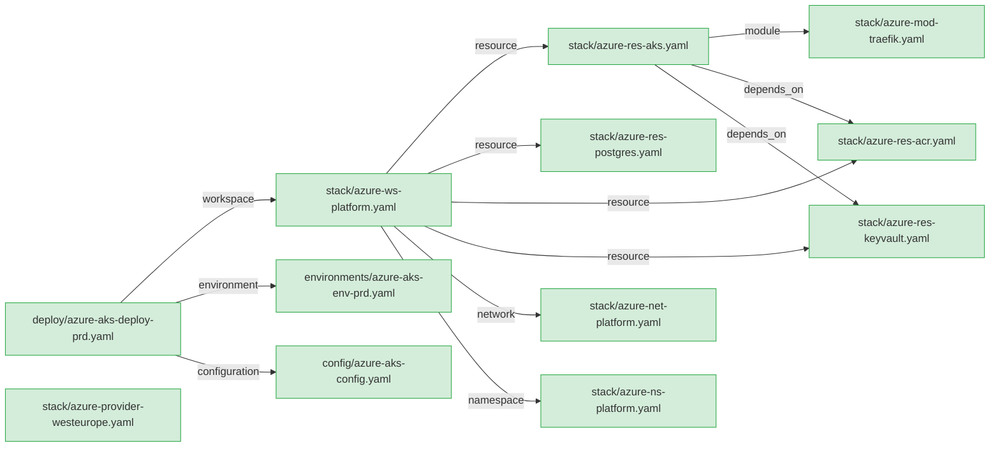

# `strata validate graph` — Workspace Dependency Graph

- Status: proposed
- Date: 2026-06-24
- Parent: [0014-onboarding-experience.md](0014-onboarding-experience.md) (item #11)

## Summary

A new `strata validate graph` subcommand that generates a Mermaid dependency diagram of the workspace's YAML files. Nodes are files (colored by validation status); edges are cross-file references.

## Context

Strata workspaces contain a web of YAML files that reference each other. The dependency chain is:

```
configuration
  └─ environments (referenced by deployments)
  └─ workspace
       ├─ resources (file: references)
       │    └─ modules (nested file: references)
       ├─ namespaces (file: references)
       ├─ networks (file: references)
       ├─ firewalls (file: references)
       └─ dns_zones (file: references)
  └─ deployment
       ├─ → workspace (spec.workspace.file)
       ├─ → environments (spec.environments[])
       └─ → configurations (spec.configurations[].file)
```

A new user can't see these relationships. A `validate graph` command makes the dependency tree visible and actionable — you see what's connected, what's missing, and what's broken.

## Command Placement

**Chosen:** `strata validate graph`

| Candidate               | Reasoning                                                                                                                                                    | Verdict                |
| ----------------------- | ------------------------------------------------------------------------------------------------------------------------------------------------------------ | ---------------------- |
| `strata validate graph` | Graph is a visual validation artifact — "show me if my workspace wires up correctly." Extends the existing `validate` command without a new top-level group. | ✅ Selected             |
| `strata guide graph`    | Conceptually fits onboarding, but `guide` is currently a single command (not a group). Turning it into a group is a Phase 2 REPL concern.                    | ❌ Deferred             |
| `strata build graph`    | `build` is about producing deploy artifacts. A dependency graph is informational, not a build step.                                                          | ❌ Wrong semantics      |
| `strata flow`           | Top-level would be clean, but violates the flat `strata <group> <command>` convention for non-trivial commands.                                              | ❌ Convention violation |

**Consequence:** `validate` becomes a Click **group** with two subcommands:

```
strata validate run   ← current validate behavior (default when invoked as `strata validate`)
strata validate graph ← new dependency graph
```

Backward compatibility: `strata validate -f foo.yaml` continues to work via Click's `invoke_without_command` + `result_callback` pattern or by making `run` the default.

---

## Graph Model

### Nodes

Each YAML file in the workspace is a node. Node identity is the relative file path.



### Node Status (Color)

| Status   | Color                 | Condition                                              |
| -------- | --------------------- | ------------------------------------------------------ |
| Valid    | green (`:::valid`)    | File exists, Phase 1 validation passes                 |
| Invalid  | orange (`:::invalid`) | File exists, Phase 1 validation fails                  |
| Missing  | red (`:::missing`)    | Referenced by another file but does not exist on disk  |
| External | grey (`:::external`)  | `@repo/path` reference to a file in another repository |

### Edges

Edges represent cross-file references discovered by inspecting model fields:

| Source Kind | Field                             | Target Kind   | Edge Label                           |
| ----------- | --------------------------------- | ------------- | ------------------------------------ |
| deployment  | `spec.workspace.file`             | workspace     | `workspace`                          |
| deployment  | `spec.environments[]`             | environment   | `environment`                        |
| deployment  | `spec.configurations[].file`      | configuration | `configuration`                      |
| workspace   | `spec.resources[].file`           | resource      | `resource`                           |
| workspace   | `spec.resources[].modules[].file` | module        | `module`                             |
| workspace   | `spec.namespaces[].file`          | namespace     | `namespace`                          |
| workspace   | `spec.networks[].file`            | network       | `network`                            |
| workspace   | `spec.firewalls[].file`           | firewall      | `firewall`                           |
| workspace   | `spec.dns_zones[].file`           | dns           | `dns`                                |
| resource    | `spec.depends_on[]`               | resource      | `depends_on`                         |
| workspace   | `spec.topology[].provisioner`     | (inline)      | `provisioner` (annotation, not edge) |

### Edge Discovery Algorithm

1. Load all YAML files in the workspace that have a valid `apiVersion` + `kind` envelope.
2. For each file, parse with the appropriate model (Phase 1 only — no cross-ref resolution needed).
3. Extract reference fields (table above). Resolve relative paths against the file's directory.
4. For `@repo/` prefixed paths: mark as `external` node (grey) — don't attempt resolution.
5. Build adjacency list: `{source_path → [(target_path, edge_label)]}`.

---

## Output Modes

### 1. Mermaid markdown file (`--save` / default)

Writes `graph.md` (or user-specified path) containing:

```markdown
# Workspace Dependency Graph

Generated: 2026-06-24T14:30:00Z
Workspace: my-platform

## Graph

​```mermaid
graph LR
  classDef valid fill:#d4edda,stroke:#28a745
  classDef invalid fill:#fff3cd,stroke:#ffc107
  classDef missing fill:#f8d7da,stroke:#dc3545
  classDef external fill:#e2e3e5,stroke:#6c757d

  deploy_prd["deploy/deploy-prd.yaml"]:::valid
  ws_platform["stack/ws-platform.yaml"]:::valid
  env_prd["envs/env-prd.yaml"]:::valid
  res_aks["stack/res-aks.yaml"]:::valid
  mod_traefik["stack/mod-traefik.yaml"]:::invalid
  ns_app["stack/ns-app.yaml"]:::missing

  deploy_prd -->|workspace| ws_platform
  deploy_prd -->|environment| env_prd
  ws_platform -->|resource| res_aks
  ws_platform -->|namespace| ns_app
  res_aks -->|module| mod_traefik
​```

## Summary

| Status    | Count | Files                                                         |
| --------- | ----- | ------------------------------------------------------------- |
| ✅ Valid   | 4     | deploy-prd.yaml, ws-platform.yaml, env-prd.yaml, res-aks.yaml |
| ⚠️ Invalid | 1     | mod-traefik.yaml                                              |
| ❌ Missing | 1     | ns-app.yaml                                                   |

## Mermaid Live

[Open in Mermaid Live Editor](https://mermaid.live/edit#base64=...)
```

### 2. Console output (`--output console`)

Renders a text tree (no Mermaid rendering in terminal):

```
Workspace Dependency Graph: my-platform

deploy/deploy-prd.yaml (deployment) ✅
├── envs/env-prd.yaml (environment) ✅
└── stack/ws-platform.yaml (workspace) ✅
    ├── stack/res-aks.yaml (resource) ✅
    │   └── stack/mod-traefik.yaml (module) ⚠️
    │       └── Error: spec.services[0].image — required field missing
    └── stack/ns-app.yaml (namespace) ❌ NOT FOUND

Summary: 4 valid, 1 invalid, 1 missing
```

### 3. JSON output (`--output json`)

```json
{
  "success": true,
  "data": {
    "nodes": [
      {"path": "deploy/deploy-prd.yaml", "kind": "deployment", "status": "valid"},
      {"path": "stack/ws-platform.yaml", "kind": "workspace", "status": "valid"},
      {"path": "stack/ns-app.yaml", "kind": "namespace", "status": "missing"}
    ],
    "edges": [
      {"source": "deploy/deploy-prd.yaml", "target": "stack/ws-platform.yaml", "label": "workspace"},
      {"source": "stack/ws-platform.yaml", "target": "stack/ns-app.yaml", "label": "namespace"}
    ],
    "summary": {"valid": 4, "invalid": 1, "missing": 1}
  }
}
```

---

## CLI Interface

```
strata validate graph [OPTIONS]

Options:
  --entry PATH       Entry point file (deployment YAML). If omitted, discovers
                     all deployments in the workspace and graphs each.
  --save [PATH]      Write Mermaid markdown to file. Default: graph.md in work_path.
  --direction DIR    Mermaid graph direction: LR (default) | TD | BT | RL.
  --no-validate      Skip validation (all nodes shown as neutral/grey).
                     Faster for large workspaces when you only want structure.
  -f, --file PATH    Alias for --entry (consistency with validate run).
  --output FORMAT    console | json | text. Default: console.
  --work-path PATH   Workspace root (standard option).
  --verbose          Include validation error details per node.
  --quiet            Suppress console output (only write --save file).
```

### Examples

```bash
# Graph the whole workspace (discovers all deployments)
strata validate graph

# Graph a specific deployment's dependency tree
strata validate graph --entry deploy/deploy-prd.yaml

# Save as markdown with top-down layout
strata validate graph --save --direction TD

# CI: check for missing references (exit code 3 if any node is "missing")
strata validate graph --output json | jq '.data.summary.missing'

# Structure only (skip validation, fast)
strata validate graph --no-validate --save docs/architecture.md
```

---

## Implementation Architecture

```
commands/
  cli_validate.py            ← convert from @click.command to @click.group
  validate/
    run_validate_command.py   ← existing (rename internally, stays backward-compatible)
    graph_validate_command.py ← NEW: thin Click wrapper

controllers/
  graph_controller.py        ← NEW: orchestrates graph building

services/
  (no new services — reuses PlatformValidator + existing model loading)

utils/
  graph.py                   ← NEW: pure functions for graph building + Mermaid rendering
```

### `GraphController`

```python
class GraphController(BaseController):
    """Build a workspace dependency graph from YAML file references."""

    def execute(self) -> GraphResult:
        # 1. Discover entry points (deployments) or use --entry
        # 2. For each deployment, recursively resolve file references
        # 3. Validate each discovered node (unless --no-validate)
        # 4. Build GraphResult (nodes + edges + summary)
        ...
```

### `utils/graph.py`

Pure utility functions (no service imports):

```python
@dataclass
class GraphNode:
    path: str           # relative to workspace
    kind: str           # PlatformKind value
    status: str         # valid | invalid | missing | external
    errors: list[str]   # validation errors (if any)

@dataclass
class GraphEdge:
    source: str         # node path
    target: str         # node path
    label: str          # reference type

@dataclass
class GraphResult:
    nodes: list[GraphNode]
    edges: list[GraphEdge]
    entry_points: list[str]

def render_mermaid(result: GraphResult, direction: str = "LR") -> str:
    """Render GraphResult as a Mermaid graph definition."""
    ...

def render_tree(result: GraphResult) -> str:
    """Render GraphResult as a text tree for console output."""
    ...

def render_mermaid_live_url(mermaid_source: str) -> str:
    """Generate a Mermaid Live Editor URL from source."""
    ...
```

---

## Exit Codes

| Condition                                  | Exit Code |
| ------------------------------------------ | --------- |
| All nodes valid (or `--no-validate`)       | 0         |
| System error (can't read workspace)        | 1         |
| Any node has status `missing` or `invalid` | 3         |

This aligns with the existing convention: exit code 3 = "processed but invalid." CI pipelines can gate on `strata validate graph` to catch broken references.

---

## Edge Cases

| Case                                   | Behavior                                                                                                                                                      |
| -------------------------------------- | ------------------------------------------------------------------------------------------------------------------------------------------------------------- |
| Circular references (A → B → A)        | Detect during traversal (visited set). Log warning, render cycle as bidirectional edge, don't infinite-loop.                                                  |
| `@repo/` paths with no repo map        | Mark as `external` (grey). No resolution attempted — this is a structural view, not a runtime resolver.                                                       |
| File exists but isn't valid YAML       | Node status = `invalid`, error = "Failed to parse YAML".                                                                                                      |
| File has valid YAML but unknown `kind` | Node status = `invalid`, error = "Unknown kind: X". Still include in graph — the reference exists.                                                            |
| Workspace with no deployments          | If no `--entry` and no deployments found, graph all YAML files as disconnected nodes. Warn: "No deployment entry points found — showing all workspace files." |
| Very large workspace (100+ files)      | Mermaid supports this. Console tree may be long — consider `--entry` to scope. JSON is always complete.                                                       |

---

## Example: Azure AKS Reference Workspace

Given `config/azure-aks/`:



Console tree view:

```
azure-aks Dependency Graph

deploy/azure-aks-deploy-prd.yaml (deployment) ✅
├── config/azure-aks-config.yaml (configuration) ✅
├── environments/azure-aks-env-prd.yaml (environment) ✅
└── stack/azure-ws-platform.yaml (workspace) ✅
    ├── stack/azure-res-aks.yaml (resource) ✅
    │   ├── stack/azure-mod-traefik.yaml (module) ✅
    │   ├── ─ depends_on → stack/azure-res-acr.yaml ✅
    │   └── ─ depends_on → stack/azure-res-keyvault.yaml ✅
    ├── stack/azure-res-postgres.yaml (resource) ✅
    ├── stack/azure-res-acr.yaml (resource) ✅
    ├── stack/azure-res-keyvault.yaml (resource) ✅
    ├── stack/azure-net-platform.yaml (network) ✅
    └── stack/azure-ns-platform.yaml (namespace) ✅

Summary: 11 valid, 0 invalid, 0 missing
```

---

## Phase 2 REPL Integration

When the `strata guide` REPL ships (ADR items #6–8), the `flow` REPL command calls `GraphController` directly and renders inline with Rich. Same data model, different presentation layer:

```
guide> flow
┌─────────────────────────────────────────┐
│  Workspace Dependency Graph             │
│  ✅ 11 valid  ⚠️ 0 invalid  ❌ 0 missing │
├─────────────────────────────────────────┤
│  (Rich tree rendering here)             │
└─────────────────────────────────────────┘
guide> flow --save
  → Saved to graph.md
```

---

## Open Questions

1. **Provider files** — providers (`kind: provider`) aren't referenced by file path from other models. Should they appear in the graph as orphan nodes, or only if explicitly listed? → Propose: include if found in workspace, show as disconnected unless referenced from configuration.

2. **Tenant/DNS/Firewall isolation** — these kinds may not be in the deployment→workspace path. Include them as top-level nodes when discovered? → Propose: yes, show all workspace files. Unconnected nodes are visible but greyed out.

3. **Multi-deployment workspaces** — when multiple deployments exist, should the graph merge them (one unified graph) or separate them (one subgraph per deployment)? → Propose: merged by default, `--entry` scopes to one.

4. **Depth limit** — should there be a `--depth N` flag to limit traversal depth for very large workspaces? → Propose: not in v1 — premature optimization. Add if requested.

---

## Acceptance Criteria

- [ ] `strata validate graph` produces a Mermaid markdown file for the Azure AKS reference workspace
- [ ] Console output shows a readable text tree with status indicators
- [ ] JSON output includes nodes, edges, and summary
- [ ] Missing file references are detected and shown as red nodes (exit code 3)
- [ ] `--entry` scopes the graph to a single deployment's tree
- [ ] `--no-validate` skips validation and shows pure structure
- [ ] Circular references are detected without infinite loops
- [ ] `@repo/` paths shown as external (grey) nodes
- [ ] Mermaid Live Editor URL included in `--save` output
- [ ] Backward compatibility: `strata validate -f foo.yaml` still works after group conversion
