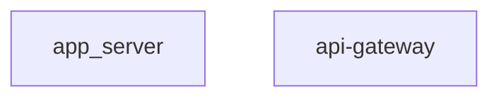

# Diagram visualization in VS Code extension

- Status: **Implemented** — Phases 1–4 (CLI/YAML foundation, workspace connection, source coverage + cookbook, GUI Builder + AI chat) are complete and shipped. Everything else is intentionally deferred, not unfinished — see "Deferred (By Design)" below for what's not done and why.
- Date: 2026-07-11 (revised 2026-08-13 — repositioned from "strata owns a diagram system" to "strata generates Mermaid fragments and connects them to the workspace; users compose freely"; revised 2026-08-25 — Phases 1–4 completed, status changed from partially-implemented to implemented)

## Deferred (By Design)

Everything in Phases 1–4 below is implemented and shipped. Nothing in this list is an oversight — each item was evaluated (see "Open Questions" and the phase checklists in "Implementation Roadmap") and deliberately left undone, for the reason given.

- **Phase 5 — advanced features (`v1.5.0+`, not started):** diagram parameterization (`${profile}`/`${environment}`), comparison mode (two diagrams side by side), dashboard mode (pin multiple diagrams), a community diagram gallery, and performance optimization for large topologies. Each is a genuinely separate design/UI effort from the Phase 4 Builder, which deliberately targets **one** diagram against **one** context — see Open Questions #2/#3/#5/#6/#11.
- **`nodeMap` enrichment cache (Phase 2):** superseded for tooltips/highlighting by a simpler classDef/label-matching approach that needs no extra CLI round-trip. Only still relevant if secondary node actions beyond "open file" are ever added — nothing today needs it.
- **Per-data-source icon conventions:** designed (see "Icon conventions" below) but not wired into the webview — no built-in source renders icons yet, so there is nothing to theme there.
- **`strata new --template diagram` scaffold:** not implemented; `strata diagram show --print-template` already covers the "give me a starting template" need.
- **Cookbook browser as structured, browsable data:** the 185-entry catalog in Part 2 is prose in this ADR, not CLI-served data. The sidebar ships the real `strata diagram list` catalog (built-ins + workspace definitions) instead of a hardcoded browse-by-category UI for entries that don't exist as files.
- **Large-topology handling (collapse/expand, pagination, zoom) — Open Question #8, still genuinely open:** needs the node-count benchmark (#12) first; no workspace has reported hitting a performance wall yet.
- **Proactive AI diagram suggestions — Open Question #9, still genuinely open:** deliberately unscheduled. Phase 4 ships reactive NL→diagram only (`/diagram create`); a proactive trigger needs its own design if/when users actually ask for it.
- **Sugar-based diagram inheritance (base + override) — Open Question #11:** hand-written `spec.template` diagrams already get this for free via Jinja ``/`` (ADR-0017); the `layout`/`style` sugar half stays deferred until cookbook diagrams show real duplication pain, not preemptively.


## Context and Problem Statement

Today, the VS Code extension provides text-based tree views and code lens for exploring strata workspaces, but lacks visual representations of infrastructure topology, deployment orchestration, and version promotion flows. Users must mentally construct these relationships by navigating YAML files and tree views, which is cognitively expensive and error-prone.

The gaps:
- **No infrastructure topology visualization** — Users cannot see the hierarchy of workspaces → topologies → namespaces → modules → services at a glance.
- **No deployment stage flow diagram** — The execution order, dependencies, and provisioner assignments across deployment stages are not visually apparent.
- **No version promotion flow diagram** — Promotion rings (dev → test → qas → prd), gates, and policies lack visual representation; operators cannot see version progression across environments at a glance.
- **No service dependency diagram** — Cross-module and cross-namespace service dependencies are difficult to reason about from YAML alone.
- **Current dependency graph is file-focused** — `dependencyGraphProvider` shows YAML file references (`@repo/path` patterns) but doesn't visualize logical infrastructure relationships. ADR 0015 has since delivered `strata validate graph` with both file-reference and resource-topology modes; the VS Code extension should consume this rather than reimplement it.
- **Diagrams are disconnected from the workspace** — even where a diagram exists, clicking a node does nothing. There is no path from "I see `api-gateway` in this picture" to "open the YAML where it's defined."

This breaks the "visualize the YAML" principle: infrastructure configuration should be navigable as diagrams, not just as hierarchical text.

### What this ADR is *not* trying to do

Mermaid is a mature, expressive, well-documented diagramming language that already supports 10+ diagram types and is renderable by GitHub, VS Code, Mermaid Live, and most static site generators. **Strata should not wrap it in a proprietary abstraction.**

This mirrors the position strata has already taken twice:

- **ADR-0033 (GitHub PR integration):** don't build a GitHub App — expose exit codes + JSON output and let the pipeline owner compose. *"strata is a CLI that operators invoke; it doesn't own their pipeline."*
- **[Value Proposition](../platform/value-proposition.md):** build output is plain Terraform. *"Copy it, run it yourself, and strata is out of the picture."*

Mermaid is the Terraform of this ADR. The value strata adds is **not** a diagram DSL — it is:

| Strata is genuinely good at                                                | Mermaid is already good at                  |
| -------------------------------------------------------------------------- | ------------------------------------------- |
| Knowing what's in the workspace (topology, drift, secrets, versions, refs) | Expressing any diagram shape the user wants |
| Turning that into nodes/edges with **real identity** (file + line)         | Layout, styling, 10 diagram types           |
| Keeping the picture **live** as config changes                             | Being writable by hand, by AI, by any tool  |
| **Connecting a rendered node back to the workspace** (click → open file)   | (cannot do this — it renders an inert SVG)  |

The last row is the defensible, non-duplicative value: Mermaid renders a picture, but it has no idea that `api-gateway` corresponds to line 42 of a namespace YAML. That connection is the feature.

## Decision Drivers

- **Cognitive load reduction** — Visual diagrams reduce mental overhead for understanding complex deployments.
- **Operational confidence** — Seeing stage flows and promotion gates visually increases confidence before deployment.
- **Onboarding acceleration** — New team members learn infrastructure topology faster via diagrams than YAML exploration.
- **Compliance visibility** — Promotion gates and approval workflows must be immediately visible to auditors and operators.
- **Data availability** — Infrastructure topology and file-reference data is already available from ADR 0015's graph controller (today via `strata validate graph --output json`; this ADR moves that surface to `strata diagram show`). The VS Code extension consumes CLI JSON output rather than re-extracting data in TypeScript.
- **Don't reinvent Mermaid** — users who already know Mermaid must never be blocked by strata's abstraction. Any diagram Mermaid can express must remain expressible, with or without strata's help.
- **No lock-in** — a generated diagram is plain Mermaid text. Copy it into a README, a Confluence page, or GitHub markdown and strata is out of the picture.

## Considered Options

### Option A: Fixed set of built-in diagrams only

Provide 3–5 hardcoded diagram types with no user customization.

**Pros:** Simple to implement, no configuration required.
**Cons:** Every workspace is different; fixed diagrams won't fit all needs.

### Option B: Comprehensive catalog with user-selectable diagrams

Provide a large catalog of diagram types (see Part 2) that users can browse, select, and render.

**Pros:** Broad coverage, still manageable complexity.
**Cons:** Catalog grows stale; users are limited to what the developers thought of.

### Option C: A strata-owned diagram DSL that can express everything

A `kind: diagram` schema rich enough to express all 185 catalog diagrams — aggregation for pie charts, axis bindings for quadrant charts, participant/message roles for sequence diagrams, weighted edges for sankey, temporal binning for gantt, plus schema-introspection sources for type-hierarchy diagrams.

**Pros:** Fully declarative; one format for everything.
**Cons:** **This is reimplementing Mermaid, badly.** Stress-testing a draft schema against the catalog showed it could express roughly the flowchart-family diagrams (~60–70%) and structurally could not express pie aggregation, sequence actor/message roles, quadrant axes, sankey edge weights, gantt temporal mapping, or static schema introspection — each of which would need its own `layout.type`-specific extension block. That is a permanent arms race against a format that already solved all of it.

### Option D: Generate Mermaid fragments + connect them to the workspace *(chosen)*

Strata generates Mermaid for the things it uniquely knows (topology, drift, refs, promotion state) and attaches node→workspace identity metadata. Users compose freely from there — embedding generated fragments into hand-written Mermaid, or ignoring strata's generation entirely and hand-writing the whole thing.

**Pros:** No abstraction ceiling; strata does only what it's uniquely good at; every diagram Mermaid supports remains possible; generated output is portable plain text.
**Cons:** Users wanting exotic diagram types write Mermaid themselves (with strata supplying the data, not the syntax).

## Decision Outcome

**Option D: generate Mermaid fragments, connect them to the workspace, get out of the way.**

Concretely, strata provides:

1. **Generated diagrams from live workspace data** — the Top 10 (Part 1) rendered from real CLI JSON output, no authoring required.
2. **Node → workspace connection** — click a node, open the YAML at the right line. The one thing plain Mermaid genuinely cannot do (see "Node Identity & Click Resolution").
3. **Jinja as the composition mechanism** — a `kind: diagram` document whose template is Jinja, so generated loops and hand-drawn Mermaid coexist in one block and *every* Mermaid diagram type stays expressible.
4. **No format ceiling** — a diagram with no `sources` is simply static Mermaid, in the same file format, still getting preview, theming, and opt-in click-to-open.

### Rationale

1. **No abstraction ceiling.** Anything Mermaid can express stays expressible. Strata's schema never becomes the limiting factor.
2. **Strata does only what it's uniquely positioned to do** — supply live workspace data and node identity. It does not compete with a mature diagramming language.
3. **Portable output.** Generated Mermaid is plain text: paste it into a README, a GitHub comment, or Confluence and it renders without strata.
4. **Radically cheaper to ship.** No Diagram Builder GUI is required for the core value; no 185 bespoke renderers; no schema arms race chasing Mermaid feature parity.

### Consequences

**Good:**
- Users who know Mermaid are never blocked by strata's abstraction.
- The catalog (Part 2) becomes an honest *cookbook* — worked examples of "here's the Mermaid, here's the strata command that feeds it" — not 185 features to build and maintain.
- Click-to-open-file works for generated, hand-written, and mixed diagrams alike.

**Bad:**
- Diagram types beyond the common node-edge views require the user to write a Jinja template; strata supplies the data and the context, not the layout.
- Jinja is now user-facing for diagram authoring — a modest learning curve, mitigated by `--print-template` and shipped built-ins to copy from.

**Neutral:**
- If demand later proves that a specific `layout.type` extension (e.g. pie aggregation) is worth owning, it can be added incrementally without invalidating anything here — the composition seam and click-resolution layer are unaffected.

---

## Related Work

- **ADR 0015 — `strata validate graph`** (completed): delivers the data foundation for built-in diagrams #1 and #8. This ADR **replaces that command surface** with `strata diagram show` (see "CLI surface" in Part 3) while reusing its `GraphController` verbatim as the `topology` and `files` source types. `dependencyGraphProvider.ts` was removed and replaced by `diagramPreviewProvider.ts`, which delegates to this CLI output rather than doing its own `@repo/` parsing.
- **ADR 0009 — Extended SBOM**: SBOM catalog diagrams (Category 26) use `strata build sbom --output json`.
- **ADR 0007 — Deployment State Locking**: Category 25 diagrams use lock manifest data.
- **ADR 0038 — Multi-Tenant Fleet**: Category 13 and 22 diagrams use fleet deployment data.

## Implementation Status

Implemented — see "Implementation Roadmap" below for the authoritative, phase-by-phase checklist, and "Deferred (By Design)" above for what's intentionally not built. Summary: Phases 1–3 are complete — CLI/data-layer foundation (including `strata diagram show --format svg|png` via Kroki), VS Code preview pane, click-to-open, theme integration, hover tooltips, reverse cursor→node lookup (`diagramPreviewProvider.ts`), `strata validate --deep` link-rot checking (`DiagramService._validate_dynamic()`), all 10 Top-10 built-ins, the `strataDiagrams` sidebar (`diagramsViewProvider.ts`), and the `/diagram` chat command are all done. Phase 4 (`diagramBuilderProvider.ts` — Visual Builder, round-trip, NL→diagram chat generation via `/diagram create`, Mermaid-markdown export, and client-side SVG/PNG export) is also done — Builder export needed no Kroki dependency since the preview webview already has the diagram rendered by Chromium.


### What ADR 0015 already delivers (no VS Code work needed for data layer)

| Built-in # | Diagram                        | CLI backing                                                   | VS Code work remaining                                                                                    |
| ---------- | ------------------------------ | ------------------------------------------------------------- | --------------------------------------------------------------------------------------------------------- |
| 1          | Infrastructure Topology        | `topology` source (ADR-0015 `GraphController`, resource mode) | ✅ Done — Webview + Mermaid render in `diagramPreviewProvider.ts` (`Strata: Show Infrastructure Topology`) |
| 8          | Deployment File Reference Tree | `files` source (ADR-0015 `GraphController`, file mode)        | ✅ Done — Webview + Mermaid render in `diagramPreviewProvider.ts` (replaced `dependencyGraphProvider.ts`)  |

Catalog Cat.1 #1, #2 and Cat.6 #49 are also covered by ADR 0015's JSON output.

All other built-in diagrams (#2–7, #9–10) and the full catalog require new data extraction.

---

## Design System — Status Colors, Icons & Theme Integration

Before any of the 185 catalog diagrams or the Diagram Builder's `color_by`/`style` options can be implemented consistently, they need one shared palette to draw from. Two color systems already exist independently in `src/strata/utils/graph.py` and must be unified and extended, not replaced:

### What already exists (and must be preserved as-is)

**File-mode status palette** (`render_mermaid`, `_STATUS_CLASSES`) — colors by node *health*:

| Status     | Token name | Hex (fill / stroke)            | Meaning                                                    |
| ---------- | ---------- | ------------------------------ | ---------------------------------------------------------- |
| `valid`    | success    | `#d4edda` / `#28a745`          | File exists and passes validation                          |
| `invalid`  | warning    | `#fff3cd` / `#ffc107`          | File exists but fails validation (docs call this "orange") |
| `missing`  | danger     | `#f8d7da` / `#dc3545`          | Referenced but not present on disk                         |
| `external` | neutral    | `#e2e3e5` / `#6c757d`          | `@repo/path` reference to another repository               |
| `orphan`   | muted      | `#f5f5f5` / `#adb5bd` (dashed) | Exists, valid, but unreferenced                            |

**Resource-mode kind palette** (`render_mermaid_resources`) — colors by node *kind/taxonomy*, a completely different dimension from status:

| Kind        | Hex (fill / stroke)                                      |
| ----------- | -------------------------------------------------------- |
| `resource`  | `#dbeafe` / `#2563eb` (blue)                             |
| `module`    | `#fef3c7` / `#d97706` (amber)                            |
| `namespace` | `#d1fae5` / `#059669` (green)                            |
| `network`   | `#e0e7ff` / `#4f46e5` (indigo)                           |
| `disabled`  | `#e2e3e5` / `#6c757d` (grey)                             |
| `missing`   | `#f8d7da` / `#dc3545` (red — reused from status palette) |

These two dimensions — **status** (health/validity) and **kind** (taxonomy/category) — are orthogonal and both correct. The design system below keeps them separate and gives each a name, rather than collapsing them into one ad-hoc `color_by` string per diagram.

### Problem: hardcoded hex breaks in VS Code's dark/high-contrast themes

Both palettes above are light-theme pastels (Bootstrap's classic `alert-success`/`alert-warning`/etc. palette) baked directly into the Mermaid `classDef` strings. Rendered inside a VS Code webview:
- They ignore the user's active theme (Dark+, Dark High Contrast, Light+, and any custom theme) entirely.
- Pastel fills that read fine on white look muddy or low-contrast on a dark editor background.
- There's no way for a user's theme choice to propagate into the diagram at all.

**Fix:** Mermaid supports runtime theming via `mermaid.initialize({ theme: 'base', themeVariables: {...} })`. The webview should read VS Code's own CSS custom properties (already injected into every webview automatically — `--vscode-charts-green`, `--vscode-charts-red`, `--vscode-charts-yellow`, `--vscode-charts-blue`, `--vscode-charts-purple`, `--vscode-charts-orange`, `--vscode-foreground`, `--vscode-editor-background`) and map them into Mermaid's `themeVariables` at render time, instead of hardcoding hex. This makes every diagram automatically theme-correct with zero per-diagram configuration — the CLI-side `graph.py` keeps its current hardcoded hex (it targets Mermaid Live/GitHub-rendered markdown, which don't have a VS Code theme), and only the **webview renderer** in the extension does the CSS-variable mapping.

### Extended semantic token set (for the 185-diagram catalog)

The file/resource palettes above only cover 2 of the ~8 semantic domains the catalog introduces. Each new domain gets its own **named token ramp**, never new raw hex:

| Domain                   | Token ramp (low → high severity/priority)                               | Used by                                                    |
| ------------------------ | ----------------------------------------------------------------------- | ---------------------------------------------------------- |
| **Validity status**      | `valid` → `invalid` → `missing`                                         | Cat. 1, 6 (existing, unchanged)                            |
| **Drift severity**       | `info` → `low` → `medium` → `high` → `critical`                         | Cat. 11 (#87–92), Diagram Builder `color_by: drift_status` |
| **Policy enforcement**   | `audit` → `warn` → `deny`                                               | Cat. 12 (#93–98)                                           |
| **CVE severity**         | `unknown` → `low` → `medium` → `high` → `critical`                      | Cat. 12 (#97–98), Cat. 26 (#177)                           |
| **Lock/promotion state** | `unlocked` → `locked` → `held` → `expired`                              | Cat. 25 (#169–170), Cat. 3 (#25, #31)                      |
| **Health check result**  | `unknown` → `passing` → `degraded` → `failing`                          | Cat. 2 (#18), Diagram Builder                              |
| **Deployment outcome**   | `success` → `partial` → `failed`                                        | Cat. 10 (#78, #81)                                         |
| **Taxonomy/kind**        | no ordering — categorical (`resource`/`module`/`namespace`/`network`/…) | Cat. 1 (existing), Diagram Builder `group_by`              |

Severity ramps (drift, CVE) share **one 5-step color ramp** so a user who learns "red = critical" in the drift diagram doesn't have to relearn it for the CVE diagram:

```
info/unknown → low        → medium      → high         → critical
  (grey)        (blue)       (amber)       (orange)        (red)
--vscode-descriptionForeground → --vscode-charts-blue → --vscode-charts-yellow → --vscode-charts-orange → --vscode-charts-red
```

3-step ramps (policy enforcement) reuse the same low/medium/high slice of the ramp (`audit`→grey/blue, `warn`→amber, `deny`→red) rather than inventing a separate 3-color scheme.

### Icon conventions

The Diagram Builder mockup (Part 3) and chat commands use ad-hoc emoji (📊, 💾, 📋). These become a fixed, documented set — one icon per **data source type**, reused everywhere that source appears (sidebar catalog entry, chat command help, builder's data-source picker, node tooltips):

| Data source (Part 3 table) | Icon | Rationale                              |
| -------------------------- | ---- | -------------------------------------- |
| `topology`                 | 🏗️    | Construction/building — infrastructure |
| `modules`                  | 📦    | Package — deployable unit              |
| `stages`                   | 🔀    | Flow/branching — pipeline stages       |
| `promotion`                | 🚀    | Progression toward production          |
| `network`                  | 🌐    | Network/connectivity                   |
| `firewalls`                | 🛡️    | Protection/security                    |
| `dns`                      | 🔤    | Name resolution                        |
| `secrets`                  | 🔑    | Credential material                    |
| `variables`                | 🔧    | Configuration values                   |
| `features`                 | 🚩    | Feature flags                          |
| `drift`                    | ⚠️    | Warning — unplanned change             |
| `history`                  | 🕒    | Time/chronology                        |
| `policies`                 | 📏    | Rule/measurement                       |
| `tenants`                  | 🏢    | Organization/customer                  |
| `environments`             | 🌱    | Environment/stage of growth            |
| `repositories`             | 📁    | Source repository                      |
| `sbom`                     | 📋    | Manifest/inventory list                |
| `resources`                | ⚙️    | Infrastructure component               |
| `approvals`                | ✅    | Sign-off/gate                          |
| `locks`                    | 🔒    | Exclusive hold                         |
| `outputs`                  | 📤    | Data leaving a stage                   |
| `values`                   | 📊    | Resolved data                          |

Reused, not new, per severity level (consistent with the token ramp above): `ℹ️` info · `🔵` low · `🟡` medium · `🟠` high · `🔴` critical.

### Mermaid diagram-type styling constraints

Not every one of the 10 Mermaid types (`flowchart`, `sequence`, `gantt`, `pie`, `mindmap`, `class`, `stateDiagram`, `timeline`, `quadrant`, `sankey`) supports `classDef`-based coloring the same way. This must be resolved per-type before Phase 2 (full Top 10) starts, not discovered ad-hoc per diagram:

| Mermaid type   | Supports `classDef`?                                 | Coloring approach                                                                                                                  |
| -------------- | ---------------------------------------------------- | ---------------------------------------------------------------------------------------------------------------------------------- |
| `flowchart`    | Yes                                                  | Direct `classDef` + `:::class` per node (current pattern — no change)                                                              |
| `stateDiagram` | Yes (`classDef`)                                     | Same pattern as flowchart                                                                                                          |
| `class`        | Limited (per-class `style`)                          | Use `style ClassName fill:...` instead of `classDef`                                                                               |
| `sequence`     | No                                                   | Use `Note over` styling or `rect rgb(...)` background blocks per severity zone                                                     |
| `gantt`        | Partial (`section` + custom CSS classes)             | Section-level coloring only, not per-task                                                                                          |
| `pie`          | No node coloring — Mermaid auto-assigns slice colors | Use a fixed, documented color order matching the token ramp so severity always renders in the same color regardless of slice order |
| `mindmap`      | Limited (per-node `::icon`, no fill)                 | Icon-based differentiation (see icon table above) instead of color                                                                 |
| `timeline`     | No                                                   | Section grouping only; rely on icons/labels for severity, not color                                                                |
| `quadrant`     | No per-point styling                                 | Point labels + icons; quadrant position itself carries the meaning                                                                 |
| `sankey`       | Flow-width only                                      | No node/severity color — width encodes volume, not health                                                                          |

This means **not every diagram in the catalog can show severity via color** — pie/mindmap/timeline/quadrant/sankey diagrams must lean on icons and labels instead. This constraint should be called out per-category in Part 2 as those categories are implemented (Cat. 11 Drift Detection is entirely `pie`/`timeline` — severity will be icon-driven, not color-driven, there).

### What this changes in Part 3 (Diagram Builder)

The `style.color_by` and `style.highlight` fields in the `DiagramDefinition` schema (Part 3) should reference **token names**, not raw Mermaid CSS:

```yaml
style:
  color_by: drift_status       # references the "Drift severity" token ramp above, not a hex value
  highlight:
    - condition: "drift.severity == critical"
      token: critical           # was: style: "fill:#ff0000,stroke:#900"
  group_by: namespace           # taxonomy dimension — uses the "Taxonomy/kind" palette, not severity
```

The webview renderer resolves `token: critical` → the theme-aware CSS variable at render time, so a saved `.strata/diagrams/*.yaml` definition stays portable across users with different VS Code themes — nobody's saved diagram has another person's hardcoded colors baked in.

---

## Part 1: Built-In Diagrams (Top 10)

These diagrams are available immediately with zero configuration — one click from command palette or chat.

| #   | Name                           | Chat Command    | Mermaid Type | Purpose                                                                          | Data source                                                       |
| --- | ------------------------------ | --------------- | ------------ | -------------------------------------------------------------------------------- | ----------------------------------------------------------------- |
| 1   | Infrastructure Topology        | `/topology`     | flowchart    | Workspace → topologies → namespaces → modules → services hierarchy               | `topology` source (ADR 0015 ✅)                                    |
| 2   | Deployment Stage Flow          | `/stages`       | flowchart    | Stage execution order, dependencies, failure handling                            | `strata deploy status --output json`                              |
| 3   | Version Promotion Flow         | `/promote`      | flowchart LR | Ring progression with gates and current versions                                 | `strata promote status --output json`                             |
| 4   | Network Topology               | `/network`      | flowchart    | Networks, subnets, peerings, firewalls, DNS zones combined                       | `strata validate run --output json` (network/firewall/dns models) |
| 5   | Service Dependency Graph       | `/services`     | flowchart    | Cross-module service dependencies and startup ordering                           | `topology` source (ADR 0015 ✅)                                    |
| 6   | Environment Composition        | `/envs`         | flowchart    | Base + override merge hierarchy producing final config                           | `strata values list --output json`                                |
| 7   | Secret Resolution Chain        | `/secrets`      | flowchart    | Store → generate → resolve → inject lifecycle                                    | `strata values list --output json` (secret entries)               |
| 8   | Deployment File Reference Tree | `/refs`         | flowchart    | All YAML files referenced by a deployment                                        | `files` source (ADR 0015 ✅)                                       |
| 9   | Stage Execution Timeline       | `/timeline`     | gantt        | Per-stage and per-step duration from deployment history                          | `strata deploy history --output json`                             |
| 10  | Full Platform Architecture     | `/architecture` | flowchart    | End-to-end: providers → topologies → resources → namespaces → modules → services | `topology` source (ADR 0015 ✅, extended)                          |

---

## Part 2: Diagram Cookbook (185 worked examples)

The catalog below is a **cookbook, not a feature list.** Per the Decision Outcome, strata is not committing to implement 185 bespoke renderers — it is committing to make the *data* for each of these reachable, and to document what Mermaid you'd write with it.

Each entry answers two questions:
1. **What strata command gives me the data?** (the "Data Source" column)
2. **What Mermaid shape does it become?** (the "Mermaid Type" column)

How an entry is realized:

| Entry style                                                 | How the user gets it                                                |
| ----------------------------------------------------------- | ------------------------------------------------------------------- |
| Common node-edge views (flowchart / stateDiagram / class)   | `layout`/`style` sugar — no Jinja needed                            |
| Everything else (pie, sequence, gantt, quadrant, sankey, …) | A Jinja `template:` — same file format, strata supplies the context |

Both use the **same `kind: diagram` document and the same pipeline** (see Part 3). The difference is only whether the user wrote the template or let the sugar generate one — `--print-template` converts between them. Unlike an earlier draft of this ADR, there is no category of catalog entry that the format cannot express.

Users browse the cookbook from the Architecture Hub sidebar or via `/diagram list` in chat.

### Category 1: Infrastructure Topology (12 diagrams)

| #   | Name                           | Data Source                                                        | Mermaid Type | Description                                                        |
| --- | ------------------------------ | ------------------------------------------------------------------ | ------------ | ------------------------------------------------------------------ |
| 1   | Workspace Topology Overview    | `workspace_model.WorkspaceTopologyModel`                           | flowchart    | Topologies, providers, provisioners, components, namespaces        |
| 2   | Resource Dependency Graph      | `workspace_model.WorkspaceResourceModel.depends_on`                | flowchart    | DAG of resource dependencies within a workspace                    |
| 3   | Resource-to-Module Binding     | `workspace_model.WorkspaceModuleReferenceModel`                    | flowchart    | Maps infrastructure resources to attached application modules      |
| 4   | Provider-Region-Zone Map       | `configuration_model.ConfigurationZoneModel` + provider properties | mindmap      | Hierarchical view of zones → regions → providers                   |
| 5   | Subnet Layout per Network      | `network_model.NetworkDefinitionModel.subnets`                     | flowchart    | Address space decomposition into subnets with CIDR blocks          |
| 6   | Network Peering Topology       | `network_model.PeeringReferenceModel`                              | flowchart    | Network-to-network peering relationships                           |
| 7   | Full Network Topology          | `network_model` + `firewall_model` + `dns_model`                   | flowchart    | Combined view: networks, subnets, peerings, firewalls, DNS zones   |
| 8   | Resource-Subnet Assignment     | `workspace_model.WorkspaceResourceModel.subnet`                    | flowchart    | Which resources sit in which subnet                                |
| 9   | Resource-Firewall Binding      | `workspace_model.WorkspaceResourceModel.firewalls`                 | flowchart    | Which NSG/firewall rulesets protect which resources                |
| 10  | Cross-Resource References      | `workspace_model.WorkspaceResourceModel.references`                | flowchart    | Value-passing links between resources (e.g. connection strings)    |
| 11  | Topology Component Composition | `configuration_model.ConfigurationTopologyModel.components`        | class        | Topology type + its required/optional component roles              |
| 12  | Multi-Topology Workspace       | `workspace_model.WorkspaceSpecModel.topology` (list)               | flowchart    | Multiple topologies per workspace with shared/dedicated namespaces |

### Category 2: Deployment Orchestration (10 diagrams)

| #   | Name                           | Data Source                                                      | Mermaid Type | Description                                              |
| --- | ------------------------------ | ---------------------------------------------------------------- | ------------ | -------------------------------------------------------- |
| 13  | Deployment Stage Pipeline      | `deployment_model.DeploymentStageModel`                          | flowchart    | Sequential/parallel stage execution order                |
| 14  | Stage DAG (depends_on)         | `DeploymentStageModel.depends_on`                                | flowchart    | Full directed acyclic graph of stage dependencies        |
| 15  | Stage Failure Handling Flow    | `DeploymentStageModel.on_failure`                                | stateDiagram | State machine: stop/rollback/continue paths per stage    |
| 16  | Deployment File Reference Tree | `DeploymentModel.spec` (workspace, environments, configurations) | flowchart    | All YAML files referenced by a deployment                |
| 17  | Stage-Provisioner Mapping      | `DeploymentStageModel.provisioner/topology`                      | flowchart    | Which provisioner runs each stage                        |
| 18  | Health Check Flow              | `DeploymentStageModel.health_checks`                             | sequence     | Post-deploy health check sequence per stage              |
| 19  | Approval Gate Flow             | `DeploymentGateModel` (`spec.gates`, ADR-0059)                   | flowchart    | Gate scope, mode (declare/enforce), and approver routing |
| 20  | Stage Timeout Budget           | `DeploymentStageTimeoutsModel`                                   | gantt        | Per-step timeout allocation within each stage            |
| 21  | Secret Access Allowlist        | `DeploymentStageModel.secrets`                                   | flowchart    | Which stages can access which secret keys                |
| 22  | Deployment Layers Hierarchy    | `deployment_model.spec.layers`                                   | flowchart    | Layer stack (tenant → zone → environment)                |

### Category 3: Version & Promotion Flows (11 diagrams)

| #   | Name                                | Data Source                                        | Mermaid Type | Description                                                 |
| --- | ----------------------------------- | -------------------------------------------------- | ------------ | ----------------------------------------------------------- |
| 23  | Progression Ring Sequence           | `promotion_model.ProgressionModel.rings`           | flowchart LR | Linear ring progression (dev → test → staging → prd)        |
| 24  | Ring-Wave Matrix                    | `promote matrix` output                            | quadrant     | Rings vs wave assignments with version status               |
| 25  | Version Pin Status Matrix           | `version_lock_model.VersionLockModel`              | flowchart    | Per-ring pinned versions for all targets                    |
| 26  | Promotion Strategy Flow             | `PromotionStrategyModel` (type, waves, gates)      | flowchart    | How an artifact type moves through waves within a ring      |
| 27  | Promotion Record Timeline           | `promotion_record_model`                           | timeline     | Chronological wave execution with commits and timestamps    |
| 28  | Gate Evaluation Sequence            | `PromotionGateResultModel`                         | sequence     | Gate checks performed before each promotion step            |
| 29  | Version Lock vs Manifest Layering   | version-lock + version-manifest resolution         | flowchart    | Resolution priority: manifest → lock → environment override |
| 30  | Promotion Wave Deployment Targeting | `PromotionWaveModel` + deployment wave assignments | flowchart    | Which deployments participate in canary/early/all waves     |
| 31  | Cross-Ring Quorum State             | `ProgressionRingModel.require` (any_one/all)       | stateDiagram | Quorum gate status across ring boundaries                   |
| 32  | Promotion Rollback Chain            | `PromotionRecordSpecModel.rollback_of`             | flowchart    | Links between promotions and their rollbacks                |
| 33  | Version Drift per Target            | `version_manifest` vs `version_lock` comparison    | flowchart    | Where manifest declares a version but lock differs          |

### Category 4: Network & Security (7 diagrams)

| #   | Name                              | Data Source                                           | Mermaid Type | Description                                               |
| --- | --------------------------------- | ----------------------------------------------------- | ------------ | --------------------------------------------------------- |
| 34  | Firewall Ruleset Matrix           | `firewall_model.FirewallRuleModel`                    | flowchart    | Inbound/outbound rules with allow/deny per direction      |
| 35  | Firewall Traffic Flow             | `FirewallRuleModel` (direction, from, to, port)       | sequence     | Traffic paths: source → firewall decision → destination   |
| 36  | DNS Zone Record Map               | `dns_model.DnsZoneModel.records`                      | class        | Zone hierarchy with record types and values               |
| 37  | DNS Resolution Chain              | `dns_model.DnsRecordModel` (value/var/secret sources) | flowchart    | How DNS record values are resolved                        |
| 38  | Security Store Policy             | `ConfigurationSecurityModel.allowed_secret_stores`    | pie          | Distribution of allowed vs blocked store types            |
| 39  | Authentication Model Map          | `auth_models` (OAuth2, AWS, GCP, APIKey, Certificate) | class        | Provider authentication mechanisms and credential sources |
| 40  | Network Address Space Utilization | `network_model` CIDR allocations                      | flowchart    | Address space breakdown and utilization percentage        |

### Category 5: Secret & Variable Resolution (8 diagrams)

| #   | Name                           | Data Source                                             | Mermaid Type | Description                                                  |
| --- | ------------------------------ | ------------------------------------------------------- | ------------ | ------------------------------------------------------------ |
| 41  | Variable Resolution Chain      | `store_models.VariableStoreModel` + environment merging | flowchart    | Resolution path: constant → environment → appconfig → consul |
| 42  | Secret Store Distribution      | `store_models.SecretStoreModel` (store types)           | pie          | Breakdown of secrets by backend type                         |
| 43  | Secret Generation & Rotation   | `SecretGenerateSpec` + `SecretRotateSpec`               | stateDiagram | Lifecycle: generate → active → warn/rotate                   |
| 44  | Module Reference Requirements  | `ModuleReferenceModel` (variables, secrets, features)   | class        | What each module needs from the environment                  |
| 45  | Feature Flag State Map         | `FeatureStoreModel` entries                             | flowchart    | Feature toggles with their on/off state per environment      |
| 46  | Value Source Traceability      | `strata values list` output                             | sankey       | Flow from store backends through environments to deployment  |
| 47  | Environment Variable Injection | `ModuleServiceEnvironmentModel`                         | flowchart    | How each container env var gets its value                    |
| 48  | Store Backend Integration Map  | `store_models.*StoreType` → `IntegrationModel`          | flowchart    | Which integrations back which store types                    |

### Category 6: Dependency & Reference Chains (8 diagrams)

| #   | Name                                      | Data Source                                                 | Mermaid Type | Description                                            |
| --- | ----------------------------------------- | ----------------------------------------------------------- | ------------ | ------------------------------------------------------ |
| 49  | Cross-Repository File References          | `@repo_name/path` references in all YAML                    | flowchart    | Inter-repo file dependency graph                       |
| 50  | Remote Source Graph                       | `repository_model.RemoteModel` (gitops, bundled, container) | flowchart    | All remote sources with their types and references     |
| 51  | Resource Capability Dependencies          | `resource_model.ResourceDependencyModel`                    | flowchart    | Category/subcategory dependency declarations           |
| 52  | Configuration Inheritance Chain           | configuration → workspace → environment → deployment        | flowchart    | Full config merge hierarchy                            |
| 53  | Namespace-Module Containment              | `namespace_model.NamespaceModuleModel`                      | flowchart    | Which modules live in which namespaces                 |
| 54  | Module Service Dependency Graph           | `ModuleServiceModel.depends_on`                             | flowchart    | Intra-module and cross-module service startup ordering |
| 55  | Deployment-Workspace-Environment Assembly | `DeploymentModel.spec` references                           | flowchart    | How a deployment composes its workspace + environments |
| 56  | Provider Resource Type Catalog            | `ConfigurationProviderResourceModel`                        | class        | Available resource types per provider                  |

### Category 7: Lifecycle & Hooks (6 diagrams)

| #   | Name                           | Data Source                                       | Mermaid Type | Description                                             |
| --- | ------------------------------ | ------------------------------------------------- | ------------ | ------------------------------------------------------- |
| 57  | Build Lifecycle Hook Sequence  | `CommonLifecycleModel` phases                     | sequence     | Script execution during build (before/after each phase) |
| 58  | Deploy Lifecycle Hook Sequence | deploy phases (setup, check, plan, apply)         | sequence     | Script execution during deploy with scope               |
| 59  | Script Scope Execution Model   | `ScriptPathModel.scope` + `priority`              | flowchart    | How scripts fan out by scope                            |
| 60  | Provisioner Step Pipeline      | provisioner steps (setup→check→plan→apply→output) | flowchart LR | Step sequence per deployer type                         |
| 61  | Workspace Onboarding Workflow  | `workflow_model.WorkflowStep`                     | flowchart    | The 8-phase guide workflow with dependencies            |
| 62  | Integration Lifecycle Hooks    | `IntegrationModel.lifecycle`                      | sequence     | Hook points for external integrations                   |

### Category 8: Resource & Provider Relationships (7 diagrams)

| #   | Name                                | Data Source                                        | Mermaid Type | Description                                              |
| --- | ----------------------------------- | -------------------------------------------------- | ------------ | -------------------------------------------------------- |
| 63  | Provider-Topology-Resource Triangle | workspace spec                                     | flowchart    | Provider → Topology → Resources → Modules                |
| 64  | Resource Configuration Schema       | `ConfigurationProviderResourceModel.configuration` | class        | Schema fields per resource type                          |
| 65  | Resource Storage Layout             | `resource_model.ResourceStorageModel`              | flowchart    | Disk and volume mounts per resource                      |
| 66  | Resource Count Distribution         | `WorkspaceResourceModel.count`                     | pie          | Instance count distribution across resources             |
| 67  | Conditional Resource Inclusion      | `WorkspaceResourceModel.condition` + `enabled`     | flowchart    | Conditionally deployed resources                         |
| 68  | Module Slot Types                   | `WorkspaceModuleReferenceModel.slot_type`          | flowchart    | Slot distribution (main, staging, canary, sidecar, init) |
| 69  | Provider Engine Versions            | `ProviderPropertiesModel.engine` + `version`       | class        | IaC engine and version constraints per provider          |

### Category 9: Environment Composition (8 diagrams)

| #   | Name                                     | Data Source                          | Mermaid Type | Description                                              |
| --- | ---------------------------------------- | ------------------------------------ | ------------ | -------------------------------------------------------- |
| 70  | Environment Override Merge               | `EnvironmentOverridesModel`          | flowchart    | How env overrides layer onto workspace config            |
| 71  | Environment Remote Pinning               | `EnvironmentRemoteOverrideModel`     | flowchart    | Per-environment version pins for remotes                 |
| 72  | Environment Module Overrides             | `EnvironmentModuleOverrideModel`     | class        | Module-level overrides (chart_version, images, enabled)  |
| 73  | Environment Resource Overrides           | `EnvironmentResourceOverrideModel`   | class        | Resource overrides (count, config, enabled) per env      |
| 74  | Environment Include Merging              | `EnvironmentIncludeModel`            | flowchart    | Terraform file merging during build                      |
| 75  | Multi-Environment Deployment Composition | deployment `environments[]` list     | flowchart    | How multiple environment files compose into final config |
| 76  | Environment Scope Annotation             | `DeploymentEnvironmentRef.scope`     | flowchart    | Promotion wave targeting by environment scope            |
| 77  | Deployment Properties Merge              | tenant + deployment + env properties | flowchart    | Property override precedence chain                       |

### Category 10: Audit & History (9 diagrams)

| #   | Name                           | Data Source                            | Mermaid Type | Description                                      |
| --- | ------------------------------ | -------------------------------------- | ------------ | ------------------------------------------------ |
| 78  | Deployment History Timeline    | `deploy_log_model.DeployLogModel`      | timeline     | Chronological deployments with success/failure   |
| 79  | Stage Execution Duration       | `DeployLogStageModel.duration_seconds` | gantt        | Per-stage timing breakdown                       |
| 80  | Step-Level Execution Waterfall | `DeployLogStepModel` per stage         | gantt        | Granular step timing (setup, check, plan, apply) |
| 81  | Deployment Success Rate        | deploy history aggregation             | pie          | Success vs failure ratio over time               |
| 82  | Audit Event Flow               | `AuditConfigModel` → `AuditSinkModel`  | flowchart    | Event types routing to different sinks           |
| 83  | Audit Policy Coverage          | `AuditPolicyModel.events`              | pie          | Enabled vs disabled audit event types            |
| 84  | PR Enrichment Chain            | `DeployLogPullRequestModel`            | sequence     | Deploy → commit → PR → approvers → issues        |
| 85  | Execution Error Distribution   | `DeployLogModel.errors` aggregation    | pie          | Error types and frequency                        |
| 86  | Promotion Activity Log         | `promotion_record_model`               | timeline     | Promotion executions with outcomes               |

### Category 11: Drift Detection (6 diagrams)

| #   | Name                        | Data Source                                        | Mermaid Type | Description                                       |
| --- | --------------------------- | -------------------------------------------------- | ------------ | ------------------------------------------------- |
| 87  | Drift Severity Distribution | `drift_model.DriftSummary`                         | pie          | Critical/High/Medium/Low/Info breakdown           |
| 88  | Drift Entry Detail          | `drift_model.DriftEntry` (before/after)            | class        | Individual resource drift with changed attributes |
| 89  | Drift Timeline              | `DriftEntry.first_detected` + `consecutive_checks` | timeline     | When drift was first detected and persistence     |
| 90  | Drift by Resource Type      | `DriftEntry.resource_type` aggregation             | pie          | Which resource types drift most                   |
| 91  | Drift by Stage              | `DriftEntry.stage` grouping                        | pie          | Which stages experience most drift                |
| 92  | Drift Action Distribution   | `DriftEntry.action` (update/delete/create)         | pie          | Types of unplanned changes detected               |

### Category 12: Policy Enforcement (6 diagrams)

| #   | Name                       | Data Source                                 | Mermaid Type | Description                                                     |
| --- | -------------------------- | ------------------------------------------- | ------------ | --------------------------------------------------------------- |
| 93  | Policy Evaluation Pipeline | `PolicyModel.phase` ordering                | flowchart    | When each policy evaluates (validate→build→plan→deploy)         |
| 94  | Policy Enforcement Levels  | `PolicyModel.enforcement` (deny/warn/audit) | pie          | Distribution of enforcement strictness                          |
| 95  | Policy Type Coverage       | `PolicyModel.type` catalog                  | mindmap      | All policy types: tenant_zone, required_tags, naming, CVE, etc. |
| 96  | Policy-Phase Matrix        | policy × phase                              | quadrant     | Which policies fire at which lifecycle phase                    |
| 97  | CVE Severity Distribution  | `sbom_model.CveAuditResultModel`            | pie          | Critical/High/Medium/Low/Unknown findings                       |
| 98  | CVE Allowlist Coverage     | `CveAllowedEntryModel` vs findings          | flowchart    | Which CVEs are suppressed with justifications                   |

### Category 13: Multi-Tenant Distribution (7 diagrams)

| #   | Name                           | Data Source                           | Mermaid Type | Description                               |
| --- | ------------------------------ | ------------------------------------- | ------------ | ----------------------------------------- |
| 99  | Tenant-Zone Assignment         | `tenant_model.TenantSpecModel.zones`  | flowchart    | Which tenants are allowed in which zones  |
| 100 | Tenant Environment Composition | `TenantSpecModel.environments`        | flowchart    | Tenant-injected base environment files    |
| 101 | Tenant Property Inheritance    | `TenantSpecModel.properties/custom`   | flowchart    | How tenant defaults flow into deployments |
| 102 | Tenant Onboarding Timeline     | `TenantSpecModel.onboarded` dates     | timeline     | Tenant onboarding chronology              |
| 103 | Namespace Ownership Model      | `NamespaceType` (dedicated vs shared) | flowchart    | Tenant-dedicated vs shared namespaces     |
| 104 | Tenant-Deployment Wave Map     | tenant scope + promotion waves        | flowchart    | Which tenants are in canary vs all waves  |
| 105 | Zone-Region-Tenant Hierarchy   | zones → regions → providers → tenants | mindmap      | Full data residency hierarchy             |

### Category 14: Service Architecture (9 diagrams)

| #   | Name                              | Data Source                                       | Mermaid Type | Description                                                      |
| --- | --------------------------------- | ------------------------------------------------- | ------------ | ---------------------------------------------------------------- |
| 106 | Module Service Composition        | `ModuleServiceModel` (image, ports, env)          | class        | Container services within a module                               |
| 107 | Port Exposure Map                 | `ModuleServiceModel.ports`                        | flowchart    | Host:container port mappings across all services                 |
| 108 | Service Health Check Matrix       | `ModuleCheckModel` + healthcheck                  | class        | Health check types and targets per service                       |
| 109 | Service Environment Variable Map  | `ModuleServiceEnvironmentModel`                   | flowchart    | Env var sources (literal, variable, secret, feature) per service |
| 110 | Service Mount Topology            | `ModuleMountModel` (volume_ref vs storage_class)  | flowchart    | Volume and PVC mounts per service                                |
| 111 | Module Endpoint Catalog           | `ModuleEndpointModel` (url, type, port, protocol) | class        | All exposed endpoints across modules                             |
| 112 | Service Image Registry Map        | `ModuleServiceModel.image`                        | pie          | Container images by registry                                     |
| 113 | Cross-Module Service Dependencies | `ModuleServiceModel.depends_on` (@module/service) | flowchart    | Inter-module container startup ordering                          |
| 114 | Compose vs Helm Distribution      | `ModuleSpecModel.type`                            | pie          | Module deployment type distribution                              |

### Category 15: Repository & Remote Structure (6 diagrams)

| #   | Name                             | Data Source                                   | Mermaid Type | Description                                     |
| --- | -------------------------------- | --------------------------------------------- | ------------ | ----------------------------------------------- |
| 115 | Solution Repository Map          | `solution_model.SolutionSpecRepositoryModel`  | flowchart    | All registered repos with types and branches    |
| 116 | Remote Type Distribution         | `RemoteModel.type` (bundled/gitops/container) | pie          | Remote source types breakdown                   |
| 117 | Remote Version Pinning           | `RemoteModel.reference` per environment       | flowchart    | How remote versions vary across environments    |
| 118 | Repository-to-File Reference Map | `@repo_name/` references across all YAML      | sankey       | Flow of file references from repos to consumers |
| 119 | Git Context at Deploy Time       | `DeployLogModel.commit_sha/message/author`    | timeline     | Git commit trail of deployments                 |
| 120 | Profile-ConfigPath Binding       | `SolutionSpecProfileModel` path types         | class        | Profile → config/env/data/secret file mappings  |

### Category 16: Build Artifact Structure (10 diagrams)

| #   | Name                            | Data Source                                    | Mermaid Type | Description                                    |
| --- | ------------------------------- | ---------------------------------------------- | ------------ | ---------------------------------------------- |
| 121 | Platform Artifact Model         | `platform_artifact_model`                      | class        | Complete platform.json structure               |
| 122 | Build Output Profile            | `OutputProfileModel` (emit categories)         | flowchart    | Which tfvars file categories are emitted       |
| 123 | Output File Generation          | `OutputFileModel` (single/multi/script modes)  | flowchart    | Custom output file generation flows            |
| 124 | SBOM Component Breakdown        | `SbomComponentModel` by type                   | pie          | SBOM composition by component type             |
| 125 | SBOM Collector Pipeline         | `sbom/` collectors                             | flowchart    | Which collectors produce which SBOM components |
| 126 | Build Artifact Directory Tree   | builder output paths                           | mindmap      | Generated file/directory structure per builder |
| 127 | Deployment Manifest BOM         | `ManifestArtifactsModel`                       | class        | Platform hash, repos, images, providers        |
| 128 | Manifest Storage Flow           | `ConfigurationManifestModel` (local vs gitops) | flowchart    | Where manifests are persisted                  |
| 129 | Terraform Backend Configuration | `WorkspaceIacBackendModel`                     | class        | State storage backends per provisioner         |
| 130 | Builder Type Pipeline           | terraform → helm → compose → ansible → script  | flowchart LR | Builder execution order                        |

### Category 17: Integration & Tooling (5 diagrams)

| #   | Name                             | Data Source                     | Mermaid Type | Description                                     |
| --- | -------------------------------- | ------------------------------- | ------------ | ----------------------------------------------- |
| 131 | Integration Capability Map       | `IntegrationModel.capabilities` | mindmap      | Integrations grouped by capability              |
| 132 | Integration Availability Status  | `strata tools status`           | class        | Required vs optional, enabled vs available      |
| 133 | Integration Authentication Types | `AuthenticationModel` types     | class        | Auth methods per integration                    |
| 134 | Provisioner Plugin Registry      | `ProvisionerManifestModel`      | class        | Plugin metadata, supported steps, health checks |
| 135 | Provisioner Type Capabilities    | `ProvisionerType` enum + steps  | class        | What each provisioner type can do               |

### Category 18: Workspace & Solution State (5 diagrams)

| #   | Name                         | Data Source                             | Mermaid Type | Description                                       |
| --- | ---------------------------- | --------------------------------------- | ------------ | ------------------------------------------------- |
| 136 | Solution State Overview      | `strata status` output                  | mindmap      | Solution identity, profiles, repos, health        |
| 137 | Workspace Guide Progress     | `workflow_model.WorkflowStep` statuses  | flowchart    | 8-phase onboarding checklist with ok/warn/pending |
| 138 | Profile Configuration Matrix | `SolutionSpecProfileModel` × path types | class        | Profiles with their config/env/data/secret paths  |
| 139 | Deployment Registration Map  | `SolutionSpecDeploymentModel`           | flowchart    | Registered deployment files in the solution       |
| 140 | Configuration Kind Hierarchy | all `PlatformKind` values               | mindmap      | The full YAML kind taxonomy                       |

### Category 19: Deployment Values & Resolution (5 diagrams)

| #   | Name                              | Data Source                                | Mermaid Type | Description                                                |
| --- | --------------------------------- | ------------------------------------------ | ------------ | ---------------------------------------------------------- |
| 141 | Value Resolution Waterfall        | `strata values list` (layered)             | flowchart    | Configuration → workspace → environment → deployment merge |
| 142 | Resolved Variables Table          | `strata deploy values` output              | class        | Final resolved variable/secret/feature values              |
| 143 | CidrSource Resolution             | `CidrSourceModel` (value/var/secret)       | flowchart    | How network CIDRs resolve                                  |
| 144 | DNS Record Value Resolution       | `DnsRecordModel` (value/var/secret)        | flowchart    | How DNS record values are resolved                         |
| 145 | Provider Configuration Resolution | workspace + environment provider overrides | flowchart    | How provider properties get final values                   |

### Category 20: Deployment Manifest & Compliance (6 diagrams)

| #   | Name                            | Data Source                                  | Mermaid Type | Description                                |
| --- | ------------------------------- | -------------------------------------------- | ------------ | ------------------------------------------ |
| 146 | Manifest Stage Execution Report | `ManifestStageModel`                         | gantt        | Per-stage success/failure with timing      |
| 147 | Image Digest Audit              | `ManifestArtifactImageModel.digest`          | class        | Image references with SHA verification     |
| 148 | Repository Commit Pinning       | `ManifestRepositoryModel` (ref → commit SHA) | class        | Requested ref vs resolved commit           |
| 149 | Manifest Output References      | `ManifestOutputsReferenceModel`              | flowchart    | Durable output artifacts per stage/version |
| 150 | Lock State Audit Trail          | `ManifestLockReferenceModel`                 | timeline     | State lock acquisition/release events      |
| 151 | Deployment Action Distribution  | manifest `action` field aggregation          | pie          | Deploy vs destroy vs plan action breakdown |

### Category 21: Cost & Resource Allocation (4 diagrams)

| #   | Name                           | Data Source                           | Mermaid Type | Description                          |
| --- | ------------------------------ | ------------------------------------- | ------------ | ------------------------------------ |
| 152 | Resource Instance Distribution | `WorkspaceResourceModel.count` × type | pie          | Resource instance counts by type     |
| 153 | Storage Allocation Map         | `ResourceDiskModel.size` + volumes    | pie          | Disk sizes across all resources      |
| 154 | Provider Region Distribution   | topology → provider → region          | pie          | Resource distribution across regions |
| 155 | Tenant Resource Footprint      | tenant × resources via deployments    | pie          | Estimated allocation per tenant      |

### Category 22: Multi-Deployment Fleet (5 diagrams)

| #   | Name                              | Data Source                         | Mermaid Type | Description                                            |
| --- | --------------------------------- | ----------------------------------- | ------------ | ------------------------------------------------------ |
| 156 | Fleet Deployment Map              | all registered deployments          | flowchart    | All deployments with their workspaces and environments |
| 157 | Shared vs Dedicated Namespace Map | `NamespaceType` across deployments  | flowchart    | Cross-deployment namespace sharing                     |
| 158 | Deployment-Environment Matrix     | deployments × environments          | quadrant     | Which deployments target which environments            |
| 159 | Version Matrix Heatmap            | `promote matrix` across all targets | class        | Current pinned versions across all rings/targets       |
| 160 | Fleet Health Dashboard            | aggregate deploy history            | pie          | Fleet-wide success/failure/drift status                |

### Category 23: Configuration Schema & Validation (5 diagrams)

| #   | Name                         | Data Source                               | Mermaid Type | Description                                      |
| --- | ---------------------------- | ----------------------------------------- | ------------ | ------------------------------------------------ |
| 161 | Layer Hierarchy Definition   | `ConfigurationLayerModel` ordered list    | flowchart LR | Deployment path layering                         |
| 162 | Provider Region Allowlist    | `ConfigurationProviderModel.regions`      | class        | Allowed regions per provider                     |
| 163 | Resource Schema Constraints  | `ConfigurationSchemaField`                | class        | Validation patterns for resource configs         |
| 164 | Topology Component Blueprint | `ConfigurationTopologyModel` + components | class        | Required/optional components with min/max counts |
| 165 | Deployment Property Schema   | `ConfigurationDeploymentModel.properties` | class        | Required/optional properties with patterns       |

### Category 24: Output & Outputs Architecture (3 diagrams)

| #   | Name                         | Data Source                              | Mermaid Type | Description                                    |
| --- | ---------------------------- | ---------------------------------------- | ------------ | ---------------------------------------------- |
| 166 | Output Artifact Storage Flow | `ConfigurationOutputsModel`              | flowchart    | How Terraform outputs are persisted            |
| 167 | Stage Output Chaining        | outputs from stage A → inputs to stage B | sequence     | How downstream stages consume upstream outputs |
| 168 | Sensitive Output Handling    | `SensitiveOutputHandling` (redact/omit)  | stateDiagram | Sensitive value treatment in stored artifacts  |

### Category 25: Locking & Concurrency (2 diagrams)

| #   | Name                             | Data Source               | Mermaid Type | Description                        |
| --- | -------------------------------- | ------------------------- | ------------ | ---------------------------------- |
| 169 | Deployment State Lock Lifecycle  | lock mechanism + manifest | stateDiagram | Lock acquire → hold → release flow |
| 170 | Concurrent Deployment Prevention | lock mechanism            | sequence     | How concurrent deploys are blocked |

### Category 26: SBOM & Supply Chain (7 diagrams)

| #   | Name                         | Data Source                        | Mermaid Type | Description                                 |
| --- | ---------------------------- | ---------------------------------- | ------------ | ------------------------------------------- |
| 171 | SBOM Dependency Tree         | `SbomComponentModel` relationships | flowchart    | Full bill of materials with package URLs    |
| 172 | Image Source Distribution    | image PURL breakdown               | pie          | Where container images come from            |
| 173 | Terraform Module Sources     | terraform collector output         | flowchart    | Terraform module registry/git sources       |
| 174 | Helm Chart Sources           | helm collector output              | flowchart    | Helm chart repositories and versions        |
| 175 | Dependency Lockfile Coverage | deps_collector per language        | pie          | Language breakdown of scanned lockfiles     |
| 176 | SBOM Ignore Coverage         | `SbomIgnorePathRuleModel`          | flowchart    | Excluded paths with justifications          |
| 177 | CVE Finding → Component Map  | `CveFindingModel` → component      | flowchart    | Which components have which vulnerabilities |

### Category 27: Composite / Cross-Cutting Views (8 diagrams)

| #   | Name                                      | Data Source                                           | Mermaid Type | Description                                                                      |
| --- | ----------------------------------------- | ----------------------------------------------------- | ------------ | -------------------------------------------------------------------------------- |
| 178 | Full Platform Architecture                | all models combined                                   | flowchart    | End-to-end: providers → topologies → resources → namespaces → modules → services |
| 179 | Deployment-to-Infrastructure Traceability | deployment → stages → provisioners → resources        | sankey       | How a deploy command flows to infrastructure changes                             |
| 180 | Secret Lifecycle End-to-End               | store → generate → rotate → resolve → inject → deploy | sequence     | Complete secret journey                                                          |
| 181 | Configuration Kind Dependency Graph       | all YAML files with cross-references                  | flowchart    | All file dependencies across all kinds                                           |
| 182 | Strata CLI Command Taxonomy               | all CLI groups and commands                           | mindmap      | Full CLI command tree                                                            |
| 183 | Build → Deploy → Manifest Pipeline        | build → deploy → manifest write                       | sequence     | End-to-end pipeline from code to evidence                                        |
| 184 | Environment Composition Stack             | tenant envs + deployment envs + overrides + versions  | flowchart    | Full merge stack producing final resolved config                                 |
| 185 | Deployment Readiness Checklist            | guide + policy + health + drift                       | mindmap      | All gates before a deployment is "ready"                                         |

---

## Part 3: Authoring — how users create diagrams

Per the Decision Outcome, strata does **not** own a diagram DSL that must express everything. It offers a spectrum of authoring paths, from "no authoring at all" to "raw Mermaid, strata stays out of it." Users pick the cheapest one that answers their question.

### The render pipeline

Everything below is one pipeline. Strata's job is the first two boxes; Mermaid's job is the last one:

```
  spec.sources[]          spec.template            Mermaid
 ┌──────────────┐      ┌────────────────┐      ┌──────────────┐
 │ CLI JSON     │ ───► │ Jinja2 renders │ ───► │ renders text │
 │ → context    │      │ context → text │      │ → SVG        │
 │   (dict)     │      │                │      │              │
 └──────────────┘      └────────────────┘      └──────────────┘
   strata knows          user controls           Mermaid owns
   the workspace         the syntax              the picture
```

This reuses the Jinja2 engine [ADR-0017](0017-jinja2-template-engine.md) already standardised on across the whole codebase (`TemplateProcessor.render(content, context)`, `jinja2>=3.1`) — no new templating concept is introduced.

**The consequence is important:** because the *user* writes the template and Jinja emits arbitrary text, **every Mermaid diagram type is expressible** — pie, gantt, sequence, quadrant, sankey, mindmap. There is no schema ceiling, because there is no schema doing the layout. Strata supplies data; Jinja supplies text; Mermaid supplies the picture.

### The authoring spectrum

| Path                    | What the user writes                                  | When to use it                                                | Requires VS Code? |
| ----------------------- | ----------------------------------------------------- | ------------------------------------------------------------- | ----------------- |
| **1. Shipped built-in** | Nothing — render a definition that ships with strata  | The stock view answers your question                          | No                |
| **2. Own definition**   | `kind: diagram` — sources + a Jinja template          | You want a saved, refreshable, team-shared view of live data  | No                |
| **3. Static Mermaid**   | The same file, template only, no `sources`            | Hand-drawn diagram; you just want preview + theming           | No                |
| **4. Generator**        | Nothing — GUI or natural language emits a path-2 file | You don't want to write Jinja or learn the source field names | Yes               |

Paths 1–3 are CLI-and-editor only. **The VS Code extension is a convenience layer, never a requirement.**

Note that paths 2 and 3 are *the same file format* — a static diagram is simply one with no `sources`. There is no separate "raw Mermaid mode" to implement or document.

### Path 2: `kind: diagram` — sources + template

```yaml
apiVersion: strata.huybrechts.xyz/v1
kind: diagram
meta:
  name: prd_topology
  annotations:
    description: "Production topology, coloured by drift severity"
spec:
  sources:
    - type: topology
      as: topo                    # name it in the Jinja context
      filter:
        workspace: platform
        environment: prd
    - type: drift
      as: drift
      filter:
        severity: [critical, high]

  template: |
    flowchart TD
    
      {{ n.id }}["{{ n.label }}"]:::{{ n.status }}
      click {{ n.id }} "{{ n.uri }}"
    
    
      {{ e.source }} --> {{ e.target }}
    
```

**The same format handles diagram types the old schema could not.** A pie chart — previously "structurally inexpressible" — is just Jinja's built-in `groupby` filter:

```yaml
spec:
  sources:
    - type: drift
      as: drift
  template: |
    pie title Drift by severity
    
      "{{ severity }}" : {{ entries | length }}
    
```

A gantt chart, likewise:

```yaml
spec:
  sources:
    - type: history
      as: hist
  template: |
    gantt
      title Deployment stage timeline
      dateFormat X
    
      {{ s.name }} : {{ s.start_ts }}, {{ s.duration_seconds }}s
    
```

No `aggregate:`, no `axes:`, no `participants_field:`, no per-type extension blocks. Jinja already has iteration, filtering, grouping, and conditionals — the exact primitives those would have reimplemented.

#### The Jinja context

Each entry in `spec.sources` is fetched, filtered, and bound into the context under its `as` name (defaulting to its `type`). The value is the plain JSON the CLI already emits — no new data model:

```jsonc
{
  "topo": {
    "nodes": [
      {
        "id": "app_server",            // Mermaid-safe, already slugified
        "label": "app_server",
        "kind": "resource",
        "status": "valid",
        "uri": "strata://workspace/platform/resource/app_server",
        "location": { "file": "stack/workspace.yaml", "line": 42 }
      }
    ],
    "edges": [ { "source": "app_server", "target": "api_gateway", "label": "hosts" } ]
  },
  "drift": { "entries": [ /* ... */ ], "summary": { "critical": 2, "high": 5 } }
}
```

Because `uri` is part of the node data, emitting `click {{ n.id }} "{{ n.uri }}"` is all it takes to get the workspace connection — in a hand-written template just as much as a generated one.

#### Template helpers

Strata registers a small set of Jinja filters — deliberately few, since Jinja's built-ins cover most needs:

| Filter              | Purpose                                                                    |
| ------------------- | -------------------------------------------------------------------------- |
| `\| slug`           | Make any string a Mermaid-safe node ID (wraps the existing `slugify_path`) |
| `\| token`          | Resolve a Design System token name to a theme-aware colour                 |
| `\| mermaid_escape` | Escape quotes/brackets inside node labels                                  |

#### Optional sugar: omit the template

For the common flowchart case, `template:` may be omitted and a default generated from declarative hints — progressive disclosure, so simple diagrams stay simple:

```yaml
spec:
  sources:
    - type: topology
      as: topo
  layout:
    type: flowchart
    direction: TD
  style:
    color_by: status        # Design System token ramp, never raw hex
    group_by: namespace
```

Providing `template:` always wins; `layout`/`style` are a shorthand that *generates* a template. `strata diagram show --print-template` emits the generated template so a user can copy it as a starting point and then customise — the sugar is never a dead end.


### Path 3: Static Mermaid — same file, no `sources`

Hand-drawn diagrams need no separate format or mode. Omit `sources` and the template is simply static text:

```yaml
apiVersion: strata.huybrechts.xyz/v1
kind: diagram
meta:
  name: platform_context_view
spec:
  template: |
    flowchart TD
      legacy[Legacy ERP] --> gw[API Gateway]
      partner[Partner API] --> gw
      click gw "strata://module/api-gateway"
```

Strata contributes preview, theming, and — if the author writes a `click ... "strata://..."` line — the same deterministic click-to-open that generated diagrams get. Nothing is inferred from node names.

**Mixing hand-drawn and live data needs no special seam.** Because the whole `template` is Jinja, hand-written Mermaid and generated loops simply coexist in one block:

```yaml
spec:
  sources:
    - type: topology
      as: topo
      filter: { environment: prd }
  template: |
    flowchart TD
      subgraph "Hand-drawn context"
        legacy[Legacy ERP] --> gw
      end

      
      {{ n.id }}["{{ n.label }}"]
      click {{ n.id }} "{{ n.uri }}"
      

      gw --> api_gateway
```

This replaces the `{{ include: ... }}` seam an earlier draft proposed — Jinja already *is* the composition mechanism, so no bespoke include syntax is needed.

### Path 4: Generators — Builder & AI chat

The visual Builder and the AI chat participant are **generators that emit a path-2 file**. They are a convenience for users who don't want to write Jinja — never a parallel format, never the only way to do something.

Anything the Builder produces must be hand-editable, and hand-written definitions must load back into the Builder. If those diverge, the Builder is wrong. Since the Builder emits `layout`/`style` sugar rather than raw Jinja, `--print-template` is the bridge for users who outgrow it.

### CLI surface

`strata validate graph` is **replaced**, not deprecated — it never behaved like a validation command (it exits `0`/`1` only, never `3`, so it does not gate anything). Visualization moves to its own group:

```bash
strata diagram show -f topology                          # shipped built-in, by name
strata diagram show -f .strata/diagrams/prd.yaml         # user definition
strata diagram show -f prd.yaml --output mermaid|svg|png
strata diagram show -f topology --print-template         # emit the generated Jinja to customise

strata diagram list                                      # built-ins + user definitions
strata diagram resolve strata://workspace/platform/resource/app_server --output json

strata new my_view --template diagram --output-file .strata/diagrams/
strata validate .strata/diagrams/my_view.yaml            # normal document validation
```

There is no `show <topic>` positional — **built-in diagrams are shipped `kind: diagram` YAML files**, not hardcoded renderers. `show -f topology` and `show -f ./mine.yaml` take the identical code path, and a built-in can be copied into `.strata/diagrams/` and edited like any other definition.

`validate` keeps only real gating validation (`validate run`, exit 3). "Validate *and* draw" is honestly two commands: `strata validate run && strata diagram show -f refs`.

---

## Diagram Builder UI (optional generator)

The Diagram Builder is a visual composer that lets users create custom diagrams by combining data sources, choosing layouts, and applying filters. Custom diagrams are saved to the solution and become team-shared artifacts.

### Concept

Users should not be limited to the 185 catalog diagrams. Every workspace has unique questions:
- "Show me only the modules that changed in the last deployment"
- "Show the network topology but only for the production environment"
- "Combine the stage flow with the drift status so I can see which stages have drifted resources"
- "Show me all the resources connected to tenant X across all workspaces"

The Diagram Builder lets users **compose** diagrams from building blocks.

### Building Blocks

A custom diagram is defined by:

```yaml
apiVersion: strata.huybrechts.xyz/v1
kind: diagram
meta:
  name: my-production-topology
  annotations:
    description: "Production infrastructure with drift indicators"
  labels:
    category: topology
    environment: prd
spec:
  # What data to include
  sources:
    - type: topology
      filter:
        workspace: platform
        topology: kubernetes
    - type: drift
      filter:
        severity: [critical, high]
    - type: modules
      filter:
        namespace: core
        deployer: helm

  # How to render it
  layout:
    type: flowchart       # flowchart | sequence | gantt | pie | mindmap | class | stateDiagram | timeline | quadrant | sankey
    direction: TD         # TD | LR | BT | RL

  # What to emphasize
  style:
    color_by: drift_status    # drift_status | provisioner | deployer_type | status | environment | tenant
    highlight:
      - condition: "drift.severity == critical"
        style: "fill:#ff0000,stroke:#900"
    group_by: namespace       # namespace | topology | stage | ring | tenant

  # Interactions (optional)
  actions:
    on_click: open_file       # open_file | show_values | show_history | none
    on_hover: show_tooltip    # show_tooltip | none
```

### Data Source Types (composable)

Users pick from these data sources and combine them freely:

| Source Type    | What It Provides                   | Combinable With                   |
| -------------- | ---------------------------------- | --------------------------------- |
| `topology`     | Workspaces, topologies, components | modules, drift, network           |
| `modules`      | Namespaces, modules, services      | topology, secrets, endpoints      |
| `stages`       | Deployment stages, dependencies    | drift, history, approvals         |
| `promotion`    | Rings, gates, version locks        | history, tenants                  |
| `network`      | Networks, subnets, peerings        | firewalls, dns, resources         |
| `firewalls`    | Firewall rules, NSG bindings       | network, resources                |
| `dns`          | DNS zones, records                 | network                           |
| `secrets`      | Secret stores, resolution chains   | modules, environments             |
| `variables`    | Variable stores, resolution        | modules, environments             |
| `features`     | Feature flags, state               | modules, environments             |
| `drift`        | Drift entries, severity            | topology, stages, resources       |
| `history`      | Deploy logs, durations             | stages, promotion                 |
| `policies`     | Policy evaluations, enforcement    | stages, deployments               |
| `tenants`      | Tenant assignments, zones          | topology, promotion, environments |
| `environments` | Environment composition, overrides | topology, modules, promotion      |
| `repositories` | Repos, remotes, tags               | references, versions              |
| `sbom`         | Components, dependencies, CVEs     | modules, images                   |
| `resources`    | Resource instances, dependencies   | topology, network, firewalls      |
| `approvals`    | Approval status, reviewers         | stages, promotion                 |
| `locks`        | Lock state, holders, TTL           | stages, deployments               |
| `outputs`      | Stage outputs, chaining            | stages                            |
| `values`       | Resolved values, sources           | modules, environments             |

### Filter Operators

Filters narrow data sources to specific subsets:

```yaml
filter:
  # Equality
  workspace: platform
  environment: prd
  tenant: acme-corp

  # Lists (OR)
  namespace: [core, apps, monitoring]
  provisioner: [terraform, helm]

  # Negation
  not:
    status: disabled
    deployer: script

  # Conditional
  where:
    - "resource.count > 1"
    - "module.slot_type == canary"

  # Time-based (for history/audit)
  since: 7d          # 7 days, 2w, 1m, etc.
  until: now
```

### Builder UX in VS Code

The builder provides a visual interface in the Architecture Hub panel:

```
┌─────────────────────────────────────────────────────────────────┐
│  📊 Diagram Builder                               [Save] [Reset]│
├─────────────────────────────────────────────────────────────────┤
│                                                                  │
│  ┌─ Data Sources ──────────────────────────────────┐            │
│  │ [+ Add Source]                                   │            │
│  │                                                  │            │
│  │  ☑ topology    workspace: platform ▼  [filter]  │            │
│  │  ☑ modules     namespace: core ▼     [filter]   │            │
│  │  ☑ drift       severity: high+ ▼    [filter]    │            │
│  │  ☐ network     (click to configure)             │            │
│  │  ☐ secrets     (click to configure)             │            │
│  └──────────────────────────────────────────────────┘           │
│                                                                  │
│  ┌─ Layout ────────────────────────────────────────┐            │
│  │  Type: [flowchart ▼]   Direction: [TD ▼]       │            │
│  │  Color by: [drift_status ▼]                     │            │
│  │  Group by: [namespace ▼]                        │            │
│  └──────────────────────────────────────────────────┘           │
│                                                                  │
│  ┌─ Preview ───────────────────────────────────────┐            │
│  │                                                  │            │
│  │         ┌─────────────┐                         │            │
│  │         │  core       │                         │            │
│  │         │  ┌───────┐  │                         │            │
│  │         │  │api-gw │  │                         │            │
│  │         │  └───────┘  │                         │            │
│  │         │  ┌───────┐  │                         │            │
│  │         │  │  db   │  │  (live Mermaid render)  │            │
│  │         │  └───────┘  │                         │            │
│  │         └─────────────┘                         │            │
│  └──────────────────────────────────────────────────┘           │
│                                                                  │
│  Name: [my-production-topology    ]                              │
│  [💾 Save to Solution]  [📋 Copy Mermaid]  [📷 Export PNG]      │
└─────────────────────────────────────────────────────────────────┘
```

### Storage: `.strata/diagrams/`

Custom diagrams are saved as YAML files in the solution:

```
.strata/
├── solution.json
├── diagrams/
│   ├── production-topology.yaml
│   ├── stage-flow-with-drift.yaml
│   ├── tenant-distribution.yaml
│   └── weekly-deploy-timeline.yaml
└── ...
```

Benefits:
- **Versioned** — stored in git alongside the infrastructure config.
- **Team-shared** — everyone on the team sees the same diagrams.
- **Profile-aware** — diagrams can reference `${profile}` to adapt to the active profile.
- **Refreshable** — opening a saved diagram re-renders with current data (not a snapshot).

### CLI Integration

```bash
# Render a saved diagram
strata diagram render .strata/diagrams/production-topology.yaml --output mermaid
strata diagram render .strata/diagrams/production-topology.yaml --output svg
strata diagram render .strata/diagrams/production-topology.yaml --output png

# List saved diagrams
strata diagram list --output json

# Create from template
strata diagram new --template topology --name my-topology

# Validate diagram definition
strata validate .strata/diagrams/my-diagram.yaml
```

### Chat Integration

```
@strata /diagram list              → Show saved diagrams
@strata /diagram show <name>       → Render a saved diagram
@strata /diagram build             → Open the Diagram Builder
@strata /diagram "show me all modules with drift in production"
                                   → AI-assisted: infer sources + filters, render
```

The last form is the most powerful: users describe what they want in natural language, and the chat participant generates a diagram definition, renders it, and optionally saves it.

### AI-Assisted Diagram Generation

The chat participant can generate diagram definitions from natural language:

```
User: "show me how secrets flow from Key Vault to the api-gateway module"

@strata interprets this as:
  sources: [secrets, modules]
  filter:
    secrets.store_type: azure_keyvault
    modules.name: api-gateway
  layout:
    type: flowchart
    direction: LR
    color_by: source_type
```

This makes the full 185-diagram catalog accessible without users needing to know the YAML schema.

### Predefined Templates

For quick starts, the builder offers templates matching the Top 10 built-in diagrams plus common variations:

| Template       | Starting Sources               | Starting Layout |
| -------------- | ------------------------------ | --------------- |
| `topology`     | topology + modules             | flowchart TD    |
| `stages`       | stages                         | flowchart LR    |
| `promotion`    | promotion + history            | flowchart LR    |
| `network`      | network + firewalls + dns      | flowchart TD    |
| `services`     | modules (services focus)       | flowchart TD    |
| `secrets`      | secrets + variables            | flowchart LR    |
| `timeline`     | history                        | gantt           |
| `drift`        | drift + topology               | flowchart TD    |
| `fleet`        | all deployments + environments | flowchart TD    |
| `supply-chain` | sbom + modules                 | flowchart TD    |

---

## Technical Architecture

### `ArchitectureHubProvider`

```typescript
export class ArchitectureHubProvider implements vscode.Disposable {
    private _panel: vscode.WebviewPanel | undefined;
    private _activeTab: string;

    // Built-in diagram renderers
    private _renderers: Map<string, DiagramRenderer>;

    // Diagram builder state
    private _builderState: DiagramBuilderState | undefined;

    async show(tab?: string): Promise<void>;
    async showDiagram(definition: DiagramDefinition): Promise<void>;
    async openBuilder(template?: string): Promise<void>;
    async update(status: WorkspaceStatus): Promise<void>;
    dispose(): void;
}
```

### `DiagramRenderer` Interface

```typescript
interface DiagramRenderer {
    /** Generate a Mermaid string plus the node map needed for click resolution.
     *  See "Node Identity & Click Resolution" below — nodeMap is what makes
     *  clicking an SVG node do something instead of nothing. */
    render(sources: DataSourceResult[], options: LayoutOptions): {
        mermaid: string;
        nodeMap: Record<string, DiagramNodeData>;
    };

    /** Resolve a clicked node ID to its primary action (open-file, when
     *  location is set) plus any secondary actions for a context menu. */
    handleClick(nodeId: string, nodeMap: Record<string, DiagramNodeData>): {
        primary?: DiagramAction;
        secondary: DiagramAction[];
    };

    /** Get tooltip content for hover — from DiagramNodeData.tooltip. */
    getTooltip(nodeId: string, nodeMap: Record<string, DiagramNodeData>): string;
}
```

### `DiagramDefinition` Schema

```typescript
interface DiagramDefinition {
    apiVersion: string;
    kind: 'diagram';
    meta: {
        name: string;
        annotations?: { description?: string };
        labels?: Record<string, string>;
    };
    spec: {
        sources: DataSourceConfig[];
        layout: LayoutConfig;
        style?: StyleConfig;
        actions?: ActionConfig;
    };
}

interface DataSourceConfig {
    type: string;         // topology | modules | stages | drift | etc.
    filter?: Record<string, any>;
}

interface LayoutConfig {
    type: MermaidDiagramType;
    direction?: 'TD' | 'LR' | 'BT' | 'RL';
}

interface StyleConfig {
    color_by?: string;
    highlight?: HighlightRule[];
    group_by?: string;
}
```

### Data Source Resolution

Each data source type maps to a CLI command or cached workspace status data:

```typescript
const SOURCE_RESOLVERS: Record<string, (filter: any) => Promise<DataSourceResult>> = {
    topology:     (f) => client.getStatus().then(s => filterTopology(s, f)),
    modules:      (f) => client.getStatus().then(s => filterModules(s, f)),
    stages:       (f) => client.getStageFlow(f.deployment).then(s => filterStages(s, f)),
    promotion:    (f) => client.getPromotionFlow().then(p => filterPromotion(p, f)),
    drift:        (f) => client.runDrift(f.deployment).then(d => filterDrift(d, f)),
    history:      (f) => client.getAuditChanges(f).then(h => filterHistory(h, f)),
    network:      (f) => client.getStatus().then(s => filterNetwork(s, f)),
    secrets:      (f) => client.getValues().then(v => filterSecrets(v, f)),
    // ... etc.
};
```

### Node Identity & Click Resolution

The single hardest problem in this ADR is not rendering Mermaid — it's **connecting a rendered node back to the workspace**. A Mermaid diagram is just an SVG; clicking "api-gateway" does nothing unless something maps that node ID back to a file, a line, or an action. This connection must work in both directions, and every one of the 185 diagrams has a *different* notion of what a node's "identity" even is:

| Diagram source          | Node identity              | What it resolves to                                                                                             |
| ----------------------- | -------------------------- | --------------------------------------------------------------------------------------------------------------- |
| File-reference graph    | Relative file path         | Trivial — `vscode.workspace.openTextDocument(path)`, no line needed                                             |
| Resource topology       | Logical resource name      | A reference *inside* `workspace.yaml` (`spec.resources[].name`) — often at a specific line, not just "the file" |
| Module node             | Module name                | A reference inside a namespace YAML **and** a separate Helm/compose file — two locations, not one               |
| Drift entry             | Terraform resource address | No YAML file at all — it's a *runtime result*, not a source. "Open file" doesn't apply; "run drift check" does  |
| Secret resolution chain | Secret key                 | A declaration in `environment.yaml` under `spec.secrets[]`, at a specific line                                  |

Because node identity means something different per data source, resolution **cannot be a single lookup function** — it has to be defined per source type, at data-fetch time, not guessed later from the node ID string alone.

#### Durable identity: the `strata://` URI

An in-memory node map alone is not enough, because it is **ephemeral extension state**. Copy the generated Mermaid into a README and the connection is gone. Save it as a `.mmd` file — gone. Close and reopen the panel — rebuilt from scratch. And in Path 4 (raw Mermaid), there is no map at all, which is why click-to-open there was described only as "best-effort."

The fix is to encode identity **in the Mermaid text itself**, using Mermaid's native `click` directive:



**URI shape** — structural, not positional:

```
strata://<kind>/<name>[/<child-kind>/<child-name>]
```

| Example URI                                         | Resolves to                                            |
| --------------------------------------------------- | ------------------------------------------------------ |
| `strata://file/deploy/deploy-prd.yaml`              | That file (no line)                                    |
| `strata://workspace/platform/resource/app_server`   | `spec.resources[name=app_server]` inside the workspace |
| `strata://deployment/acme_prd/stage/infrastructure` | `spec.stages[name=infrastructure]`                     |
| `strata://environment/env-prd/secret/DB_PASSWORD`   | `spec.secrets[key=DB_PASSWORD]`                        |
| `strata://module/api-gateway/service/web`           | `spec.services[name=web]` in that module               |

This is consistent with strata already owning a reference notation — `@repo_name/path` for cross-repo file references. `strata://` is the same idea extended to *objects inside* files rather than files themselves.

**Why this solves the problem:**

| Property                       | Consequence                                                                                                              |
| ------------------------------ | ------------------------------------------------------------------------------------------------------------------------ |
| **Travels with the text**      | Paste the Mermaid anywhere and the identity comes along — the connection is no longer trapped in extension memory        |
| **Inert elsewhere**            | GitHub / Mermaid Live render it as a link to an unknown scheme: harmless no-op, no broken rendering                      |
| **Structural, not positional** | No line numbers baked in — reformatting, reordering, or inserting YAML above the target does not break it                |
| **Hand-writable**              | A user writing raw Mermaid (Path 4) can add `click` lines by hand and get *deterministic* click-to-open, not best-effort |
| **Greppable**                  | `grep -r "strata://workspace/platform/resource/app_server"` finds every diagram referencing that resource                |
| **Not VS Code-specific**       | `strata diagram resolve strata://... --output json` → `{ file, line }`. Works headless, in CI, in any editor             |

**What this changes about the node map:** it stops being the *source* of the connection and becomes an in-memory **enrichment cache** — tooltips, extra `actions[]`, live status colouring. The durable link is the URI; the map adds the things a URI can't carry.

**Reverse direction gets easier too.** "Cursor is on this YAML line — which node is that?" becomes: compute the URI for the object under the cursor, then match it against `click` directives in the rendered source. No positional guessing.

**Validation.** Because a `strata://` URI is structural, `strata validate` can check it resolves — a diagram pointing at `resource/app_server` after that resource is renamed is a **broken link**, and is catchable at validate time rather than discovered by a user clicking a dead node.

#### `DataSourceResult` — every resolver returns nodes *and* their metadata together

```typescript
interface DataSourceResult {
    /** Mermaid fragment contributed by this source (nodes the renderer will place) */
    nodes: DiagramNodeData[];
    edges: DiagramEdgeData[];
}

interface DiagramNodeData {
    /** Mermaid-safe node ID (slugified, unique within the diagram) */
    id: string;
    label: string;
    kind: string;                 // resource | module | secret | drift | ... — for color_by/group_by
    status?: string;               // for the status token ramp (see Design System section)

    /** Durable identity, emitted into the Mermaid source as a `click` directive.
     *  This is what survives copy/paste out of the extension — see "Durable
     *  identity: the strata:// URI" above. Omitted for nodes with no workspace
     *  object behind them (e.g. a hand-drawn context box). */
    uri?: string;                  // strata://workspace/platform/resource/app_server

    /** Primary "open this" location — omitted when there is none (e.g. drift entries) */
    location?: {
        file: string;               // workspace-relative path
        line?: number;              // 1-based; omit for file-level (no specific line)
    };

    /** Secondary locations — "this node is also defined/referenced here" */
    references?: Array<{ file: string; line?: number; label: string }>;

    /** Actions beyond "open file" — populated per source type, not guessed generically */
    actions?: DiagramAction[];

    /** Hover tooltip content — plain text or a small key/value table */
    tooltip?: string | Record<string, string>;
}

interface DiagramEdgeData {
    source: string;    // node id
    target: string;    // node id
    label?: string;
}
```

Each `SOURCE_RESOLVERS` entry is responsible for populating `location`/`references`/`actions` correctly for *its own* data — the resource-topology resolver knows how to find `spec.resources[].name` inside `workspace.yaml` and at what line; the drift resolver knows there is no file to open and instead offers a "re-run drift check" action. This is the only place in the system that needs source-specific knowledge — the renderer, the webview, and the click handler downstream are all generic.

#### `DiagramAction` — what a click (or right-click) can do

```typescript
interface DiagramAction {
    label: string;          // shown in tooltip / context menu, e.g. "Open file", "Show resolved values"
    kind: 'open-file' | 'run-command' | 'show-panel';
    // open-file
    file?: string;
    line?: number;
    // run-command
    command?: string;        // VS Code command ID, e.g. "strata.runDrift"
    args?: unknown[];
    // show-panel
    panelId?: string;        // e.g. "strata.valuesPanel"
}
```

Every node gets a **default primary action** derived from `location` (single click = open file at line, when `location` is set), plus zero or more secondary actions surfaced via right-click / hover menu (`actions[]`). A drift node with no `location` has no default click action — only its `actions[]` (e.g. "Re-run drift check", "Show before/after diff").

#### Click flow, end to end

```
CLI JSON output                    Extension host                        Webview (SVG)
──────────────────────            ───────────────────────────           ─────────────────────
strata validate graph              SOURCE_RESOLVERS build a              mermaid.initialize({
  --output json                    NodeMap: Record<string,                securityLevel: 'loose'
  → nodes[] with                    DiagramNodeData> and hold it          })  // required for
    identifier, path,               in ArchitectureHubProvider             click callbacks
    kind, name, metadata            state for this panel                
                                                                          User clicks node <g id="...">
                                   On message from webview:                  ↓
                                     resolve id → DiagramNodeData         window.vscode.postMessage({
                                     → location set?                        type: 'nodeClick', id }))
                                         → openTextDocument(file, line)
                                     → else show actions[] as
                                       quick-pick menu
```

`securityLevel: 'loose'` is required for Mermaid to attach `onclick` handlers to nodes at all (the default `'strict'` mode strips them) — this is a concrete, easy-to-miss implementation detail, not just a design nicety.

#### Workspace → diagram (the reverse direction)

The reverse — "I'm editing this YAML file, highlight the corresponding node in whatever diagram is open" — reuses the same `NodeMap`, just walked backward:

1. Extension listens for `workspace.onDidChangeTextDocument` / cursor position changes.
2. For the active file + line, scan the currently-held `NodeMap` for any `DiagramNodeData` whose `location.file` matches (and, if set, whose `location.line` is closest to the cursor).
3. Post a `{ type: 'highlight', id }` message into the webview; the webview applies a CSS outline/glow class to that node's `<g>` element (no re-render needed — this is a pure client-side style toggle, not a Mermaid re-render).

This only works for diagrams whose nodes carry `location` — drift/history/timeline-style diagrams have no file to reverse-map from, and simply don't participate in this feature. That's an acceptable, explicit limitation rather than something to force.

#### What this means for custom (Diagram Builder) diagrams

When a user composes a diagram from multiple sources in the Builder (Part 3), the builder doesn't need any new click-resolution logic of its own — it just concatenates the `nodes`/`edges` arrays that each selected source's `DataSourceResult` already returns, verbatim. Click resolution "just works" for user-composed diagrams because each contributing source already carries its own `location`/`actions` metadata; the builder never needs to know what a `topology` node's file path convention is versus a `secrets` node's.

### Mermaid Rendering

- Use `mermaid.initialize({ startOnLoad: true, theme: 'base', themeVariables: {...}, securityLevel: 'loose' })` — `theme: 'base'` + `themeVariables` populated from VS Code CSS custom properties per the Design System section above; `securityLevel: 'loose'` is required for node click callbacks to fire at all (default `'strict'` strips them).
- Responsive sizing: diagram fills webview panel width, respects zoom levels.
- Click handlers use `window.vscode.postMessage({ type: 'nodeClick', id })` to communicate back to the extension host, which resolves the ID against the `nodeMap` held for that panel — see "Node Identity & Click Resolution" above for the full resolution flow and the `DataSourceResult`/`DiagramNodeData`/`DiagramAction` types involved.
- Builder provides live preview: re-render on every source/filter/layout change.

---

## Open Questions

> **2026-08-24 review:** questions #2/#3/#5/#6 were flagged as blocking Phase 4's Visual Builder scope, but the roadmap already answers them — they're verbatim Phase 5 checklist items. #1 turned out not to need a decision at all: Phase 3 built two diagrams (`network`, `architecture`) that already compose 2–3 sources into one view via `group_by` subgraphs, proving "composed diagrams" is just "the sources picker lets you add more than one source" — the Builder's basic mechanic, not a separate mode. Net effect: the Phase 4 Visual Builder only needs to compose **one** diagram (sources → layout/style → live preview) against **one** context; no composition/comparison/dashboard mode required for v1.
>
> **2026-08-24 review, pass 2 (remaining #4, #7–#12):** none of these ever blocked Phase 4, but three had answers hiding in plain sight rather than being genuinely open. #4 (publishable) is just Phase 4's own Mermaid-export item — no bespoke publishing integration needed. #7 (cache vs re-resolve) was already answered by Phase 1's shipped behavior (live re-render on save) — nothing to decide. #10 (Mermaid alternatives) resolves to a hard no — it contradicts the ADR's own founding position that strata doesn't own a diagram DSL/renderer. #11 (inheritance) is half-answered for free by Jinja on the hand-written-template path; only the sugar-path half stays deferred to Phase 5. #8, #9, and #12 are genuinely still open — they need benchmark data, an actual user request, and a performance number (respectively) that don't exist yet, so they're left as real open questions rather than forced to a premature answer.

1. ~~Should the builder support **composed diagrams**~~ — **Resolved, no**: already possible today via `spec.sources` (multiple entries) + `style.group_by`, demonstrated by `network.yaml`/`architecture.yaml` (Phase 3). Not a distinct Builder feature — it's the sources picker doing its normal job.
2. ~~Should saved diagrams support **parameterization**~~ — **Resolved: deferred to Phase 5** (already listed there: `${profile}`, `${environment}`).
3. ~~Should the builder support **comparison mode**~~ — **Resolved: deferred to Phase 5** (already listed there). Needs new design work Phase 4 doesn't: rendering the same definition against two different profile/entry contexts and a split-view UI.
4. ~~Should diagrams be **publishable** (export to Confluence, GitHub wiki, or docs folder)?~~ — **Resolved: yes, via plain-text export only.** Phase 4's existing "Export to SVG/PNG/Mermaid markdown" checklist item *is* the answer — no bespoke Confluence/wiki push integration. That would make strata own a publishing pipeline, contradicting the "no lock-in" principle: a diagram is plain Mermaid text, and users paste it wherever they already publish.
5. ~~Should we provide a **diagram gallery**~~ — **Resolved: deferred to Phase 5** (already listed there).
6. ~~Should there be a **dashboard mode**~~ — **Resolved: deferred to Phase 5** (already listed there). A persistent multi-panel VS Code UI feature, unrelated to composing one diagram.
7. ~~Should we cache diagram data or re-resolve on every render?~~ — **Resolved: re-resolve every render.** Already Phase 1's behavior (preview pane re-renders live on save). Every source is a cheap file/YAML read, not a live external call — Phase 3's checklist notes history/drift/promotion/etc. are all explicitly "never a live check." Caching only earns its complexity if #12's benchmarks find a real topology where re-resolution is slow — YAGNI until then.
8. Should we handle very large topologies (50+ modules, 200+ services) via collapse/expand, pagination, or zoom? — **Still open** — genuinely needs the Next Steps #3 benchmark data before picking a mechanism; tracked by the Phase 5 "Performance optimization for large topologies" checklist item. Not a Phase 4 blocker since the Builder itself doesn't change how large diagrams render.
9. Should the AI chat generate diagrams proactively (e.g., after a deployment, auto-show stage timeline)? — **Still open, deliberately unscheduled.** Phase 4's chat item is reactive NL→diagram only; proactive generation needs its own trigger design (which lifecycle hook fires it, how a suggestion surfaces without being intrusive) that hasn't been attempted. Revisit only if users ask for it after Phase 4 ships.
10. ~~Should we support Mermaid alternatives (D3.js, Elk.js) for complex layouts that Mermaid handles poorly?~~ — **Resolved: no, permanently out of scope.** Contradicts the ADR's own foundational stance (see "What this ADR is not trying to do" — "Mermaid is the Terraform of this ADR"). If Mermaid's layout genuinely can't express a shape, Option D already answered this: the user was never restricted to strata's generation — hand-write it in whatever tool fits.
11. Should diagram definitions support **inheritance** (extend a base diagram with additional sources/filters)? — **Partially resolved.** Hand-written `spec.template` diagrams already get this for free — `TemplateProcessor` is plain Jinja (ADR-0017), so `` / `` work today with zero strata-specific feature work. Sugar-based (`layout`/`style`) inheritance would need real schema design (base+override merge semantics) and stays deferred to Phase 5 — revisit only if cookbook diagrams show actual duplication pain, not preemptively.
12. Maximum Mermaid node count before performance degrades? Need benchmarks. — **Still open** — the actual prerequisite for #8; no benchmark has been run yet (Next Steps item 3). Blocks nothing today since no workspace has reported hitting a perf wall, but should be measured before Phase 5's "Performance optimization for large topologies" work starts.

---

## Implementation Roadmap

Ordered by the Decision Outcome's priorities: **CLI/YAML foundation first, workspace connection second, GUI conveniences last.** Phases 1–2 deliver the core value with no GUI Builder at all.

### Phase 1: CLI foundation + preview (v1.1.0)
- [x] Define the `kind: diagram` schema — `sources` + Jinja `template`, plus optional `layout`/`style` sugar; add to `strata schema get diagram`
- [x] Wire `TemplateProcessor.render()` (ADR-0017, already shipped) as the render step
- [x] Register the `slug` / `token` / `mermaid_escape` filters
- [x] `strata diagram show -f <name-or-path>` (`--print-template`, `--save`) — headless, CI, docs pipelines
- [x] `strata diagram show --format svg|png` — **implemented via Kroki** (https://kroki.io), not mermaid-cli: a single HTTP POST of the Mermaid text, no CLI install, no account, no API key. Self-hostable (`STRATA_KROKI_ADDRESS` env var, or a declared `type: kroki` integration for endpoint override — see `docs/help/kroki.md`). Note the flag is `--format`, not `--output` — `--output` already means the JSON/console/text response envelope on every command, so it couldn't be reused for the image format too. `strata new --template diagram` is still outstanding.
- [x] `strata diagram list`
- [x] Ship built-ins **as `kind: diagram` YAML files**, not hardcoded renderers — one code path with user definitions (`refs`, `topology`; the remaining Top 10 are outstanding)
- [x] Generate a template from `layout` / `style` when `spec.template` is omitted (flowchart and stateDiagram; other types are a template)
- [x] **Remove `strata validate graph`** (no deprecation shim); reuse its `GraphController` as the `topology` / `files` source types
- [x] VS Code **preview pane** for `.strata/diagrams/*.yaml` — live render on save (`diagramPreviewProvider.ts`; also reachable via built-in `Strata: Show Dependency Graph` / `Strata: Show Infrastructure Topology` commands, which supersede the old `dependencyGraphProvider.ts`)
- [x] Theme integration per the Design System section — `theme: 'base'` + VS Code CSS variable mapping for chrome/fonts, plus a hex-pair reverse-lookup in `diagramPreviewProvider.ts` that re-themes every `classDef` the CLI's `design_tokens.py` can emit (all ~40 token names collapse to 10 distinct hex pairs) onto `--vscode-charts-*`/`--vscode-descriptionForeground`. An unrecognized custom hex pair (a hand-authored diagram's own `classDef`) passes through unmodified. Icon conventions (per-data-source emoji) are not wired into the webview yet — no icons are rendered by `refs`/`topology` today, so there is nothing to theme there yet.
- [x] Test with example workspaces in `config/`

### Phase 2: Workspace connection (v1.2.0) — *the differentiating feature*
- [x] Define the `strata://` URI scheme (shape, kinds, resolution rules) — the durable identity that travels with the Mermaid text
- [x] `strata diagram resolve strata://... --output json` → `{ file, line }`; headless, not VS Code-specific
- [x] Emit `click <node> "strata://..."` directives into generated Mermaid
- [x] `strata validate` checks `strata://` URIs resolve (catch broken links at validate time, not on a dead click) — `DiagramService._validate_dynamic()` (`--deep` only), scoped to hand-authored `click` directives in `spec.template`; a *generated* template's URIs are always fresh by construction, so nothing to check there
- [x] ~~`DataSourceResult` / `DiagramNodeData` / `DiagramAction` types~~ — superseded by a simpler approach: tooltips read the classDef name already present on a node's rendered SVG element (no extra CLI round-trip); reverse-lookup matches by rendered label text rather than a typed node/action model. See Node Identity & Click Resolution for the originally-designed richer version (secondary actions beyond open-file are still unimplemented)
- [ ] `nodeMap` as enrichment cache (tooltips, actions, status) for topology + file-reference sources (ADR-0015 data, already available) — superseded for tooltips/highlighting (see above); still relevant if secondary actions (`DiagramAction`) are ever added
- [x] Click → open file at line (`securityLevel: 'loose'` for Mermaid click callbacks; webview intercepts `window.open()` on `strata://` URLs and resolves via `strata diagram resolve` — `diagramPreviewProvider.ts`)
- [x] Reverse direction: cursor in YAML → compute URI → highlight matching node — implemented via forward-resolving every node's URI once per render (`_buildReverseIndex()`, capped at 150 nodes) rather than a hypothetical inverse resolver (cursor→URI is not implementable from `location`+`line` alone without re-parsing YAML structure); indexed by `file`/`file:line`, matched to the webview by rendered label text
- [x] Hover tooltips — shows the node's classDef name (status/kind token) and whether it's clickable; simpler than the originally-designed `DiagramNodeData.tooltip` (no secondary actions), see note above

### Phase 3: Source coverage + cookbook (v1.3.0)
*No composition-seam work needed — Jinja already handles mixing hand-written and generated content.*
- [x] `resources` / `modules` / `namespaces` — single-kind views over the `topology` graph
- [x] `network` / `firewalls` / `dns` — read the workspace's own reference lists (`spec.networks[]` etc.)
- [x] `stages` / `environments` — read the resolved deployment's `spec.stages[]` / `spec.environments[]`
- [x] `tenants` — full-tree scan for `kind: tenant` documents (no workspace-level reference list to read)
- [x] `history` — reads `.strata/logs/` audit trail (deploy run/destroy), capped at 20 most recent, no `uri`/`location`
- [x] `promotion` — reads `.strata/promotions/records/*.yaml`, capped at 20 most recent
- [x] `approvals` — projects `spec.gates[]` off the same promotion records; no live gate re-evaluation
- [x] `variables` / `secrets` / `features` / `values` — report what's **declared**, never a live-resolved
      value; never call `ValueController.resolve_values()` (always live, returns actual secret values).
      No node of any kind ever carries a value or store pointer, for any store type — not even
      `constant`. `metadata` is exactly `{store, environment}` in every case
- [x] `policies` — reads `configuration.spec.policies`. `strata diagram show` conditionally loads a
      `ConfigurationService` the same way `strata policy list` does, only when a diagram declares this
      source and only when actually rendering (not `--print-template`)
- [x] `drift` — reads `.strata/drift/{deployment}.drift.json` (no live drift check); `drifting`/
      `resolved`/`acknowledged` status, no `uri`/`location`, same reasoning as `history`
- [x] `locks` — reports only the deployment's declared `spec.locking` block; never a live
      "is a lock currently held" check against the backend
- [x] `repositories` — reads `.strata/solution.json`'s repository list (declaration only); `status`
      reflects local path existence, never a live `git fetch`/`status`; credentials embedded in a
      repository URL are stripped before the URL is surfaced
- [x] `outputs` / `sbom` — read cached artifacts from the deployment's own build directory
      (`build/{name}-{version}/`, mirroring `DeploymentService.get_build_path()`); never trigger a
      live `terraform output` or a fresh SBOM scan. `outputs` surfaces only an output's key, stage,
      and sensitivity flag — never the value, regardless of the cache's own filtering. `sbom`
      surfaces full component identity (name/version/purl/properties) — not secret-like
- [x] Remaining Top 10 built-ins, shipped as `kind: diagram` files — `stages` (#2), `promotion` (#3), `network` (#4, combines `network`/`firewalls`/`dns`), `services` (#5, module dependency graph — a "service" node kind doesn't exist in the data model, so this is honestly scoped to modules), `environments` (#6), `secrets` (#7), `timeline` (#9, gantt — see below), `architecture` (#10, combines `topology`/`environments`). 6 of the 8 use pure `layout`/`style` sugar (no `spec.template` authored at all — first real proof the generator works end-to-end); `services` and `timeline` needed hand-written templates (edge filtering / gantt is not sugar-generatable)
- [x] Cookbook browser in sidebar — scoped down from the original ask: the ADR's Part 2 catalog (185 entries) is prose in this document, not machine-readable data the CLI serves, so there is nothing to browse there yet. Shipped instead: a `strataDiagrams` tree view listing `strata diagram list` output (built-ins + workspace definitions), grouped by source, with a text filter across name/description (`strata.filterDiagrams`) — not filter-by-category, since the data has no category field
- [x] Worked Jinja templates for the non-flowchart cookbook entries — all 5 non-flowchart Mermaid types now have a shipped example: `gantt` (`timeline.yaml`, milestone-based since the audit trail has no per-stage duration data), `pie` (`drift-summary.yaml`, drift status distribution), `sequence` (`gate-sequence.yaml`, gate checks for the most recent promotion record), `quadrant` (`environment-complexity.yaml`, secrets vs variables per environment — honestly scoped to two metrics the `environments` source already exposes, not a literal catalog matrix), `sankey` (`secret-store-flow.yaml`, store→environment secret counts — honestly scoped to two tiers, since a third "→ deployment" hop needs data the `secrets` source doesn't expose today). None of the five are sugar-generatable (only `flowchart`/`stateDiagram` are), so all are hand-written `spec.template`, matching `services.yaml`/`timeline.yaml`'s precedent. Per the Mermaid styling-constraints table, none use `classDef` coloring — `pie`/`quadrant`/`sankey` lean on labels/order, `sequence` on ✅/❌ icons.
- [x] `/diagram list` and `/diagram show` chat commands — one `/diagram` command (`/diagram` or `/diagram list` to browse, `/diagram show <name>` to open), not the ten bespoke per-diagram slash commands (`/topology`, `/stages`, ...) Part 1's table originally sketched

### Phase 4: Generators — GUI Builder + AI chat (v1.4.0)
*Both are convenience generators emitting a Phase-1 `kind: diagram` file — neither is required for any capability above.*

**Scope, clarified 2026-08-24 (see Open Questions):** composition/comparison/dashboard modes are explicitly out of scope here — composition is just the sources picker accepting more than one source (already proven possible, no new mechanism needed); comparison and dashboard modes are Phase 5. The Builder targets **one** diagram, **one** context, **one** preview.

- [x] Visual Builder UI (sources picker, layout selector, live preview) — `diagramBuilderProvider.ts`; a webview form (name/description, add/remove sources with a bind-name field, layout type/direction, style color_by/group_by/highlight rules) that stages the assembled `kind: diagram` YAML to a temp file and hands it to the existing `DiagramPreviewProvider` for live preview — no second Mermaid renderer, reuses Phase 1/2's theming and click handling as-is
- [x] Round-trip guarantee: Builder output is hand-editable; hand-written definitions load back into the Builder; `--print-template` is the escape route for users who outgrow the sugar — `ShowDiagramCommand` now always includes the parsed `sources`/`layout`/`style`/`has_template` alongside the rendered output, so the Builder can reload a sugar-based definition without re-parsing YAML client-side; a definition with a hand-written `spec.template` is detected via `has_template` and the Builder declines to open it, pointing at `--print-template` instead
- [x] Natural language → diagram definition in chat — **scoped 2026-08-24**: the LLM emits only `sources`/`layout`/`style` (the sugar), never a hand-written `spec.template` — a small closed vocabulary (~23 source `type` values, `color_by`/`group_by` as field names off the known node shape, small layout enums) is a bounded extraction task, not free-form code generation. Every proposal is run through the existing `DiagramService.validate()` pipeline (the same Phase 1/1.5/2 checks hand-authored diagrams already get, including the `--deep` link-rot check) before ever being rendered or offered for saving; an invalid result gets exactly one retry with the validation errors fed back to the LLM, then falls back to surfacing those errors to the user like any hand-authored typo — never a silently-broken diagram. Implemented as `/diagram create <description>` in `strataChatParticipant.ts`, using the chat request's own language model (`request.model`, no strata-side `ai_agent` integration involved) — a successful generation opens the Diagram Builder pre-filled rather than dropping raw YAML into the chat transcript.
- [x] Export to Mermaid markdown, SVG, and PNG — "Copy Mermaid" copies the rendered Mermaid source to the clipboard (paste into a README/wiki/GitHub markdown, per the ADR's "no lock-in" principle). "Export SVG"/"Export PNG" produce real image files, entirely client-side: the Builder ensures the sibling preview panel is showing the current (possibly unsaved) state, then asks that webview for the diagram it already rendered — `DiagramPreviewProvider.requestExport()` serializes the live `<svg>` DOM node for SVG, or rasterizes it onto an offscreen `<canvas>` for PNG — and writes the result via a save dialog. No Kroki/network round trip for either: the diagram is already rendered by Chromium in the webview, so there's nothing to re-render externally. `strata diagram show --format svg|png` (Kroki) remains the equivalent for headless/CI use where no VS Code/browser is involved at all — a genuinely separate use case, not a redundant one.


### Phase 5: Advanced features (v1.5.0+)
- [ ] Diagram parameterization (`${profile}`, `${environment}`)
- [ ] Comparison mode (two diagrams side by side)
- [ ] Dashboard mode (pin multiple diagrams)
- [ ] Community diagram gallery
- [ ] Performance optimization for large topologies

---

## Related ADRs

- [ADR 0015: Flow command dependency graph](0015-flow-command-dependency-graph.md) — existing `strata flow` for CLI dependency visualization
- [ADR 0011: Promotion strategies for version progression](0011-promotion-strategies-for-version-progression.md) — version-lock and promotion policy design
- [ADR 0032: Approval workflows and gates](0032-approval-workflows-and-gates.md) — approval and policy engine
- [ADR 0008: Infrastructure drift detection](0008-infrastructure-drift-detection.md) — drift model data source
- [ADR 0018: Deployment audit traceability](0018-deployment-audit-traceability.md) — audit/history data source
- [ADR 0009: SBOM extended sources and inventory](0009-sbom-extended-sources-and-inventory.md) — supply chain data source

## Next Steps

1. Validate this design with early users — which of the 185 diagrams do they reach for first?
2. Prototype Phase 1 (Architecture Hub + Top 3) with `config/azure-aks` example
3. Benchmark Mermaid rendering performance at scale (50+ nodes, 200+ edges)
4. Design the Diagram Builder UX — mockups and interaction patterns
5. Define the `diagram` kind schema for `strata validate` support
6. Plan CLI `strata diagram` command group implementation
7. Evaluate AI-assisted diagram generation accuracy (natural language → YAML definition) — **narrowed 2026-08-24**: only the `sources`/`layout`/`style` sugar is in scope for generation (see Phase 4 checklist), validated through the existing `DiagramService.validate()` pipeline with a one-retry repair loop; what's left to actually evaluate is prompt quality against real user phrasings, not whether unconstrained LLM-authored Jinja is safe (it was never going to be attempted).
