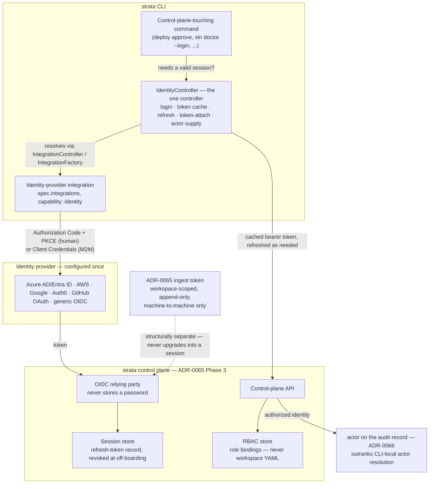

# Identity, authentication, and authorization for a strata server component

- Status: proposed
- Date: 2026-08-07
- Related: ADR-0065 (audit ingest service — Phase 3 control plane, per-workspace bearer tokens), ADR-0066 (audit event routing & policy model — CLI-side `actor` resolution), ADR-0018 (deployment audit & traceability), ADR-0062 (CLI consolidation — `sln doctor`'s health-check surface, extended here), ADR-0057 (deployment workflow orchestration — work items and hand-off gates), ADR-0007 (deployment state locking), ADR-0005 (secret resolution at build time)

## Context and Problem Statement

Strata today is a CLI: one process, one workspace, no server, no login. "Who is running this" is answered entirely locally — ADR-0066 settles that `actor` resolves from whichever cloud provider CLI is authenticated (Azure/AWS/GCP), falling back to CI runner environment variables (`GITHUB_ACTOR`, `BUILD_REQUESTEDFOR`), falling back to the OS login. That works because there is nothing to log into: the CLI runs under whatever credential the operator or CI runner already has, and strata only attributes it after the fact.

ADR-0065 introduces strata's first real server — an audit ingest service — and deliberately keeps its authentication minimal: a static bearer token, issued per workspace, append-only, machine-to-machine. That is the right scope for a service whose only client is a CI runner pushing event records. ADR-0065 says so itself, in its own open question 5: *"per-workspace tokens are proposed above, but issuance, rotation, and revocation have no home yet; that likely arrives with Phase 3's identity model rather than Phase 1."*

ADR-0065's Phase 3 ("control plane") is where this stops being optional. Its own description names three capabilities that all imply a **human** logging into something: "approvals that outlive a process," "locks held across machines," and — explicitly — "an authorization model for who may deploy where." None of that is answerable by ADR-0066's local `actor` resolution (there is no server to attribute to) or by ADR-0065's ingest tokens (those authenticate a workspace's CI pipeline, not a person, and grant nothing beyond append-only writes).

This is a different problem in kind, not degree:

|               | ADR-0066 `actor`                                      | ADR-0065 ingest token                              | This ADR                                                                         |
| ------------- | ----------------------------------------------------- | -------------------------------------------------- | -------------------------------------------------------------------------------- |
| Authenticates | Nothing — attributes after the fact                   | A workspace's CI pipeline                          | A human                                                                          |
| Mechanism     | Cloud CLI / CI env var / OS login, read locally       | Static bearer token, issued per workspace          | OIDC/OAuth2 login against an identity provider                                   |
| Lifetime      | Per-invocation, not stored                            | Long-lived until rotated                           | Session-scoped, revocable                                                        |
| Grants        | Nothing — it is a label on a record                   | Append-only ingest, nothing else                   | Whatever the control plane's authorization model permits (approve, deploy, view) |
| Threat model  | Self-asserted unless it's a cloud identity (ADR-0066) | Leaked token writes junk records — bad but bounded | Leaked session/credential impersonates a person with real authority              |

Left unaddressed, the likely failure mode is predictable and is exactly the anti-pattern ADR-0065 was careful to avoid for its own token model: someone under deadline pressure reuses the ingest bearer token as a stand-in for a human login, because it is the only credential the server already understands. That collapses two threat models that must stay separate — a workspace-scoped, append-only machine credential is not, and must never become, an authorization credential for a specific person.

This ADR is written now, ahead of Phase 3 being scheduled, so that whoever eventually builds the control plane is not left improvising identity, authentication, and authorization as an afterthought bolted onto the ingest token design. It does not block ADR-0065 Phases 1–2, neither of which need a human to log into anything.

## Decision Drivers

- **Machine and human credentials must not blur.** ADR-0065's per-workspace ingest token and a human session must remain separate credentials, separate lifetimes, separate revocation paths.
- **Audit must be able to attribute to a real person.** ADR-0018 and ADR-0066 exist to answer "who did this" — a control plane that authenticates users only as "the workspace" regresses that.
- **No password custody.** Strata should not become responsible for storing or resetting passwords; that liability belongs to whatever identity provider an organization already runs.
- **Must work for teams with no existing IdP, not only enterprises with Azure AD/Okta.** A control plane that only works behind a corporate directory service excludes exactly the small teams strata already serves as a CLI.
- **Authorization must answer "who may approve/deploy where."** Named explicitly in ADR-0065 Phase 3 and implied by ADR-0057's gates — this is not new scope, it is scope ADR-0065 already deferred.
- **Must not block ADR-0065 Phases 1–2.** Neither phase has a human-facing surface; this ADR's decisions only take effect when Phase 3 is scheduled.
- **Reuse standards, don't invent a protocol.** ADR-0066 chose CloudEvents + ECS over a bespoke envelope for exactly this reason; the same discipline applies here — OIDC/OAuth2 over a homegrown login flow.
- **One implementation, one place.** ADR-0066's problem 8 ("sink resolution and filtering implemented four times, with divergent semantics") is the cautionary example: identity handling on the CLI side must not be reimplemented per command that happens to talk to the control plane.

## Considered Options

**Option A — OIDC relying party against external identity providers** *(chosen)*

The strata server never stores credentials. It is an OAuth2/OIDC Relying Party against one or more configured identity providers, using the Authorization Code + PKCE grant for interactive human login and the Client Credentials grant for machine-to-machine access — both grant types sourced from the same provider configuration. Authorization is RBAC, sourced from IdP group/team claims where available and a local role-mapping override where not.

**Option B — Local username/password and session store**

Roll a conventional login form, password hashing, reset-email flow, session table.

Rejected. This makes strata custodian of credentials it has no business holding, duplicates infrastructure every serious IdP already provides (MFA, breach detection, password policy, SSO), and is precisely the "second dialect" pattern ADR-0066 rejected for policy expressions (Option C there) — building a bespoke mechanism when a standard one already covers the need.

**Option C — Reuse ADR-0065's per-workspace bearer token for humans**

Let a human log in with the same token a CI runner uses to push ingest events, at whatever scope that token already carries.

Rejected, and this is the option this ADR exists specifically to close off. It conflates two threat models with different blast radii: a leaked ingest token today lets an attacker write junk audit records (bad, bounded, detectable per ADR-0065's own risk analysis); the same token authenticating a human would let that attacker impersonate a person with real authority — approve deployments, read production audit history. It also cannot answer "who" — every request would attribute to "the workspace," which regresses the actor/traceability goals of ADR-0066 and ADR-0018 rather than extending them.

**Option D — Defer entirely; admin-only access via direct database/API, no web UI**

Keep Phase 3 accessible only via direct SQL/API access with an operator-managed credential, no login flow, until a dedicated identity ADR is scheduled.

Rejected as a permanent answer, though it is roughly where things stand today by default. It does not scale past a single trusted operator, and every capability Phase 3 exists for — approvals, cross-machine locks, "who may deploy where" — assumes more than one person can be authenticated and distinguished. It is, however, an accurate description of the *interim* state until Phase 3 is actually scheduled and this ADR's decisions are implemented — nothing here is retroactively required of ADR-0065 Phases 1–2.

## Decision Outcome

Chosen: **Option A — OIDC relying party, with RBAC authorization layered on top, kept structurally separate from ADR-0065's ingest tokens.**

### The server is a relying party, never a credential store

The control plane authenticates users via the Authorization Code flow with PKCE against a configured identity provider. It never sees, stores, or resets a password. First-class providers, settled rather than left open:

- **Azure AD / Entra ID** and **AWS** (IAM Identity Center, or Cognito as the app-facing front end) — the two cloud providers strata already integrates with directly for CLI-side identity (`azure_cli`, `aws_cli`, per ADR-0066's `actor` resolution). This is the same organizational identity, extended from "who is authenticated to deploy" to "who is authenticated to the control plane."
- **Google** — same rationale, covering `gcloud_cli`'s ecosystem and teams on Google Workspace.
- **Auth0** — a turnkey IdP-as-a-service, for teams that want a managed identity provider without standing up Azure AD, Okta, or a directory service of their own. This is the option that makes the control plane usable for a team with no existing enterprise IdP but who still want a real login (as opposed to GitHub OAuth's narrower scope, below).
- **Generic OAuth2/OIDC provider** — one configuration shape (issuer URL, client ID, client-secret reference, scopes) that covers Okta, Keycloak, PingFederate, or anything else exposing standard OIDC discovery. Strata does not special-case every possible IdP; it special-cases the ones above because they are already part of strata's ecosystem or fill a specific gap (Auth0's zero-infrastructure managed option), and falls back to this generic shape for everything else.
- **GitHub OAuth App** — kept as the zero-infrastructure default for the smallest teams. Strata's own CI-actor fallback chain (ADR-0066) already treats `GITHUB_ACTOR` as a first-class signal; a GitHub login for the control plane is the same assumption extended from "who triggered the pipeline" to "who is looking at the dashboard." It is listed separately from "generic OAuth2/OIDC" because classic GitHub OAuth Apps do not expose standard OIDC discovery — it is an OAuth2-only integration, not an interchangeable instance of the generic provider.

Configuration follows the pattern strata already uses for outward connections (ADR-0066's integration model): an identity provider is declared once, by name, with its client ID and a secret-store reference for the client secret — never a literal value in YAML, for the same reason ADR-0066 requires `${secret:KEY}` for every other credential-bearing field.

### Identity providers are `spec.integrations` entries, not a new `spec.identity` block

ADR-0066 already settled the governing principle that decides this: *"a sink is a connection to another system... anything that is one is an integration like any other."* An identity provider is exactly that — a connection to another system — so it is declared under `spec.integrations` with a new `identity` capability, resolved through the same `IntegrationController`/`IntegrationFactory` every other integration already goes through. There is no separate `spec.identity` block. Inventing one would repeat the exact mistake ADR-0066 refused to make elsewhere: a second configuration dialect for something the first one already covers.

This does mean reconciling with what `IntegrationController` does today, which is narrower than it sounds: for `azure_cli` / `aws_cli` / `gcloud_cli`, `ensure_available()` only **checks** whether the external tool is already authenticated ("is `az` logged in?") and tells the operator to run `az login` themselves if not — it delegates the actual login to a tool outside strata. An identity-provider integration is different in kind: there is no external CLI to delegate to for Auth0 or a generic OIDC provider, so strata itself must be able to drive the login. That is a new capability (`identity`), alongside the existing `IAWSTool` / `IAzureTool` / `IGCloudTool` protocols in `capabilities.py`, not a change to what `IntegrationController` already does for the integrations it manages today.

The division of responsibility mirrors the one ADR-0066 already uses between individual SIEM integration classes and the single `AuditController.forward()` that orchestrates them: each identity-provider integration class knows only how to talk to *that* provider's OIDC endpoints (Azure AD's, Auth0's, a generic issuer's); `IdentityController` (below) is the one place that owns everything common across all of them — when to trigger a login, where the session/token cache lives, how refresh works, who hands a token to an outgoing request.

### Relationship to the existing `azure_cli` / `aws_cli` / `gcloud_cli` integrations — related, not identical, and asymmetric by provider

These are not the same integration wearing a new hat, and they are not wholly unrelated either — the honest answer is provider-specific, and it is worth being precise rather than waving at "reuse what already exists." The existing integrations authenticate to a **cloud provider's resource-management APIs** (ARM, STS, Google Cloud APIs); the new ones authenticate a **human or service to strata's own control plane**. Different audience, same signed-in principal when both happen to be the same person.

- **Azure — genuine reuse, no new mechanism needed.** `AzureCLIIntegration.get_access_token(resource: str = _ARM_RESOURCE)` already accepts an arbitrary resource/audience, not just ARM's. `az account get-access-token --resource <strata-control-plane-app-id>` mints a token for **any** Azure AD app registration the signed-in principal can access — including one registered for strata's control plane. So the Azure identity-provider integration's login step should **first check whether `azure_cli` is already configured and authenticated**, and if so, call `get_access_token()` against the control-plane's resource/audience instead of starting a separate browser/device-code flow. An operator who already ran `az login` for Terraform never has to log in twice.
- **Google — the same reuse is possible, but requires one new method.** `GCloudCLIIntegration.get_access_token()` today only wraps `gcloud auth print-access-token`, with no audience parameter. `gcloud` itself supports `auth print-identity-token --audiences=<client-id>`, which is the real mechanism — but strata's existing integration does not expose it yet. So the reuse opportunity is real, but it is a small, explicit addition to `gcloud_cli.py` (a new `get_identity_token(audience)` method), not something already wired the way Azure's is.
- **AWS — no reuse; this is a standalone mechanism.** `AWSCLIIntegration` exposes `get_identity()` (STS caller identity: `Account`/`UserId`/`Arn`) and nothing that mints an OIDC ID token for an arbitrary audience — access-key/STS credentials are not OIDC tokens. AWS IAM Identity Center's own device-authorization + token-exchange flow is a structurally separate mechanism with no overlap with what `aws_cli.py` wraps today. The AWS identity-provider integration is standalone, built on IAM Identity Center directly, not layered on `aws_cli.py`.
- **Auth0, generic OIDC, GitHub OAuth — nothing to reconcile with.** Strata has no existing integration for any of these today, so these three are new from the ground up regardless of provider-specific reuse questions.

This reuse is deliberately an **optimization, never a requirement**: an operator who wants to log into the control plane from a machine with no `az`/`gcloud` installed still gets the standalone Authorization Code + PKCE / device-code flow every identity-provider integration must implement anyway. Falling back to that path is not a degraded experience, it is the baseline — the `azure_cli`/`gcloud_cli` shortcut only skips a redundant second login when one is already available.

### General-purpose for the CLI, not hardcoded to the control plane

Neither the `identity` capability nor `IdentityController` are special-cased to "the strata control plane" — they are a general mechanism for the CLI to authenticate a human or service to **any** OIDC/OAuth2-protected service, of which the control plane (ADR-0065 Phase 3) is simply the first and primary consumer. This follows the same shape every other capability in `capabilities.py` already has: `IAWSTool` / `IAzureTool` / `ISecretStore` and the rest are never restricted to one integration instance or one purpose. ADR-0066's integration-instance-identity fix — keying `_get_instance_key_static` on `config.name` instead of a shared `"default"` — already makes it possible to declare more than one integration of the same type without them collapsing into one object. So a workspace can declare two `identity`-capable integrations — one pointed at the strata control plane, another at some unrelated OIDC-protected service the CLI needs to call — and both are resolved, cached, refreshed, and health-checked identically, with no special-casing for which one happens to be strata's own server.

This is what makes the CLI-side answer general rather than a one-off: once the capability foundation and `IdentityController` exist, "can the CLI authenticate to a service that requires OIDC/OAuth2 login" is answered the same way regardless of which service that is — declare it in `spec.integrations` with the `identity` capability, and `sln doctor --deep`/`--login` (below) reports on it and can log it in, exactly the way both already do for `azure_cli`/`aws_cli`/`gcloud_cli` today.

### Sessions are separate from, and cannot be upgraded into, ingest tokens

A successful login issues a short-lived, signed session credential (JWT or equivalent) scoped to the human's authenticated identity. It is refreshed via the IdP's own refresh flow, not reissued by strata. Nothing about this credential overlaps with ADR-0065's per-workspace ingest bearer token:

|            | Ingest token (ADR-0065)   | Session credential (this ADR) |
| ---------- | ------------------------- | ----------------------------- |
| Identifies | A workspace's CI pipeline | An authenticated human        |
| Issued by  | Strata, per workspace     | Strata, after IdP login       |
| Grants     | Append-only event ingest  | Whatever RBAC permits         |
| Revocation | Per workspace             | Per session/user              |

A workspace's ingest token cannot be presented to log in, and a human session cannot be used to push ingest events. This is the direct answer to the failure mode described in the Context section: the two credential kinds are unrepresentable as one, not merely documented as different.

### Session model: short-lived access tokens, revocation at refresh — settled

A pure stateless JWT and a server-side session store are usually posed as a tradeoff. Left unresolved, this ADR would also be internally inconsistent: the comparison table above already asserts the session credential's revocation is "per session/user," and a self-contained token that nothing ever checks again cannot honor that once issued — there is nothing left to revoke.

What tips this from a tradeoff into a settled choice is that ADR-0065 already commits Phase 3 to having a database (its own open question 1 frames this as SQLite-first with a documented Postgres path). A session table is not new infrastructure on top of a system that otherwise has none — it is one more table in a store Phase 3 needs regardless. That changes the calculus from "is a session store worth the added dependency" to "there is already a store; does this table belong in it," and the answer is yes.

The model is a hybrid, not a binary choice:

- **Access tokens stay stateless and short-lived** (minutes, not hours) — self-contained, verified per request with no database hit, so the hot path pays nothing extra.
- **A server-side session record tracks the refresh token**, checked only when a client refreshes, not on every request. Revoking the record makes the *next* refresh fail; it does not touch already-issued access tokens directly.
- **Off-boarding's exposure window becomes bounded and explicit** — at most one access-token lifetime, a deliberately chosen number, rather than "whenever the session naturally expires" or an open-ended risk.

This is not a new mechanism invented for strata: refresh-token rotation with server-side revocation is the pattern Auth0 and Azure AD already push clients toward, so this decides where strata's own boundary sits rather than adding a mechanism on top of the IdPs already chosen above. It also means `strata audit status`-style introspection (ADR-0066's naming precedent for "is this actually working") extends naturally to a future `strata server sessions` or equivalent view over the same table — one place to answer "who is currently logged in, and can I kick them out right now."

### User login and machine-to-machine tokens are both first-class, from the same providers

A control plane needs to authenticate two different kinds of caller, and both are settled as part of this ADR rather than left as a gap:

- **User login** — Authorization Code + PKCE, described above. A human, a browser, a session.
- **Machine-to-machine tokens** — the OAuth2 Client Credentials grant, issued by the same configured identity provider (Azure AD app registration, AWS/Cognito app client, Auth0 M2M application, or a generic OIDC provider's client-credentials endpoint) rather than a second, bespoke minting scheme. A CI pipeline, a scheduled drift-detection job, or any other service calling the control plane's API authenticates this way and receives a token scoped by the same RBAC roles as a human, not a separate ungoverned grant of access.

This directly answers what would otherwise be Open Question 4 (whether scheduled/service identities need a third credential class): they do not need a *third* class, because Client Credentials already **is** the non-interactive counterpart of the same provider configuration used for human login — one identity provider, two grant types, one RBAC model governing both.

This is deliberately distinct from ADR-0065's Phase 1 ingest token, and that distinction is not a gap to close later — it is because the two solve different problems at different times. ADR-0065 Phase 1 needs a workspace to push audit events **before** any IdP is configured, possibly before a control plane exists at all; a static, strata-issued, per-workspace bearer token is the right minimal answer there, and nothing in this ADR requires Phase 1 to add an IdP dependency it does not otherwise need. Once Phase 3's control plane and an IdP are in place, a workspace's *other* machine-to-machine access to the control plane's API — as opposed to bare event ingest — goes through Client Credentials like every other service caller. Whether ADR-0065's ingest token is ever migrated onto this same mechanism is a future compatibility question, not a requirement of this ADR.

### `actor` gains a second, stronger source when a human is authenticated

ADR-0066 settled `actor` resolution for CLI-invoked commands: cloud provider identity → CI actor env var → OS login. When a deployment or approval originates from the control plane instead of a direct CLI invocation, the authenticated session's identity (the IdP's `sub`/`email`/`preferred_username` claim) becomes the actor — and it outranks all three of ADR-0066's CLI-side sources, because it is the one case where strata itself performed the authentication rather than merely reading an ambient credential. The two resolution paths are not in tension: a deployment is either triggered through an authenticated control-plane session, or it is a direct CLI/CI invocation resolved per ADR-0066 — never both, so there is no precedence conflict to adjudicate at record-write time, only a choice of which resolver ran.

### Authorization is RBAC, sourced from IdP claims with a local override

Roles (at minimum: viewer, approver, deployer, admin) are scoped per workspace/environment, matching the granularity ADR-0065 Phase 3 already names ("who may deploy where"). Role assignment is sourced from the IdP where it offers one (Azure AD / Okta group claims), with a local role-mapping table as the fallback and override for every IdP — including ones like GitHub OAuth Apps that do not expose an equivalent claim by default. The local table is authoritative when present; the IdP claim is only ever a default, never a silent grant of authority the operator did not configure. This mirrors the "global gate, per-destination filter" shape ADR-0066 already used for event routing — one deliberate, inspectable configuration layer sitting in front of whatever a claim happens to say.

**Where role bindings live is settled: the control plane's own store, never workspace YAML.** RBAC is a server concern, full stop — role bindings are not a `spec`-style block checked into `.strata/`. The reasoning is the same separation-of-duties argument ADR-0066 already applied to `spec.audit`: whoever can edit a workspace's YAML must not thereby be able to grant themselves `deployer` or `admin` on that workspace. Putting role bindings in the control plane's database, administered through the control plane itself (and subject to its own RBAC — an admin role is required to change role bindings), keeps that boundary intact the same way ADR-0066 kept audit configuration out of reach of the party being audited.

### The CLI has no RBAC of its own — it only gates on login

A reasonable question, given how much of this ADR is server-side: does the CLI need any authorization logic at all? **No.** RBAC is entirely a server problem. The CLI's only responsibility is the same one it already has for every cloud provider it integrates with: **require login before a command that needs an authenticated resource can proceed, then let the remote side decide what that identity is allowed to do.**

This is not a new pattern for strata — it is the exact shape of `AzureCLIIntegration.ensure_available()` ("Azure CLI is installed but not authenticated. Run: `az login`"), `AWSCLIIntegration` ("installed but not authenticated... Run: `aws configure`"), and `GCloudCLIIntegration` ("installed, authenticated, and has an active project"). None of those integrations implement Azure's or AWS's or GCP's authorization model locally; they check *whether a login exists* and otherwise get out of the way, leaving every actual permission decision to the provider being called. `IdentityController` (below) does the same thing for the control plane — triggered lazily rather than via a dedicated command, it drives the OIDC login (most naturally a device-code flow, since a CLI is not a browser), caches the resulting token locally the way `az`/`gh` already do, and any control-plane-touching command (`strata deploy approve`, a future `strata server` subcommand) checks only "is there a valid, non-expired session" before proceeding — precisely mirroring `ensure_available()`'s "installed AND authenticated" check, not a new concept.

What the CLI explicitly does **not** do: cache roles, evaluate "can this user approve this deployment," or carry any copy of the RBAC model. Every authorization decision is a round-trip to the control plane, and a `403`-shaped rejection is displayed verbatim (which role is missing, which workspace) rather than being pre-empted or second-guessed locally. A client-side permission check is never authoritative and duplicating the server's authorization logic in the CLI would only create a second place for it to drift out of sync — exactly the kind of divergent-implementation problem ADR-0066 catalogued (its problem 8) for sink filtering, now avoided here by construction rather than by discipline.

### One `IdentityController` owns every client-side identity concern

How the CLI actually authenticates to the control plane needs one answer, not one answer per command that happens to need it — otherwise this becomes the exact problem ADR-0066 spent its own "Decisions to settle" section unwinding for audit: sink resolution and filtering implemented four separate times, with semantics that quietly drifted apart until a filter admitted events it didn't name. Identity handling scattered across every control-plane-touching command would fail the same way: one command might forget to refresh an expired token, another might cache it in a different location, a third might silently proceed without a session at all.

Strata already has the structural answer to this, and it is not new: a single controller, in `controllers/` alongside `audit_controller.py`, `integration_controller.py`, and the rest, owns one cross-cutting concern end to end. An `IdentityController` is that controller for identity, and it is the **only** place any of the following logic lives:

- **Login, triggered lazily, not via a dedicated command** — the first time a command needs a control-plane token and finds no valid cached session, `IdentityController` resolves the configured identity-provider integration (via `IntegrationController`/`IntegrationFactory`, per "Identity providers are `spec.integrations` entries" above) and drives that provider's OIDC device-code flow inline — print a URL and a code, block until it completes. There is deliberately no separate `strata login` verb to remember to run first; needing one is discovered the same way `ensure_available()` already surfaces a missing `az login` today, except strata can complete this one itself rather than only pointing at an external command.
- **Token cache** — reads and writes the cached access/refresh token to one local file, the same shape as the in-process token caches `AzureCLIIntegration.get_access_token()` and `GCloudCLIIntegration` already maintain for their respective clouds, generalized to the control-plane session.
- **Refresh** — silently renews an expired access token via the IdP's refresh flow before a command proceeds, so no call site needs to know a token can expire.
- **Attaching the credential** — every command that calls the control plane's API asks `IdentityController` for the current bearer token rather than each command reading the cache file or handling headers itself; this is the CLI-side analogue of `ensure_available()`'s "installed AND authenticated" gate, but for one server instead of one cloud CLI.
- **Supplying the authenticated identity to `actor` resolution** — the `sub`/`email`/`preferred_username` claim that outranks ADR-0066's CLI-side resolution chain (settled above) is read from here, once, rather than every producer re-parsing the session token.

There is no dedicated `strata login`/`strata auth` command set wrapping this controller — see "Checking whether login is working, and triggering it explicitly, extends `sln doctor`" below for the one CLI-facing surface that does exist. The controller has no RBAC logic of its own, consistent with "The CLI has no RBAC of its own" above — its entire surface is "do we have a valid session, and here is the token," nothing more.

### Checking whether login is working, and triggering it explicitly, extends `sln doctor` — no new command

`strata sln doctor` already has exactly the shape this needs, and extending it costs nothing new. Its `auth` category (gated behind `--deep` to avoid slow network calls on every run) already loops over `IntegrationFactory.get_known_types()` and calls `check_auth()` on any integration that implements it, reporting pass/fail with a fix hint — with zero special-casing per integration type. An identity-provider integration implementing `check_auth()` ("is the cached session valid, and does the IdP still consider it so") is picked up by `sln doctor --deep` automatically, the same way `azure_cli`/`aws_cli`/`gcloud_cli` already are — and this holds for *every* `identity`-capable integration a workspace declares, not only the one pointed at strata's own control plane, per "General-purpose for the CLI, not hardcoded to the control plane" above. This is the answer to "can we check if login is working": nothing new to build in the doctor command itself, only a `check_auth()` implementation on each new integration type.

What *is* new is the fix hint. Today, `_check_auth()`'s hint for a failing check reads "Re-authenticate: run the login command for '{type}'" — correct for `az`/`aws`/`gcloud`, where the actual login happens in an external tool strata only checks. An identity-provider integration has no external tool to point at; strata itself is the thing that must drive the login. So `sln doctor` gains a `--login` flag, parallel to its existing `--deep` flag: when a `check_auth()` failure comes from an integration capable of driving its own login (the `identity` capability, via `IdentityController`), `--login` performs that login inline instead of only printing a hint to run something else. For `az`/`aws`/`gcloud`, where there is genuinely nothing strata itself can do, `--login` changes nothing — the existing external-tool hint still applies.

This reuses the existing `strata sln doctor --deep` health-check surface rather than adding a parallel one, consistent with the same instinct that ruled out a separate `spec.identity` block above: don't grow a second surface for something an existing one already generalizes to cover.

### What this ADR does not decide yet

Consistent with ADR-0065's own pattern of separating "what is decided" from "what is deferred," the following are left open deliberately — they are implementation choices that should be made when Phase 3 is actually scheduled, not guessed at now:

- Exact OIDC client library and access-token signing/format details (JWT algorithm choice, claims beyond the minimum described above).
- Exact role-binding schema in the control plane's own store, and the token-cache file location/format for `IdentityController` (likely alongside where `az`/`gh` already keep theirs).
- Whether this identity model becomes the resolution path for ADR-0066's on-demand secret resolution (its settled topic 6) if `strata audit resend`/`export` ever run server-side rather than CLI-side.

## Implementation plan

```
src/strata/
├── integrations/
│   ├── capabilities.py                      # + IIdentityProvider protocol (login, refresh, check_auth,
│   │                                         #   client_credentials_token); "identity" added to VALID_CAPABILITY_NAMES
│   └── identity/                             # NEW — one class per first-class provider
│       ├── generic_oidc_identity_integration.py
│       ├── github_oauth_identity_integration.py
│       ├── azure_ad_identity_integration.py
│       ├── aws_identity_integration.py
│       ├── google_identity_integration.py
│       └── auth0_identity_integration.py
├── controllers/
│   └── identity_controller.py                # NEW — the one controller: login, token cache, refresh,
│                                              #   token-attach, actor-supply
├── models/
│   └── integration_model.py                  # no new spec block — capabilities gains "identity"
└── commands/
    └── sln/doctor_sln_command.py             # + --login flag; _check_auth() already generic, no
                                               #   structural change needed

server/  (Phase 3 — deployable shape is ADR-0065's own open question 2, in-package vs separate)
└── auth/
    ├── oidc_relying_party.py                 # NEW — Authorization Code+PKCE (human) + Client Credentials (M2M)
    ├── session_store.py                      # NEW — refresh-token record, one more table in ADR-0065's DB
    └── rbac.py                               # NEW — role-binding store + per-route enforcement middleware
```

Ordering. Steps 0–6 are CLI-side, non-breaking, and ship independently of Phase 3 being scheduled — they are useful groundwork on their own, not contingent on the control plane materializing on any particular timeline. Steps 7–10 require Phase 3 itself and are gated on ADR-0065's own scheduling, not on anything here.

**0. Identity capability foundation.** Add `identity` to `VALID_CAPABILITY_NAMES` (`integrations/capabilities.py`) and define the `IIdentityProvider` protocol alongside `IAWSTool` / `IAzureTool` / `IGCloudTool`. Non-breaking, no server dependency.

**1. `IdentityController` skeleton.** New `controllers/identity_controller.py`: token-cache file, lazy-login trigger, refresh, a single `get_token()` callers use. Ships as effectively a no-op until at least one identity-provider integration exists — the single-controller shape lands before any specific provider does.

**2. First identity-provider integration.** One provider first — generic OIDC or GitHub OAuth, the zero-infrastructure defaults — implementing `IIdentityProvider` and `check_auth()`, resolved through the existing `IntegrationFactory`. Proves the `spec.integrations` + `IdentityController` wiring end to end before the remaining providers repeat the same shape.

**3. Azure and Google reuse paths.** Azure's identity-provider integration checks for an already-authenticated `azure_cli` and calls its existing `get_access_token(resource=...)` against the control-plane audience before falling back to its own OIDC flow — no change needed to `azure_cli.py` itself. Google's does the same, but first requires adding `get_identity_token(audience)` to `gcloud_cli.py` (a thin wrapper around `gcloud auth print-identity-token --audiences=...`, not present today). AWS gets no equivalent step — its identity-provider integration (step 5) is standalone from the start.

**4. `sln doctor --login` flag.** Extend `cli_sln.py`'s `sln doctor` command and `doctor_sln_command.py`'s `_check_auth()`: when a failure comes from an integration implementing `IIdentityProvider`, `--login` drives that integration's login instead of only printing the existing "run the login command" hint. No change to the `az`/`aws`/`gcloud` paths, which keep pointing at their external tools.

**5. Remaining first-class providers.** AWS (IAM Identity Center/Cognito, standalone per "Relationship to the existing integrations" above) and Auth0 — same integration shape as step 2, one class each, no new controller logic.

**6. `actor` wiring.** `IdentityController` supplies the authenticated session's `sub`/`email`/`preferred_username` to ADR-0066's `actor` resolution, outranking the CLI-local chain when a control-plane session exists. This touches the `actor`-resolution call site ADR-0066 already established, not `IdentityController` itself.

**7. OIDC relying party.** Server-side Authorization Code + PKCE for human login and Client Credentials for M2M, against whichever provider(s) are configured — `server/auth/oidc_relying_party.py`.

**8. Session store.** One more table in the database ADR-0065 already commits Phase 3 to (SQLite-first, per its own open question 1): refresh-token records, checked only at refresh, revoked for off-boarding.

**9. RBAC store and enforcement middleware.** Role bindings (viewer/approver/deployer/admin per workspace/environment), sourced from IdP group claims with a local override table; middleware on every control-plane API route — RBAC is a server-only concern (settled above), so nothing is added to the CLI here.

**10. Machine-to-machine Client Credentials path.** Wired for CI pipelines and scheduled jobs calling the control-plane API beyond bare ADR-0065 event ingest — reuses the identity-provider configuration from steps 2/3/5, not a new credential type.

**11. Docs.** An identity/auth help topic correcting the same category of doc-drift ADR-0066 found and fixed for `help/audit.md`; changelog entries for the two real CLI-visible changes (a new `identity` capability, `sln doctor --login`).

## Consequences

### Good

- **No password custody** — strata never becomes responsible for storing, hashing, or resetting credentials; that liability stays with whichever IdP an organization already trusts.
- **Works without an existing IdP** — GitHub OAuth as the zero-infrastructure default means small teams are not required to stand up a directory service to use the control plane, consistent with strata's CLI-first audience.
- **Audit gains a real human identity** — deployments and approvals made through the control plane attribute to an authenticated person, not "the workspace," strengthening rather than diluting ADR-0066/ADR-0018's traceability goals.
- **Ingest tokens stay narrowly scoped** — nothing in this ADR broadens what a leaked ADR-0065 token can do; the two credential kinds remain structurally incapable of being confused.
- **Standards-based** — OIDC/OAuth2 rather than a bespoke login protocol, the same discipline ADR-0066 applied by choosing CloudEvents/ECS over an invented envelope.
- **Does not block ADR-0065 Phases 1–2** — both remain fully usable with zero login surface; this ADR only activates when Phase 3 is scheduled.
- **The CLI gains no new authorization surface to maintain** — it already knows how to gate a command behind "are you logged in" for Azure/AWS/GCP; extending that same check to the control plane is not new machinery, and every actual permission decision stays server-side where it cannot drift out of sync with a client-side copy.
- **Identity handling has exactly one implementation on the CLI side** — `IdentityController` is the single place login, token cache, refresh, and request-signing live, avoiding the scattered-and-drifted-apart failure mode ADR-0066 catalogued for sink filtering (its problem 8).
- **No new configuration surface** — identity providers are `spec.integrations` entries with an `identity` capability, resolved through the same `IntegrationController`/`IntegrationFactory` every other integration already uses, rather than a second config dialect.
- **No new command to remember** — login triggers lazily the first time a command needs a control-plane session and finds none, rather than requiring a `strata login` step before anything else works.
- **No new health-check surface either** — `sln doctor --deep` already generically reports `check_auth()` for every integration that implements it; an identity-provider integration is picked up for free, and `--login` extends the same command to actively fix a failing check rather than only naming one.
- **Azure and Google logins can piggyback on an already-authenticated `azure_cli`/`gcloud_cli`** — `AzureCLIIntegration.get_access_token(resource=...)` already accepts an arbitrary audience, so an operator who already ran `az login` for Terraform never has to log in twice for the control plane.

### Neutral

- **Adds an OIDC dependency and per-installation setup** — registering an OAuth/OIDC application with a chosen IdP becomes an onboarding step for whoever runs the control plane, the same kind of one-time setup already required for cloud CLI integrations.
- **RBAC role source varies by IdP** — group claims exist for some providers and not others; the local override table exists precisely to make this uniform rather than something operators discover the hard way.

### Risk

- **A control plane with no login surface today may tempt an interim "just reuse the ingest token" shortcut before this ADR's decisions are implemented.**
  - Mitigation: this ADR states plainly, and ADR-0065 is updated to cross-reference, that ingest tokens must never authenticate a human session — that boundary is the reason this ADR exists.
- **Small teams without any existing enterprise IdP have two zero/low-infrastructure paths.**
  - Mitigation: GitHub OAuth (zero infrastructure) and Auth0 (managed, minutes to configure) both exist precisely to cover this case without requiring a directory service; a fully local option (Option B) was rejected on custody grounds, not revisited as a fallback.
- **Deferring the exact role-binding schema and `IdentityController`'s token-cache details risks them being decided under implementation-deadline pressure rather than deliberately.**
  - Mitigation: they are listed explicitly under "What this ADR does not decide yet" so they are a known, scheduled decision rather than a silent gap — the same treatment ADR-0065 gave its own open questions. The architectural point — RBAC lives server-side only, the CLI only gates on login — is settled now and does not wait on those details.
- **The hybrid session model means an off-boarded person's access token can remain technically valid for up to one access-token lifetime after their session is revoked.**
  - Mitigation: accepted deliberately, and bounded rather than open-ended — the access-token lifetime is chosen specifically to make that window minutes, not hours; a purely stateless model would have made the window "until natural expiry," which is worse, not safer.
- **The Azure/Google login shortcut (reusing `azure_cli`/`gcloud_cli`) must never become a hard dependency.** An operator with no `az`/`gcloud` installed, or one who is authenticated to a *different* Azure AD tenant / Google account than the one the control plane trusts, must still get a correct result.
  - Mitigation: the shortcut is strictly opportunistic — every identity-provider integration implements the standalone Authorization Code + PKCE / device-code flow regardless, and the reuse path is only attempted first, never assumed. A mismatched tenant/account surfaces as an ordinary authentication failure from the IdP itself, not a silent wrong-identity login.

## Open questions

**Settled:** the first-class identity providers are Azure AD/Entra ID, AWS (IAM Identity Center/Cognito), Google, Auth0, GitHub OAuth (zero-infrastructure default), and a generic OAuth2/OIDC provider shape for everything else (see "The server is a relying party, never a credential store" above), declared as `spec.integrations` entries rather than a new `spec.identity` block (see "Identity providers are `spec.integrations` entries, not a new `spec.identity` block" above); every provider supports both interactive user login (Authorization Code + PKCE) and machine-to-machine tokens (Client Credentials grant) under the same RBAC model, which also answers what was previously open question 4 about a separate service-identity class (see "User login and machine-to-machine tokens are both first-class" above); the session model is a hybrid of short-lived stateless access tokens with a server-side session record checked only at refresh (see "Session model: short-lived access tokens, revocation at refresh — settled" above); RBAC lives entirely in the control plane's own store — the CLI carries no authorization logic of its own, only a login gate mirroring `az login`/`gh auth login` (see "The CLI has no RBAC of its own — it only gates on login" above); exactly one `IdentityController` owns login (triggered lazily, no dedicated `strata login` command), token cache, refresh, and request-signing on the CLI side (see "One `IdentityController` owns every client-side identity concern" above); and checking login health and triggering it explicitly both extend `strata sln doctor` — its existing `auth` category and new `--login` flag — rather than a new command (see "Checking whether login is working, and triggering it explicitly, extends `sln doctor`" above).

1. Whether this identity model becomes the resolution path for ADR-0066's on-demand secret resolution (its settled topic 6) once `strata audit resend`/`export` might run server-side.

This ADR does not block ADR-0065 Phases 1–2 and is intentionally written ahead of Phase 3 being scheduled — its purpose is to ensure identity, authentication, and authorization are decided deliberately when that work begins, rather than improvised from whatever credential the server already happens to understand.

## Design summary

One diagram ties every decision above together: one identity-provider configuration, one client-side controller, one server-side enforcement point, no dedicated login command.



Reading it left to right: a command that needs the control plane asks the single `IdentityController` for a token; if none is cached (or it has expired), `IdentityController` resolves whichever identity-provider integration is configured and completes the login — or silently refreshes — against that provider, never a second implementation per command. Every subsequent request carries a bearer token, and it is the control plane's own RBAC store, not the CLI, that decides what the identity behind that token may do. The resulting identity becomes the `actor` on any audit record the action produces, outranking ADR-0066's CLI-local resolution chain. ADR-0065's ingest token sits deliberately outside this flow: it authenticates a workspace's CI pipeline to push events, and nothing in this design lets it cross into a human session, however tempting that shortcut looks under deadline pressure.

