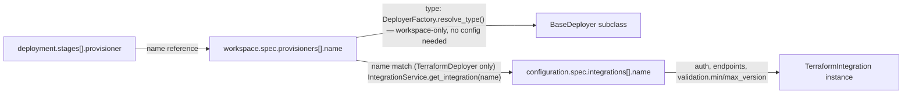
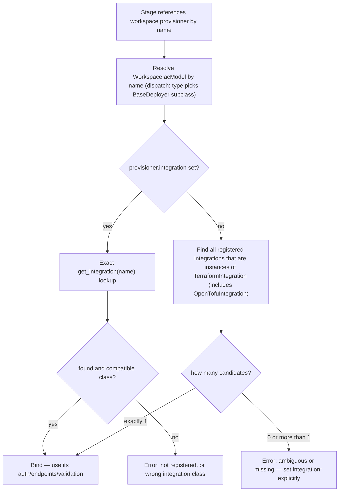

# Terraform Provisioner-to-Integration Binding: Explicit Field, Zero-Config by Default

- Status: implemented
- Date: 2026-09-14
- Target release: 2.0.0 — breaking change, hard break (no deprecation window).
  Originally specified as release-coupled with
  [ADR-0080](./0080-unified-provisioner-integration-contract.md); that
  coupling is now relaxed — see "Release and scope decisions".
- Supersedes the narrower "name-then-type fallback" framing this ADR started
  from — kept below under "Considered Options" as Option B for context, but
  the chosen design (Option D) is a deliberate, documented binding contract
  rather than a fallback bolted onto an accidental one. Breaking change,
  accepted deliberately (see Decision Outcome).

## Context and Problem Statement

`TerraformDeployer` resolves which `TerraformIntegration` instance to use for a
stage by the **provisioner's `name`**, not its `provisioner` (type) field:

1. `BaseDeployer._resolve_iac_model()`
   ([src/strata/deployers/base_deployer.py](../../src/strata/deployers/base_deployer.py#L299))
   matches `stage.provisioner` (or `topology.provisioner`) against
   `workspace.spec.provisioners[*].name` and returns that `WorkspaceIacModel`,
   which carries both a `name` (e.g. `control_infra`) and a `provisioner` type
   (e.g. `terraform`).
2. `TerraformDeployer.validate_environment()`
   ([src/strata/deployers/terraform_deployer.py](../../src/strata/deployers/terraform_deployer.py#L182))
   calls `self._get_terraform_integration(self._iac_model.name)` —
   i.e. it looks the integration up by the **provisioner's name**, not by
   `self._iac_model.provisioner` (the type string `"terraform"`).
3. `_get_terraform_integration()`
   ([src/strata/deployers/terraform_deployer.py](../../src/strata/deployers/terraform_deployer.py#L856-L871))
   does an exact `IntegrationService.get_integration(name)` registry lookup and
   raises `RuntimeError` if nothing is registered under that exact name.
4. The registry is only populated from `configuration.spec.integrations[]`,
   keyed by each spec's own `name`
   ([src/strata/services/integration_service.py](../../src/strata/services/integration_service.py#L114-L133)).

Net effect: **every** workspace provisioner name that uses Terraform must have a
same-named `type: terraform` entry in `configuration.spec.integrations`, even
when all of them share identical configuration. A workspace with three
semantically-named Terraform provisioners (`control_infra`, `core_iac`,
`env_iac` — control-plane, spoke/customer, and per-environment instance stacks)
requires three near-identical integration declarations purely to satisfy the
name-match, which is boilerplate duplication for the common case.

### The full resolution chain — and where config-linking is and isn't involved

Stage → workspace is always a name reference; workspace → configuration is a
second, independent hop that **only `TerraformDeployer` ever takes**:



- **Stages → workspace**: `stage.provisioner` (or `stage.topology`) resolves
  purely against `workspace.spec.provisioners[].name`. The *type*
  (`terraform`/`ansible`/`helm`/...) that picks the `BaseDeployer` subclass
  also comes from workspace alone — `DeployerFactory.resolve_type()`
  ([src/strata/deployers/factory.py](../../src/strata/deployers/factory.py#L109-L154))
  only calls `deployment_service.get_workspace_service()`, never touches
  `ConfigurationService` or `IntegrationService`. Dispatch works identically
  for every provisioner type and never needs configuration loaded.
- **Workspace → configuration**: this second hop is **Terraform-only**.
  `AnsibleDeployer`, `ComposeDeployer`, `HelmDeployer`, `ScriptDeployer`, and
  the sync deployers (`argocd`/`flux`) don't call `IntegrationService` at all —
  they shell out and check their binary on `PATH` directly. Only
  `TerraformDeployer.validate_environment()` takes the extra name-match hop
  into `configuration.spec.integrations[]`, and only to obtain
  `authentication`, `endpoints`, and `validation.{min,max}_version` (an
  acceptable-range check on whatever `terraform`/`tofu` binary is on `PATH`) —
  not a version *pin*. The pin itself (`WorkspaceIacModel.version`, set by
  `strata versions`) already lives entirely on the workspace side
  ([src/strata/models/workspace_model.py](../../src/strata/models/workspace_model.py#L497-L502))
  and never needs configuration to resolve.

So the fallback proposed below narrows an already Terraform-specific,
already-narrow link (auth/endpoints/validation-range only) — it does not
introduce any new coupling between workspace and configuration, and it has no
bearing on deployer dispatch or on any other provisioner type.

### Why it's keyed by name today (not an oversight)

`TerraformIntegration._get_instance_key_static()`
([src/strata/integrations/terraform.py](../../src/strata/integrations/terraform.py#L26-L44))
keys its singleton cache by `config.name` specifically so **two Terraform
provisioners can have independent configuration** — different pinned
`version:`, different `validation.command`, different backend/cloud auth. If
resolution instead matched purely on `provisioner: terraform` (type), every
Terraform-typed provisioner in a workspace would collapse onto one shared
integration instance, which breaks the moment two of them need divergent
config (e.g. a different Terraform version for legacy vs. new stacks).

Elsewhere in the codebase, lookups genuinely are by *type* instead of by
*name* — e.g. `ValueController._get_integration_by_type()` for secret stores
(`store: bitwarden`), because a secret reference only ever needs "some
integration of this type," never a specific named instance. That's a
different shape of problem (no per-instance config to disambiguate), which is
why it can afford to be type-only where Terraform's can't.

### What was actually intended, per the codebase's own design

`docs/platform/integrations.md` and `IntegrationFactory`/`IntegrationRegistry`
were built as a **generic** mechanism — `TerraformIntegration`,
`AnsibleIntegration`, and `HelmIntegration` are all pre-registered integration
types with the same `IInfrastructureTool` capability, all meant to go through
the same factory/registry path. Today's name-match binding in
`TerraformDeployer` was never a deliberately designed *binding contract* — it
is an incidental consequence of both `workspace.spec.provisioners[].name` and
`configuration.spec.integrations[].name` independently happening to be called
`name`, discovered by reading `_get_terraform_integration(self._iac_model.name)`
literally, not by any documented rule that says "these two `name` fields are
the join key." (Ansible's integration lookup being a hardcoded no-op inline
`IntegrationModel`, per ADR-0080, is further evidence this was never a
deliberate cross-file contract for *any* provisioner type — it was simply
never finished for Terraform either, it just happens to look intentional
because the two `name`s coincide in every example in this repo.)

Given that, the right question isn't "what should the fallback be" but "what
should the actual binding contract have been." Terraform is the first
provisioner type to nail this down since it is the only one with a real
per-instance-config need today.

## Considered Options

- **A. Status quo.** Keep exact by-name matching only. Simple, already
  implemented, but forces one integration declaration per provisioner name
  even when configuration would be identical across all of them, and
  formalizes an incidental name coincidence as if it were an intentional
  contract.
- **B. Fall back to type when no name match exists.** Try
  `get_integration(name)` first (preserves today's per-instance-config
  capability); if nothing is registered under that exact name, fall back to
  the single enabled `type: terraform` integration in the registry (error if
  zero or more than one exist and none match by name — ambiguous, don't
  guess). Non-breaking, no schema change — but still layers a fallback on top
  of the same incidental name-coincidence mechanism instead of replacing it.
- **C. Add an explicit `integration:` reference field only (no auto-bind).**
  Decouples the provisioner's `name` from the integration it resolves to
  (`integration: terraform_v1_5`), always required. Most explicit, but doesn't
  remove the duplication problem — every provisioner still needs the field
  set to *something*, even in the common single-config case.
- **D. Explicit optional `integration:` field, zero-config by default
  (chosen).** Add `integration: Optional[str]` to `WorkspaceIacModel`,
  replacing reliance on name coincidence entirely:
  - If `integration:` is set → exact lookup by that name; error if missing.
  - If unset → auto-bind to the sole registered integration of the matching
    integration class; error (not a silent guess) if zero or more than one
    exist and `integration:` wasn't set to disambiguate.
  - The provisioner's own `name` is never used to look anything up in
    configuration — it is purely the stage/topology reference key, restoring
    the separation of concerns workspace vs. configuration is supposed to
    have (per the earlier discussion in this ADR's resolution-chain diagram).
  - Breaking change: any workspace that (by convention or accident) relied on
    provisioner-name == integration-name for anything beyond the trivial
    single-integration case must add `integration:` explicitly — but the
    common case (one `type: terraform` integration, any number of
    identically-configured provisioners) needs zero extra config, same as
    Option B, without the incidental-coincidence foundation underneath it.

## Decision Outcome

Chosen: **Option D** — explicit optional `integration:` field with zero-config
auto-bind when unambiguous — because it's what the codebase's own
integration/registry design was clearly building toward (a real, documented
binding contract, generic enough that ADR-0080 can extend the same shape to
other provisioner types later), not a fallback patched onto an accidental
name coincidence. Breaking change accepted deliberately: this ships as part of
a major version bump with a migration path (see Remaining Work), rather than
preserving the incidental mechanism indefinitely for backward compatibility.

### Release and scope decisions (settled 2026-09-14)

- **Hard break, no deprecation window.** No transitional "fall back to
  name-match and warn" phase. The incidental name-coincidence mechanism is
  removed outright.
- **Ships in the next major version (2.0.0).** The break is not backported to
  1.x.
- **ADR-0079 and ADR-0080 ship together in that same major release.** They are
  release-coupled, not independently schedulable.

The coupling matters for correctness, not just tidiness: `integration:` is
added as a **generic** `WorkspaceIacModel` field (so ADR-0080 doesn't need a
second schema change), but only `TerraformDeployer` consumes it in this ADR
alone. Shipping 0079 without 0080 would mean setting `integration:` on an
`ansible`/`helm`/`compose` provisioner is silently ignored — reintroducing
exactly the "looks configurable, does nothing" anti-pattern that ADR-0080
exists to fix. Because both land in the same release, every provisioner type
consumes the field on arrival and no silent-no-op window ever exists.

**Guard condition — implemented.** The model validator rejecting
`integration:` on any provisioner type other than `terraform`
([src/strata/models/workspace_model.py](../../src/strata/models/workspace_model.py))
is in place as of this ADR's implementation, ahead of ADR-0080. That means
the silent-no-op risk described above is already closed: setting
`integration:` on `ansible`/`helm`/`compose`/etc. fails validation loudly
today rather than being ignored. **This relaxes the hard release coupling** —
ADR-0079 can ship in 2.0.0 independently of ADR-0080's timeline; ADR-0080
simply needs to relax this same validator (provisioner type by provisioner
type) as it wires each deployer into `resolve_for_provisioner()`.

### Consequences

- Good: the binding is now a real, named, documented contract
  (`integration:`) instead of an implicit coincidence discovered by reading
  source code — matches what `docs/platform/integrations.md` already implies
  the factory/registry design intended.
- Good: zero-config still works for the common case (one `type: terraform`
  integration shared by any number of provisioners) — no regression in the
  simple path Option B was also solving.
- Good: sets a template ADR-0080 can generalize to Ansible/Helm/other
  provisioner types without inventing a second binding mechanism.
- Good: OpenTofu keeps working unchanged — resolution matches on integration
  *class*, and `OpenTofuIntegration` subclasses `TerraformIntegration`, so a
  `type: opentofu` integration still binds to a `provisioner: terraform`
  entry exactly as it does today.
- Good: **the repo's own shipped examples are unaffected** — all five
  (`config/azure-aks`, `gcp-gke`, `hetzner-compose`, `kamatera-swarm`, and the
  scaffold templates) declare exactly one `type: terraform` integration, so
  auto-bind resolves them with zero YAML changes.
- Bad: genuinely breaking, though narrower than it first appears — it only
  affects workspaces with **two or more** registered integrations of the same
  class (e.g. both a `terraform` and an `opentofu` entry, or two `terraform`
  entries) that previously relied on provisioner-name == integration-name to
  disambiguate. Those must add `integration:` explicitly. Needs a clear
  `strata validate` error message pointing at the fix, and a
  CHANGELOG/migration-guide entry.
- Bad: touches the schema (`WorkspaceIacModel`, `.strata/schemas/workspace.json`
  and `platform.json`) and requires coordinated doc updates
  (`docs/config/workspace.md`, `docs/platform/integrations.md`).

### Designing this so ADR-0080 doesn't have to redo it

Terraform goes first only because it's the one provisioner type with a real
per-instance-config need *today* — not because the mechanism itself is
Terraform-specific. The implementation must reflect that: the resolution
algorithm (explicit `integration:` → exact lookup; else auto-bind if exactly
one same-type integration is registered; else error) is generic over
*provisioner type*, not hardcoded to `"terraform"`. Concretely:

- Implement it once as a shared helper — e.g.
  `IntegrationService.resolve_for_provisioner(iac_model: WorkspaceIacModel,
  expected_type: str) -> BaseIntegration`, taking the provisioner's
  `integration` field and its own `provisioner` type as the `expected_type` to
  filter candidates by — not as a private method embedded in
  `TerraformDeployer`.
- `TerraformDeployer._get_terraform_integration()` becomes a 2-line wrapper
  calling `IntegrationService.resolve_for_provisioner(self._iac_model,
  "terraform")` and asserting the result `isinstance(..., TerraformIntegration)` —
  the isinstance check stays deployer-specific, the resolution algorithm does
  not.
- The `integration: Optional[str]` field on `WorkspaceIacModel` is added
  once, at the model level — it's already generic across all provisioner
  types (not a Terraform-only field), so ADR-0080 doesn't need a second
  schema change to reuse it for `AnsibleDeployer`, `HelmDeployer`, etc.
- ADR-0080's job then becomes: (1) call the same shared helper from each
  deployer's `validate_environment()` instead of Ansible's current hardcoded
  inline `IntegrationModel`, and (2) decide, per provisioner type, whether
  "no integration registered at all" should be an error or a documented
  no-op fallback (e.g. Compose/Script/sync deployers may legitimately have
  nothing to bind to). ADR-0080 should not need to re-derive the
  explicit-field-plus-auto-bind algorithm itself — that's what this ADR is
  contributing.

### Example: how it resolves

**Case 1 — zero-config auto-bind (one `type: terraform` integration, several provisioners):**

```yaml
# configuration.yaml
spec:
  integrations:
    - name: terraform_tool
      type: terraform
      authentication: { method: env, token_env: TF_TOKEN }
      validation: { min_version: "1.5.0" }
```

```yaml
# workspace.yaml
spec:
  provisioners:
    - name: control_infra
      provisioner: terraform
      source: { repository: haven, source_path: terraform/control }
      # no `integration:` — only one type:terraform integration exists, auto-bound
    - name: core_iac
      provisioner: terraform
      source: { repository: haven, source_path: terraform/core }
      # same auto-bind — identical config, zero extra YAML needed
```

**Case 2 — divergent config (two `type: terraform` integrations, explicit disambiguation required):**

```yaml
# configuration.yaml
spec:
  integrations:
    - name: terraform_legacy
      type: terraform
      validation: { min_version: "1.4.0", max_version: "1.4.99" }
    - name: terraform_current
      type: terraform
      validation: { min_version: "1.8.0" }
```

```yaml
# workspace.yaml
spec:
  provisioners:
    - name: env_iac
      provisioner: terraform
      integration: terraform_legacy     # explicit — 2 candidates exist, must disambiguate
      source: { repository: haven, source_path: terraform/legacy-stack }
    - name: core_iac
      provisioner: terraform
      integration: terraform_current    # explicit — same reason
      source: { repository: haven, source_path: terraform/core }
```

```yaml
# deployment.yaml — unchanged in both cases, still names the workspace provisioner
spec:
  stages:
    - name: infra
      provisioner: core_iac
```

Resolution flow for both cases:



## Detailed Design

### 1. Model change — `WorkspaceIacModel.integration`

Add a new optional field, generic across provisioner types (not
Terraform-specific), alongside the existing `name`/`provisioner`/`source`:

```python
# src/strata/models/workspace_model.py — WorkspaceIacModel

class WorkspaceIacModel(PlatformBaseModel):
    name: PlatformName
    provisioner: str = Field(...)
    integration: Optional[str] = Field(
        None,
        description=(
            "Name of the configuration.spec.integrations[] entry this "
            "provisioner binds to. If unset, auto-binds to the sole enabled "
            "integration whose type matches this provisioner's type — errors "
            "if zero or more than one candidate exists. The provisioner's own "
            "'name' is never used to look up an integration."
        ),
    )
    ...
```

No validator changes needed here — legality of `integration` referencing a
real, enabled, correctly-typed entry is a cross-file concern, checked at
resolution time (below) and by deep validation, not at model-parse time
(configuration isn't even loaded when workspace.yaml is parsed alone).

### 2. Shared resolution helper — `IntegrationService.resolve_for_provisioner()`

One implementation, called by every deployer (Terraform now, others via
ADR-0080 later) — not copy-pasted per deployer.

**Match on integration *class*, not type string.** `OpenTofuIntegration`
subclasses `TerraformIntegration` with `type: opentofu`
([src/strata/integrations/opentofu.py](../../src/strata/integrations/opentofu.py#L11-L23))
— it is the documented, supported way to run `tofu` instead of `terraform`
for a `provisioner: terraform` entry, and it works today because the existing
code does an `isinstance(...)` check rather than comparing type strings. A
naive `integration.integration_type == "terraform"` filter would silently
break every OpenTofu workspace (no candidates found). Filtering by class
keeps subclasses working automatically, covers any future fork, and folds the
deployer's existing `isinstance` assertion into the same single place.

```python
# src/strata/services/integration_service.py

def resolve_for_provisioner(
    self,
    iac_model: "WorkspaceIacModel",
    integration_class: Type["BaseIntegration"],
) -> "BaseIntegration":
    """Resolve the integration a workspace provisioner binds to.

    Resolution order:
    1. iac_model.integration set -> exact name lookup; error if missing or
       if it is not an instance of integration_class.
    2. Unset -> auto-bind to the sole registered instance of
       integration_class; error if zero or more than one candidate.

    Subclasses count as candidates (OpenTofuIntegration is a
    TerraformIntegration), so `type: opentofu` binds to a
    `provisioner: terraform` entry exactly as it does today.
    """
    expected = integration_class.__name__

    if iac_model.integration:
        integration = self.registry.get_integration(iac_model.integration)
        if integration is None:
            raise IntegrationResolutionError(
                f"Provisioner '{iac_model.name}': integration "
                f"'{iac_model.integration}' is not registered. Check "
                f"configuration.spec.integrations for a matching 'name'."
            )
        if not isinstance(integration, integration_class):
            raise IntegrationResolutionError(
                f"Provisioner '{iac_model.name}': integration "
                f"'{iac_model.integration}' (type "
                f"'{integration.integration_type}') is not compatible — "
                f"expected a {expected}."
            )
        return integration

    candidates = [
        i for i in self.registry.get_all_integrations().values()
        if isinstance(i, integration_class)
    ]
    if len(candidates) == 1:
        return candidates[0]
    if not candidates:
        raise IntegrationResolutionError(
            f"Provisioner '{iac_model.name}': no {expected} registered. Add "
            f"one to configuration.spec.integrations, or set 'integration:' "
            f"explicitly if one already exists under a different name."
        )
    names = ", ".join(c.integration_name for c in candidates)
    raise IntegrationResolutionError(
        f"Provisioner '{iac_model.name}': {len(candidates)} compatible "
        f"integrations registered ({names}) — ambiguous. Set 'integration:' "
        f"explicitly to pick one."
    )
```

Notes:

- **No new registry method needed.** `IntegrationRegistry` stores
  `Dict[str, Any]` with no type index
  ([src/strata/integrations/registry.py](../../src/strata/integrations/registry.py#L53));
  filtering its existing `get_all_integrations()` by class is sufficient. A
  `get_by_type(str)` method would also be on the wrong axis, given the
  OpenTofu subclass case above.
- **No `enabled` filter needed.** `initialize_integrations()` already skips
  `enabled: false` specs before registering
  ([src/strata/services/integration_service.py](../../src/strata/services/integration_service.py#L123-L133)),
  so everything in the registry is enabled by construction.
- **`IntegrationResolutionError` subclasses the existing `PlatformError`**
  ([src/strata/exceptions/base_exception.py](../../src/strata/exceptions/base_exception.py#L7))
  rather than bare `Exception`, and must surface as a validation failure
  (exit code 3 per ADR-0004), not a generic crash (exit 1).

### 3. Deployer change — thin wrapper only

```python
# src/strata/deployers/terraform_deployer.py

def _get_terraform_integration(self) -> TerraformIntegration:
    svc = IntegrationService.get_instance()
    integration = svc.resolve_for_provisioner(self._iac_model, TerraformIntegration)
    return cast(TerraformIntegration, integration)
```

The local `isinstance` assertion disappears — the helper already guarantees
the class contract, so there is exactly one implementation of that check.
Call site in `validate_environment()` drops the `.name` argument:
`self._tf = self._get_terraform_integration()`.

### 4. Deep validation — resolve ahead of deploy time

A new deep-validation step, `WorkspaceService._validate_terraform_integration_bindings()`
([src/strata/services/workspace_service.py](../../src/strata/services/workspace_service.py)),
runs as part of `WorkspaceService._validate_dynamic()` — i.e. Phase 2 of
`strata validate --deep` (only runs once a `configuration_model` is available).

**Implementation note (deviates from the plan above):** it does **not** call
`IntegrationService.resolve_for_provisioner()`. That helper depends on
`IntegrationRegistry` already being populated by
`IntegrationService.initialize_integrations()`, a live singleton this static
validation pass never initializes (`strata validate` inspects YAML, it
doesn't run the deploy-time integration bootstrap). Instead, the same
algorithm is re-evaluated directly against the raw
`configuration.spec.integrations[]` specs already available on
`configuration_model`, using `IntegrationFactory.create_by_type(spec.type)` +
`isinstance(..., TerraformIntegration)` to answer "is this type
Terraform-compatible" without needing a live registry. Disabled integrations
(`enabled: false`) are excluded, matching `initialize_integrations()`'s own
behavior. This mirrors, rather than calls, `resolve_for_provisioner()` — both
must be kept in sync if the algorithm ever changes.

### 5. Schema and docs

- `.strata/schemas/workspace.json` / `platform.json`: add `integration`
  (string, optional) to the provisioner entry schema.
- `docs/config/workspace.md`: document the field and the two-step resolution
  order (link to this ADR for rationale).
- `docs/platform/integrations.md`: note that Terraform provisioners bind via
  `resolve_for_provisioner()`, and that this is the shape ADR-0080 extends to
  other provisioner types.
- CHANGELOG (breaking change): call out that multi-integration Terraform
  workspaces must add `integration:` explicitly; single-integration workspaces
  are unaffected.

## Implementation Notes

Shipped 2026-09-14, in full:

- `WorkspaceIacModel.integration` field, with a guard validator restricting it
  to `provisioner: terraform` until ADR-0080 lands
  ([src/strata/models/workspace_model.py](../../src/strata/models/workspace_model.py)).
- `IntegrationResolutionError` exception, subclassing `PlatformError`
  ([src/strata/exceptions/integration_exception.py](../../src/strata/exceptions/integration_exception.py)).
- `IntegrationService.resolve_for_provisioner()`, matching on integration
  **class** (not a type string, so `OpenTofuIntegration` keeps working) — no
  new `IntegrationRegistry` method needed, it filters the existing
  `get_all_integrations()`
  ([src/strata/services/integration_service.py](../../src/strata/services/integration_service.py)).
- `TerraformDeployer._get_terraform_integration()` rewritten as a thin wrapper
  around the shared helper; `validate_environment()` updated to catch
  `IntegrationResolutionError`
  ([src/strata/deployers/terraform_deployer.py](../../src/strata/deployers/terraform_deployer.py)).
- Deep validation — `WorkspaceService._validate_terraform_integration_bindings()`,
  wired into Phase 2 (`--deep`) of `strata validate`
  ([src/strata/services/workspace_service.py](../../src/strata/services/workspace_service.py)).
  Re-evaluates the same resolution algorithm against the raw configuration
  spec rather than calling `resolve_for_provisioner()` directly — see the
  implementation note under "Detailed Design" § 4 for why.
- Schemas: `.strata/schemas/workspace.json` and `platform.json` updated with
  the `integration` field (applied surgically — both files had unrelated,
  pre-existing drift from other past changes that a full regeneration would
  have pulled in; left untouched as out of scope for this ADR).
- Docs: `docs/config/workspace.md` (new "Integration Binding" subsection) and
  `docs/platform/integrations.md` (new "Provisioner → integration binding"
  section).
- CHANGELOG (breaking-change) entry under `[Unreleased]`.
- Tests: `IntegrationService.resolve_for_provisioner()` unit tests
  ([tests/strata/services/test_services_integration_resolve_for_provisioner.py](../../tests/strata/services/test_services_integration_resolve_for_provisioner.py)),
  `WorkspaceIacModel` validator tests
  ([tests/strata/models/test_models_workspace.py](../../tests/strata/models/test_models_workspace.py)),
  deep-validation tests
  ([tests/strata/services/test_services_workspace.py](../../tests/strata/services/test_services_workspace.py)),
  and the updated `TerraformDeployer` test
  ([tests/strata/deployers/test_deployers_terraform.py](../../tests/strata/deployers/test_deployers_terraform.py)).
  Full suite green: 6565 passed, 16 skipped, 0 failed. `mypy .` clean on every
  touched file (pre-existing, unrelated failures elsewhere untouched).

Coordinate with ADR-0080: it consumes `resolve_for_provisioner()` as-is (see
its own Remaining Work) rather than redesigning it.


