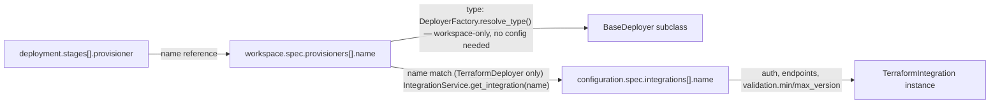

# Terraform Integration Resolution: Fall Back to Type When No Name Match Exists

- Status: proposed
- Date: 2026-09-14

## Context and Problem Statement

`TerraformDeployer` resolves which `TerraformIntegration` instance to use for a
stage by the **provisioner's `name`**, not its `provisioner` (type) field:

1. `BaseDeployer._resolve_iac_model()`
   ([src/strata/deployers/base_deployer.py](../../src/strata/deployers/base_deployer.py#L299))
   matches `stage.provisioner` (or `topology.provisioner`) against
   `workspace.spec.provisioners[*].name` and returns that `WorkspaceIacModel`,
   which carries both a `name` (e.g. `control_infra`) and a `provisioner` type
   (e.g. `terraform`).
2. `TerraformDeployer.validate_environment()`
   ([src/strata/deployers/terraform_deployer.py](../../src/strata/deployers/terraform_deployer.py#L182))
   calls `self._get_terraform_integration(self._iac_model.name)` —
   i.e. it looks the integration up by the **provisioner's name**, not by
   `self._iac_model.provisioner` (the type string `"terraform"`).
3. `_get_terraform_integration()`
   ([src/strata/deployers/terraform_deployer.py](../../src/strata/deployers/terraform_deployer.py#L856-L871))
   does an exact `IntegrationService.get_integration(name)` registry lookup and
   raises `RuntimeError` if nothing is registered under that exact name.
4. The registry is only populated from `configuration.spec.integrations[]`,
   keyed by each spec's own `name`
   ([src/strata/services/integration_service.py](../../src/strata/services/integration_service.py#L114-L133)).

Net effect: **every** workspace provisioner name that uses Terraform must have a
same-named `type: terraform` entry in `configuration.spec.integrations`, even
when all of them share identical configuration. A workspace with three
semantically-named Terraform provisioners (`control_infra`, `core_iac`,
`env_iac` — control-plane, spoke/customer, and per-environment instance stacks)
requires three near-identical integration declarations purely to satisfy the
name-match, which is boilerplate duplication for the common case.

### The full resolution chain — and where config-linking is and isn't involved

Stage → workspace is always a name reference; workspace → configuration is a
second, independent hop that **only `TerraformDeployer` ever takes**:

- **Stages → workspace**: `stage.provisioner` (or `stage.topology`) resolves
  purely against `workspace.spec.provisioners[].name`. The *type*
  (`terraform`/`ansible`/`helm`/...) that picks the `BaseDeployer` subclass
  also comes from workspace alone — `DeployerFactory.resolve_type()`
  ([src/strata/deployers/factory.py](../../src/strata/deployers/factory.py#L109-L154))
  only calls `deployment_service.get_workspace_service()`, never touches
  `ConfigurationService` or `IntegrationService`. Dispatch works identically
  for every provisioner type and never needs configuration loaded.
- **Workspace → configuration**: this second hop is **Terraform-only**.
  `AnsibleDeployer`, `ComposeDeployer`, `HelmDeployer`, `ScriptDeployer`, and
  the sync deployers (`argocd`/`flux`) don't call `IntegrationService` at all —
  they shell out and check their binary on `PATH` directly. Only
  `TerraformDeployer.validate_environment()` takes the extra name-match hop
  into `configuration.spec.integrations[]`, and only to obtain
  `authentication`, `endpoints`, and `validation.{min,max}_version` (an
  acceptable-range check on whatever `terraform`/`tofu` binary is on `PATH`) —
  not a version *pin*. The pin itself (`WorkspaceIacModel.version`, set by
  `strata versions`) already lives entirely on the workspace side
  ([src/strata/models/workspace_model.py](../../src/strata/models/workspace_model.py#L497-L502))
  and never needs configuration to resolve.

So the fallback proposed below narrows an already Terraform-specific,
already-narrow link (auth/endpoints/validation-range only) — it does not
introduce any new coupling between workspace and configuration, and it has no
bearing on deployer dispatch or on any other provisioner type.

### Why it's keyed by name today (not an oversight)

`TerraformIntegration._get_instance_key_static()`
([src/strata/integrations/terraform.py](../../src/strata/integrations/terraform.py#L26-L44))
keys its singleton cache by `config.name` specifically so **two Terraform
provisioners can have independent configuration** — different pinned
`version:`, different `validation.command`, different backend/cloud auth. If
resolution instead matched purely on `provisioner: terraform` (type), every
Terraform-typed provisioner in a workspace would collapse onto one shared
integration instance, which breaks the moment two of them need divergent
config (e.g. a different Terraform version for legacy vs. new stacks).

Elsewhere in the codebase, lookups genuinely are by *type* instead of by
*name* — e.g. `ValueController._get_integration_by_type()` for secret stores
(`store: bitwarden`), because a secret reference only ever needs "some
integration of this type," never a specific named instance. That's a
different shape of problem (no per-instance config to disambiguate), which is
why it can afford to be type-only where Terraform's can't.

## Considered Options

- **A. Status quo.** Keep exact by-name matching only. Simple, already
  implemented, but forces one integration declaration per provisioner name
  even when configuration would be identical across all of them.
- **B. Fall back to type when no name match exists.** Try
  `get_integration(name)` first (preserves today's per-instance-config
  capability); if nothing is registered under that exact name, fall back to
  the single enabled `type: terraform` integration in the registry (error if
  zero or more than one exist and none match by name — ambiguous, don't
  guess). Removes the boilerplate for the common case (all provisioners share
  one Terraform config) while still allowing an explicit override for the
  divergent case (declare an integration whose `name` matches the provisioner
  that needs different config).
- **C. Add an explicit `integration:` reference field to `WorkspaceIacModel`.**
  Decouples the provisioner's `name` (used for stage/topology references) from
  the integration it resolves to (`integration: terraform_v1_5`). Most
  flexible, but doesn't remove the duplication problem — every provisioner
  still needs an explicit field pointing at *something*, and it's a new schema
  field/concept to document and migrate existing workspaces toward.

## Decision Outcome

Chosen: **Option B** — name match first, type-based fallback second — because
it removes the common-case duplication without giving up the per-instance
override capability the singleton design was built for, and requires no new
schema field or migration.

### Consequences

- Good: workspaces with multiple same-config Terraform provisioners need only
  one `type: terraform` integration declaration, not one per provisioner name.
- Good: the override path still works unchanged — declaring an integration
  named exactly like a provisioner (e.g. `control_infra`) continues to bind
  only to that provisioner, for the divergent-config case.
- Bad: introduces an ambiguity case to handle explicitly — if no name match
  exists and more than one `type: terraform` integration is registered, which
  one wins? Must raise a clear error rather than silently picking one, so
  operators are told to either name-match or reduce to a single terraform
  integration.
- Bad: slightly less "obvious" resolution order than pure exact-match; must be
  documented (`docs/help/integrations.md` and provisioner docs) so operators
  understand why an integration was or wasn't picked up.

## Remaining Work

<!-- Required while Status is proposed / in-progress / partially-implemented.
     Remove this section once Status becomes implemented. -->

- Not started — nothing in this ADR has been implemented yet.
- Implement fallback logic in `TerraformDeployer._get_terraform_integration()`
  (or a shared helper if other type-based provisioners need the same pattern
  later): try exact name match, then fall back to the sole registered
  `type: terraform` integration, raising a clear error when the fallback set
  has zero or more than one candidate.
- Add unit tests: name match wins when both exist; fallback succeeds with
  exactly one `type: terraform` integration and no name match; fallback raises
  with zero or multiple candidates and no name match.
- Update `docs/help/integrations.md` and provisioner-related docs to describe
  the two-step resolution order.
