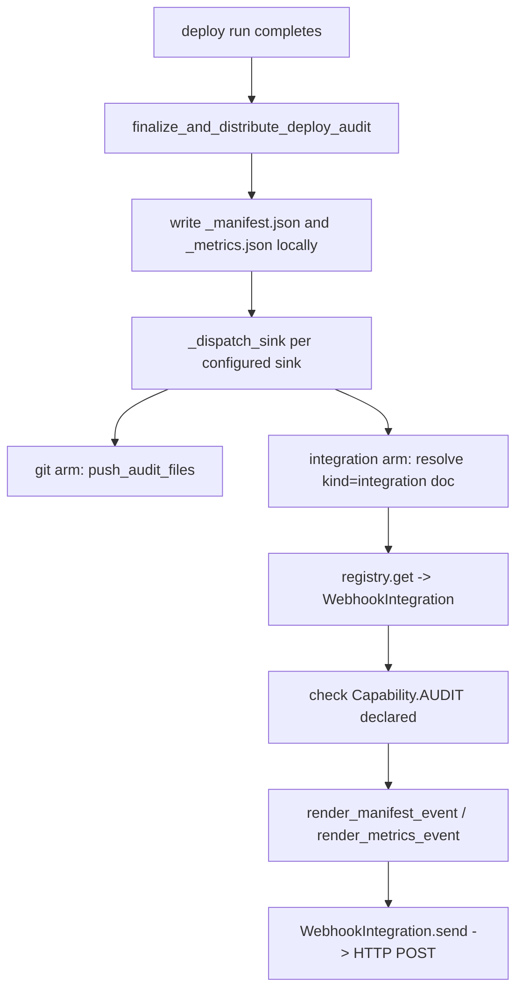

# Audit Sink Dispatch (Layer 4) — Design

- Status: **implemented (2026-10-03)** — webhook, OTel, and Azure Sentinel
  sinks all shipped and live. Jinja body templating and remaining vendor
  classes (Splunk HEC, ELK-direct, syslog/CEF) deliberately deferred (see
  Remaining Work).
- Last updated: 2026-10-03

## Overview

[audit-trail.md](../work/audit-trail.md)'s Layer 4 is "send the audit evidence
somewhere durable and tamper-resistant." v2 ships Layer 2 (local
manifest/metrics + `git` sink push) and the full CloudEvents+ECS *rendering*
for Layer 4 — but nothing ever calls that renderer. A configured
`integration` sink produces an explicit info-level finding and sends
nothing.

This doc covers closing that last gap, starting with a **generic HTTP
webhook** as the first and only concrete sink, deliberately ahead of any
vendor-specific (Splunk/ELK/Sentinel) class.

### The problem this design is reacting to

v1 shipped **five** SIEM backends (`sentinel`, `elk`, `otel`, `splunk` HEC,
`syslog`+CEF). Real usage, confirmed directly in `config-deploy`'s own
`config/audit.yaml`: **one** declared sink (`elk`), `enabled: false` — zero
actually active. That is the exact "declared-but-unread machinery" failure
[audit-trail.md](../work/audit-trail.md)'s own "Lessons from v1's own defects" #1
describes, reproduced at the integration layer.

The opposing risk is just as real, and was raised directly: *"if not
available then users find it lacking, but if we just add integrations we
have stuff that is never used."* Both failure modes are live, so the design
has to answer both, not trade one for the other.

## Current Design

### What already exists (verified against source, not assumed)

| Piece                                                                          | Where                                                                               | State                                                                                  |
| ------------------------------------------------------------------------------ | ----------------------------------------------------------------------------------- | -------------------------------------------------------------------------------------- |
| Sink config surface (`integration`/`git` arms, `enabled`/`required`/`events`)  | `models/audit_model.py::AuditSinkModel`                                             | Complete — **no schema change needed**                                                 |
| Admission/gating (event defaults, `event_overrides`, per-sink `events` filter) | `controllers/audit_run.py::_dispatch_sink()`                                        | Runs today, then stops short of sending                                                |
| CloudEvents 1.0 + ECS rendering                                                | `controllers/audit_event_rendering.py`                                              | Complete + unit-tested; its own docstring says *"Nothing calls this yet in this pass"* |
| HTTP transport                                                                 | `utils/transport.py::http_request()`, `integrations/base.py::Integration.request()` | Proven by the Infisical/AppConfig resolvers                                            |
| Lazy `type` -> class registry                                                  | `integrations/registry.py::_KNOWN`                                                  | `"webhook"` currently sits in `_KNOWN_V1_TYPES` ("known v1 type, not built yet")       |

### What is missing

- **No dispatched-on audit capability.** `audit` exists today only as the
  `x-audit` *extension* string, and `integrations/capabilities.py`'s own
  docstring is explicit that an `x-`-prefixed capability "is carried by
  `IntegrationModel` but never reaches here — there is nothing to dispatch
  it to." The one existing test fixture uses `x-audit` precisely because no
  core capability exists.
- **No `AuditSinkIntegration` ABC** — every other capability family
  (`StoreIntegration`, `InfraIntegration`) has one.
- **No concrete sink class of any kind.**
- **`_dispatch_sink()` never calls the renderers.**

## Decisions

### D1 — Standards-compliant default, not a generic adapter (for now)

The question raised was whether to (a) comply with the most-used standards
and make more easy to add, or (b) ship a Jinja2-templated generic adapter.

**These are not alternatives — they are default and override.** v2 already
renders a complete CloudEvents 1.0 + ECS envelope. That stays the default
body, so zero configuration produces a standards-compliant event. A body
template is only ever needed when a target wants a *different* shape.

**The template half is deliberately deferred** (see Remaining Work) — the
CloudEvents default fully covers the generic-webhook case, and building
template machinery before a real target needs a non-default shape is the
same anticipation mistake this design exists to avoid.

### D2 — A generic template can never cover every SIEM; don't pretend otherwise

Worth recording explicitly, because it is easy to discover too late: **not
every SIEM protocol is expressible as "POST a templated body."**

| Target                                                     | Expressible as URL + headers + body?                                                                                              |
| ---------------------------------------------------------- | --------------------------------------------------------------------------------------------------------------------------------- |
| Generic webhook, Splunk HEC, ELK/Logstash, Loki, Datadog   | Yes                                                                                                                               |
| OTLP/HTTP JSON (`/v1/logs`)                                | No as a flat template — needs a nested `resourceLogs[].scopeLogs[].logRecords[]` envelope built in code, not substituted into one |
| **Azure Sentinel** (Monitor Logs Ingestion API, DCR-based) | No — **corrected 2026-10-03**, see below                                                                                          |
| syslog / CEF                                               | No — not HTTP at all (UDP/TCP socket)                                                                                             |

**Correction, checked directly against v1's real source
(`e:\SourcesXYZ\strata\src\strata\integrations\siem\sentinel_integration.py`):
Sentinel does *not* need an HMAC-SHA256 signature.** That requirement
belongs to the legacy, now-deprecated HTTP Data Collector API — v1's actual
implementation targets the modern **Monitor Logs Ingestion API** (DCR-based):
`POST {dce-endpoint}/dataCollectionRules/{dcr-id}/streams/{stream-name}
?api-version=2023-01-01`, authenticated with a plain AAD bearer token via
`azure.identity.DefaultAzureCredential` — no custom cryptography at all.
`azure-identity` is already a strata dependency and already the established
pattern for Azure auth here (`integrations/azure_keyvault_resolver.py`,
`TRANSPORTS={"sdk"}`). The original claim in this doc was wrong; recorded
as a correction, not silently fixed, since the conclusion it fed ("write a
small dedicated class, don't grow the template language") still holds —
Sentinel needs a DCR/stream URL plus a credential-chain token, which is
still real code, just simpler real code than first thought.

OTLP/HTTP is a similar case in the other direction: no cryptography, but
still not template-shaped — the nested `resourceLogs` structure needs real
code to assemble, the same reasoning D2 already applies to Sentinel.

**Rejected: giving the template a mini-stdlib** (`hmac_sha256`,
`now_rfc1123`, `base64`) to close gaps like this. That is inventing a
crypto-capable programming language in YAML, and this codebase already
rejected the same shape of idea once:
[path-conventions.md](path-conventions.md) declined to build "a small
YAML-expression/JSONPath interpreter" and chose one small dedicated function
per real check instead. The equivalent here is one small dedicated class
per target, written when somebody actually needs it — which, per D3's
amendment below, two of them now do.

### D3 — Vendor classes are gated on evidence, docs carry vendor knowledge

No Splunk/syslog class is written until a real consumer has one `enabled:
true`. This matches the "two or more independently-written real consumers
converging" bar already applied elsewhere in this repo.

What prevents the "it feels lacking" failure mode is **not** shipping five
classes — it is that one generic sink plus a documented config example per
target lets a user send to Splunk HEC / any plain webhook *today*, with
zero vendor code on our side. The vendor-specific knowledge lives in docs,
not in unused Python.

**Amendment (2026-10-03) — OTel and Sentinel meet the bar, on two different
grounds, each real rather than speculative:**

- **OTel** — a real, already-running consumer: "our ELK stack can handle
  otel." Confirmed directly that modern Elastic accepts OTLP natively
  (APM Server/Elastic Agent/Elastic Cloud), so this is not a bet on the
  ecosystem, it is today's actual infrastructure. It is also structurally
  different from "one more vendor class": an OTel Collector itself fans
  out to Splunk/Elastic/Datadog/Sentinel/Loki as *its own* job, so
  supporting the one OTLP protocol well is closer to "stop writing SIEM
  classes" than to "write a fourth one."
- **Sentinel** — a real, named, planned consumer: "will be part of the
  control layer later." Not evidenced by an already-`enabled: true` sink
  (the bar's literal wording), but a concrete, named future consumer is a
  materially different thing from the anticipatory "might be nice" this
  bar exists to filter out — treated as meeting it.

Splunk HEC/ELK-direct/syslog-CEF remain deferred; no named consumer for any
of them yet.

### D4 — Credentials come from the environment

`configuration.token_env_var` names an environment variable whose value is
injected as an `Authorization` header. This follows
`integrations/infisical_resolver.py`'s established and explicitly documented
convention ("Real credentials are **always** environment variables"), needs
no new secret-resolution plumbing, and is CI-native.

### D5 — One request per event, not batched

A webhook send is one HTTP request per admitted event type, matching the
renderers' one-event-per-call shape and the existing per-type `events`
filter. Batching (what Splunk HEC and ELK bulk would eventually prefer) is
deliberately not designed in now — recorded here so the choice is visible
rather than accidental.

## Planned shape



Five changes, each small:

1. **`Capability.AUDIT = "audit"`** (`models/integration_model.py`) —
   promotes audit from the `x-audit` extension tier to the closed core tier.
   `VALID_INTEGRATION_CAPABILITIES` is derived (`frozenset(Capability)`), so
   it updates automatically with no second edit.
2. **`AuditSinkIntegration(Integration)`** (`integrations/capabilities.py`) —
   one abstract method, mirroring `StoreIntegration.resolve()`'s shape:
   `send(self, event: dict[str, Any]) -> None`, raising `IntegrationError`
   on failure.
3. **`WebhookIntegration`** (new `integrations/webhook.py`) — `type:
   webhook`, `TRANSPORTS = {"http"}`, `CAPABILITIES = {Capability.AUDIT}`.
   Uses the inherited `self.request("POST", "", ...)`, which already joins
   onto `spec.endpoints.address`. Two configuration knobs only:
   `configuration.headers` (static, non-secret) and
   `configuration.token_env_var` (D4). Note `http_request()` returns 4xx/5xx
   as a normal `HttpResult`, never an exception — `send()` must check
   `status` explicitly and raise `IntegrationError` itself.
4. **Registry wiring** (`integrations/registry.py`) — add `"webhook":
   ("strata.integrations.webhook", "WebhookIntegration")` to `_KNOWN` and
   remove `"webhook"` from `_KNOWN_V1_TYPES`.
5. **`_dispatch_sink()`** (`controllers/audit_run.py`) — replace the
   info-finding stub: resolve the Integration document, instantiate, verify
   `Capability.AUDIT`, render per admitted event type, `send()`. Failure
   reuses the `required` -> error-vs-warning escalation already proven on
   the `git` arm.

### Testing

A fake `AuditSinkIntegration` following `test_integrations_capabilities.py`'s
existing conventions (no real network): both event types dispatched; the
per-sink `events` filter respected; a send failure warns when `required:
false` and fails the run when `required: true`; an integration that does not
declare `Capability.AUDIT` produces a clear diagnostic rather than a crash.

## Sink design — OTel (OTLP/HTTP JSON)

`type: otel`, new `integrations/otel.py::OtelIntegration`. Forwards to any
OTLP-compatible backend — Elastic (the named real consumer), Grafana Loki,
Datadog, an OTel Collector that itself fans out further.

- **`TRANSPORTS = {"http"}`, `CAPABILITIES = {Capability.AUDIT}`.** Uses the
  inherited `self.request()`, same as `WebhookIntegration` — OTLP/HTTP JSON
  is plain REST, no SDK/protobuf dependency needed (confirmed: v1's own
  implementation is `requests`-only, no `opentelemetry-*` package).
- **URL**: `{spec.endpoints.address}/v1/logs`, fixed — not configurable,
  since it is the protocol's own path, not a deployment choice (same
  reasoning `layout.py` applies to fixed, non-configurable locations).
- **Body**: one OTLP `LogsServiceRequest`, built fresh per call —
  ```json
  {
    "resourceLogs": [{
      "resource": {"attributes": [
        {"key": "service.name", "value": {"stringValue": "strata-audit"}}
      ]},
      "scopeLogs": [{
        "scope": {"name": "strata.audit"},
        "logRecords": [{
          "timeUnixNano": "<event's own 'time', converted, not wall-clock>",
          "severityNumber": 9,
          "severityText": "INFO",
          "body": {"stringValue": "<event, json.dumps'd whole>"},
          "attributes": [{"key": "event.type", "value": {"stringValue": event["type"]}}]
        }]
      }]
    }]
  }
  ```
  **One real improvement over v1's own implementation, not just a port**:
  v1 uses `time.time()` for `timeUnixNano` — the *send* time, not the
  event's own occurrence time, silently wrong on a retried/delayed send.
  v2's version already carries a real timestamp (`event["time"]`, an
  ISO-8601 string the renderer already set from `completed_at`/
  `timestamp`) — parse and convert that instead of calling the clock
  again. `severityNumber`/`severityText` stay hardcoded (`9`/`"INFO"`): v2
  has no severity concept of its own to map from, same honest-adaptation
  reasoning `_platform_reference()` already uses elsewhere.
- **No auth knobs beyond `WebhookIntegration`'s own** (`headers`/
  `token_env_var`/`auth_scheme`) — real OTel Collector deployments
  typically sit behind network-level trust (mTLS, private networking) or a
  simple bearer token, both already covered.

## Sink design — Azure Sentinel (Monitor Logs Ingestion API)

`type: sentinel`, new `integrations/sentinel.py::SentinelIntegration`.

- **`TRANSPORTS = {"sdk"}`, `CAPABILITIES = {Capability.AUDIT}`** — not
  `"http"`: token acquisition needs `azure.identity.DefaultAzureCredential`
  (already a dependency), matching `AzureKeyVaultResolver`'s own precedent
  exactly (SDK carries its own auth chain; reimplementing that chain by
  hand over `http_request()` would be the leaner-is-worse direction ADR-0021
  already rejected once). The actual event POST is still a plain REST call
  (`requests`, via a raw call, not a dedicated Monitor Ingestion SDK client
  — v1 did not pull one in either, and there is no other reason to here).
- **Two required configuration keys** (`spec.configuration`):
  `data_collection_rule_id` (the DCR's immutable ID) and `stream_name` (the
  custom stream, e.g. `Custom-DeployAudit_CL`). Missing either raises
  `IntegrationError` before attempting a token/send, same "fail before any
  side effect" discipline already used elsewhere in this codebase.
- **URL**: `{spec.endpoints.address}/dataCollectionRules/
  {data_collection_rule_id}/streams/{stream_name}?api-version=2023-01-01`
  — `endpoints.address` is the Data Collection Endpoint (DCE), a real,
  separate Azure resource from the DCR itself.
- **Auth**: `DefaultAzureCredential().get_token("https://monitor.azure.com/.default")`,
  cached on the instance (token acquisition is not free; a long deploy
  dispatching multiple events should not re-authenticate per event) — same
  per-instance-cache granularity `registry.py`'s own docstring already
  reasons about ("short-lived commands don't have" the cross-call reuse
  problem a process-wide singleton would solve, but *this* instance's own
  lifetime, across its own `send()` calls within one dispatch loop, is
  exactly that problem, scoped correctly).
- **Body**: the Logs Ingestion API wants a **JSON array**, confirmed
  directly from v1's real implementation (`tagged = [{...} for p in
  payloads]`, posted as the whole body) — unlike `WebhookIntegration`'s
  single-object POST, `send()` here posts `[event]`, a one-element array,
  keeping D5's one-request-per-event rule (an array of one, not a batch of
  many).

## Related Decisions

- [ADR-0021](../decisions/0021-integration-layer.md) — the integration
  layer, capability ABCs, lazy registry, `x-` extension tier, and
  `http_request()`; this design adds one capability and one class within
  that existing structure rather than inventing a parallel one.
- [audit-trail.md](../work/audit-trail.md) — the parent design: the four-layer
  evidence model, the CloudEvents+ECS envelope, and the sink config surface
  this dispatch consumes.
- [path-conventions.md](path-conventions.md) — precedent for D2's rejection
  of a generic expression/template language in favour of one small dedicated
  function per real case.


## History

- Generic webhook ships first; a Jinja2 body template and per-vendor classes (Splunk HEC, ELK-direct, syslog/CEF) are deliberately deferred - confirmed that no generic template can cover Sentinel/syslog's real shape, so that is a known, decided boundary, not a later surprise.
- OTel and Azure Sentinel sinks were added once real, named consumers existed (an already-running ELK/OTel stack; a planned Sentinel control-layer target) - not built ahead of evidence.
- Corrected an earlier claim about Sentinel while designing it: v1's real `sentinel_integration.py` has no HMAC signature - that belongs to the legacy HTTP Data Collector API. The real target is the modern DCR-based Monitor Logs Ingestion API, authenticated with a plain AAD bearer token (`DefaultAzureCredential`, already an established pattern via `AzureKeyVaultResolver`).
- Every integration-arm failure mode (missing Integration document, unresolvable type, missing `Capability.AUDIT`, failed send) routes through one shared `_record_sink_failure()` warn-vs-fail flag, matching the `git` arm - a misconfigured audit sink never takes down a deploy that already succeeded. A disabled Integration document is a deliberate off-switch, not an error.
- Retry/backoff and batching are deliberately left unsolved for now - the `git` arm has neither either, and there is no real batching target (Splunk HEC/ELK bulk) yet.
