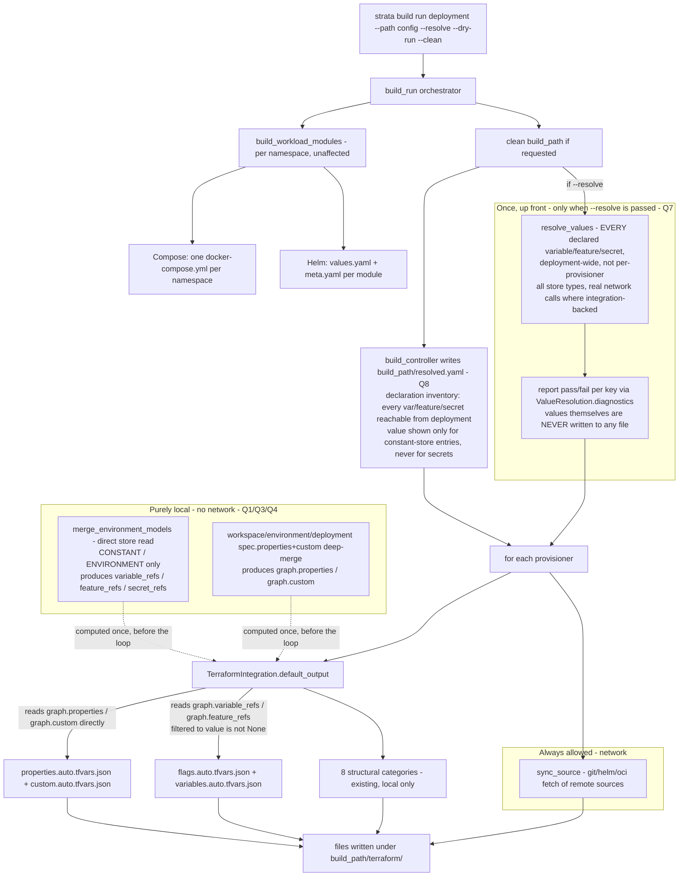
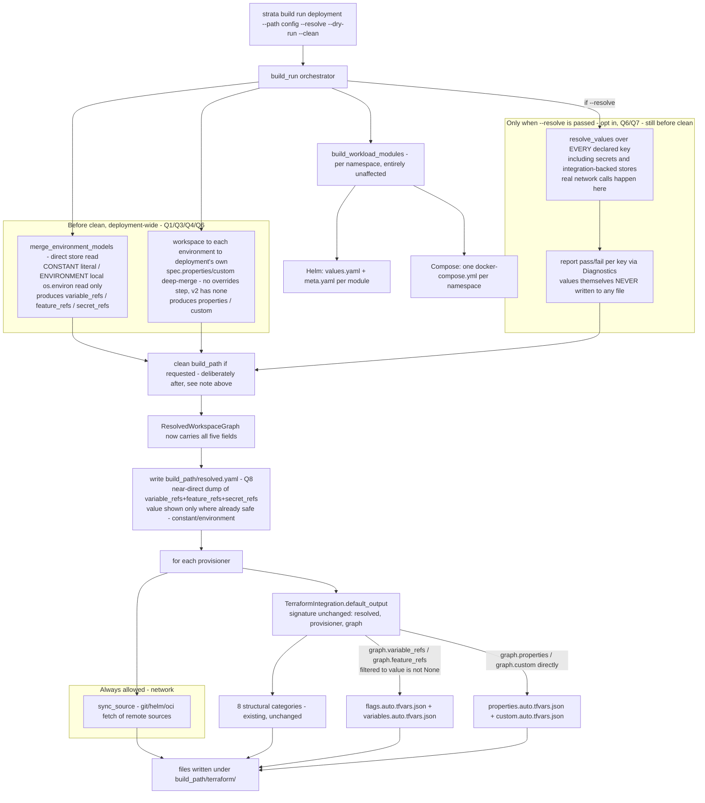

# Build-Time Value Categories (`features`/`variables`/`properties`/`custom`)

Status: implemented

## Overview

`TerraformIntegration.default_output()` is missing four of v1's real output
categories: `features`/`variables`/`properties`/`custom`. Found while
investigating the `OutputProfileModel`/`emits` revisit (see
[build-command.md](build-command.md)'s `default_output()` table), which is
blocked on this: `emits` can't gate categories that don't exist yet.

**Important correction (2026-09-25):** the gap is *not* "`resolved.values`
is silently discarded, so wire it in." `default_output()` does `del
resolved` today because `resolved: ValueResolution` is genuinely unused —
and per the Design Principle and Q1 below, none of the four new categories
consume it either. `ValueResolution`'s only real consumer, ever, is
`resolve_expr_tokens()` (substituting `${var:}`/`${secret:}`/`${feature:}`
tokens embedded inside already-built categories like `dns`/`networks`) —
which **does not exist yet** (Phase 3, a separate, already-tracked item, out
of scope here). See the diagram below. Don't conflate "`resolved` is
unused" with "these categories are missing" — they're unrelated facts that
happen to show up in the same method.

This doc scopes the fix to Terraform's own missing categories only. It does
**not** design `OutputProfileModel`/`emits` itself — that is explicitly the
next, separate step once these categories are real (see Remaining Work).

### Where each input actually goes



The point of the diagram: `--resolve`'s validation and the `resolved.yaml`
manifest both run **once, immediately after cleaning**, deployment-wide —
neither depends on which provisioner is being processed, so neither belongs
inside the per-provisioner loop. Only *after* that does `build_run()` iterate
provisioners, each doing its own `sync_source()` (the one legitimate
build-time network call besides `--resolve` itself) and `default_output()`
(now with the four new categories fed entirely by local model reads, never
by `resolved`/`ValueResolution`).

*(This diagram predates the `ValueReference`/`ResolvedWorkspaceGraph`
refinement below — it's kept because the point it makes, "`resolved` has
no arrow into the new work," still holds and explains *why* the design
went this way. For the complete, current, implementation-ready picture,
see "Final design (summary)" below.)*

## Final design (summary)

Everything below is decided (Q1-Q8, all resolved). One coherent read,
top to bottom, in execution order — cross-references point at the
"Open questions" section below for the full reasoning behind each choice.

1. **`build_run()` starts.** If `--env-file` was passed (repeatable), each file is parsed and merged into the real `os.environ` via `setdefault` (Q9 — a real, already-exported env var always wins over a file's value).
2. **Before cleaning anything** — deployment-wide, not per-provisioner: a new `build_controller.py`-level step resolves the deployment's reachable environments and calls `merge_environment_models()` to get `(variables, secrets, features)` typed dicts (Q1/Q4). From these it builds, purely locally, no network:
   - `variable_refs`/`feature_refs`/`secret_refs: list[ValueReference]` — one entry per declared key. `CONSTANT` stores get their literal value (cast per `VariableValueType` where declared, Q2); `ENVIRONMENT` stores get a local `os.environ` read. Everything else (secrets always; any integration-backed store) gets `value=None` — structurally impossible to populate wrong (Q4/Q5).
   - `properties`/`custom: dict[str, Any]` — deep-merged `workspace.spec.{source}` → each reachable `environment.spec.{source}` → the deployment's own `spec.{source}` (Q3 — a deliberate improvement over v1's actual, docstring-contradicting behavior). **No `overrides.{source}` step** — confirmed while implementing Q3 that v2's `EnvironmentSpecModel` has no `overrides` field at all (deliberately never ported, 0/26 real environment documents used it in v1).
   - **`--resolve` (opt-in, Q6/Q7):** if passed, *additionally* calls `resolve_values()` over **every** declared key (including secrets and integration-backed stores, reusing the same three dicts above — no second reachability walk) — real network calls happen here, reported via `Diagnostics` (`.info()`/`.error()` per key), merged into `build_run()`'s own returned `Diagnostics`. **Resolved values are never written to any file, with or without the flag.** Without `--resolve`, `resolved: ValueResolution` is just an empty placeholder — no network call beyond `sync_source()` happens anywhere in the default path (Q6).

   **Deliberately before `clean`, not after** (implementation detail worth documenting explicitly — this diverged from an earlier draft of this section): if deriving these values or `--resolve`'s validation fails, `build_path` is never touched at all. Cleaning first and failing after would instead leave a wiped, empty build directory behind on the same error — a strictly worse failure mode for no benefit, since none of this step touches the filesystem.
3. **Then `build_path` is cleaned if requested**, and these five values populate new fields on `ResolvedWorkspaceGraph`, built once and handed unchanged to every provisioner (Q4). `build_controller.py` then writes `build_path/resolved.yaml` (Q8) — a plain, non-auto-loaded YAML manifest, essentially a direct serialization of `variable_refs + feature_refs + secret_refs` (+ `properties`/`custom`). Safe to dump wholesale: every field is either a declaration or a value already destined for build output anyway.
4. **Then, per provisioner:** `sync_source()` (the one other legitimate build-time network call) followed by `integration.prepare()`. For Terraform, `default_output()`'s signature is **unchanged** (`resolved`, `provisioner`, `graph`) — it now additionally reads `graph.variable_refs`/`graph.feature_refs` (filtered to `value is not None`) to emit `flags.auto.tfvars.json`/`variables.auto.tfvars.json`, and `graph.properties`/`graph.custom` directly to emit `properties.auto.tfvars.json`/`custom.auto.tfvars.json` — alongside the 8 structural categories already built. Zero merge/reachability logic inside the integration itself.
5. **Helm/Compose are untouched** — both already discard `resolved` for the same reason Terraform used to (Phase 3 token substitution, deferred, out of scope here); neither has a category-file convention that these four new categories would map onto.



## Design Principle: shared inputs, per-integration translation
- change `build_run()`/`build_controller.py`'s orchestration to special-case
  Terraform,
- be confused with lifecycle scripts' own translation of the same source
  data into `STRATA_*` env vars — that's a sibling concern, tracked
  separately in [lifecycle.md](lifecycle.md)'s open Context-contract
  question. Same underlying data, different consumer-owned rendering; do not
  design them together.

Any future provisioner integration (e.g. an Ansible `default_output()`
writing `extra-vars.yml`) gets the same `resolved`/`graph` inputs and does
its **own** translation — it does not depend on or reuse Terraform's tfvars
translation.

### Build vs. deploy: a hard network-call boundary, not just a style choice

The **only** network calls `build run` is allowed to make are `sync_source()`'s
own — fetching remote `git`/`helm`/`oci` sources so they exist locally to
build from (ADR-0022/`remotes.md`). That's fetching *inputs* (source code,
charts), not *resolving values* — a different thing that happens to also be
network I/O.

Resolving a **value** (variable/secret/feature) from an integration-backed
store (`vault`/`consul`/`azure-appconfig`/`flagsmith`/etc.) is a *second*
kind of network call, and it must never happen at build time — only
`CONSTANT` (literal) and `ENVIRONMENT` (local env var) stores belong there.
Per v1's own precedent, integration-backed value resolution is deploy's job:
the deployer resolves those and injects them right before the tool runs
(`TF_VAR_<KEY>` env vars, never a file), because `deploy run` doesn't exist
in v2 yet. Q6 below documents a real gap this session found: v2's current
code does not yet enforce this second boundary at all — `build run` already
attempts integration-backed *value* resolution today (source-fetching is
fine and unaffected).

## Real v1 evidence (`terraform_builder.py`)

Four categories, each built by its own method, called from the builder that
assembles `default_output()`'s file set:

**`flags.auto.tfvars.json`** ← `_build_feature_flags_vars(deployment_service) -> Dict[str, bool]`
- Reads `deployment_service.get_environment_service().get_features()` directly — does **not** consume `ResolvedValues` at all.
- Only `FeatureStoreType.CONSTANT` and `.ENVIRONMENT` stores; **integration-backed stores (Flagsmith etc.) are skipped** — docstring: "the deployer writes those from `ResolvedValues` before `terraform init`" (a v1 **deploy-time** mechanism, not build-time).
- Truthiness coercion: bool passthrough; string checked against `("false","0","no","")` case-insensitive; else `bool(raw)`.

**`variables.auto.tfvars.json`** ← `_build_flat_variables(deployment_service) -> Dict[str, Any]`
- Same pattern: reads `get_variables()` directly, `CONSTANT`/`ENVIRONMENT` stores only.
- `_emit_variable_value(var)`: if `var.type` (a `VariableValueType`) is declared, value is emitted as its **native Python type** (bool/int/float/dict/list) — Pydantic already validated type/value consistency. Without `type`, value passes through as-is (string stays string; dict/list also pass through as JSON supports them).

**`properties.auto.tfvars.json`** / **`custom.auto.tfvars.json`** ← `_resolve_merged_properties(deployment_service, source="properties"|"custom") -> Dict[str, Any]`
- **Correction (2026-09-25): the docstring is misleading — checked all three real call sites (single-file mode, multi-source mode, and the main flat-dump emission), not just the function body.** The docstring claims `"workspace → environment → deployment"`, but the real merge chain is **`workspace.spec.{source}` → `environment.spec.{source}`(+`environment.spec.overrides.properties`, `properties` only)** — `deployment_service` is passed in only to fetch the workspace/environment sub-services; the deployment's own `spec.properties`/`spec.custom` is never read anywhere in this function or at any of its call sites. The "→ deployment" clause in the docstring does not correspond to real, working code.
- Uses the same `deep_merge()` utility as elsewhere in v1.

## v2 current state

- `ValueResolution.values` (`value_controller.py`) is a **flat `dict[str, str]`** — every reachable variable+feature key, secrets excluded, all values **stringified** regardless of origin (ADR-0022 D1a). No store-type/origin metadata survives into it.
- `build_time_keys()`/`resolve_values()` already do the reachability + secret-exclusion walk correctly (`_reachable_environments()` → `merge_environment_models()` → per-key resolve). `merge_environment_models()` returns `(variables, secrets, features)` as separate dicts **keyed by `VariableStoreModel`/`SecretStoreModel`/`FeatureStoreModel` objects** — i.e., the origin-preserving data v1's builders read directly is already sitting right there, one layer up from `ValueResolution`, just not threaded to `default_output()`.
- `properties`/`custom` fields exist today on `WorkspaceModel` (`workspace_model.py:177,179`), `EnvironmentSpecModel` (`environment_model.py:77,82` — docstring already documents the intended chain: *"Tenant properties merge in first, then this, then the deployment's own"*), and `DeploymentModel.spec` (`deployment_model.py:261,264`).
- **But only the deployment-level layer is actually merged today**, via `merge_deployment_specs()` (`deployment_service.py`) — a raw-dict deep-merge of tenant-defaults-as-partial-deployment → extends chain → deployment's own (ADR-0024). `merge_environment_models()` handles `variables`/`secrets`/`features` only; it has no `properties`/`custom` handling. **Workspace-level and environment-level `properties`/`custom` are currently dead fields — nothing reads them.**
- `TerraformIntegration.default_output(resolved, provisioner, graph)`: `graph: ResolvedWorkspaceGraph` carries `workspace` + 7 structural collections only — no deployment/environment model references. `InfraIntegration.prepare()` already accepts `**kwargs: Any` but does not forward them to `default_output()` — an unused, ready-made extension point.

### Concrete shape decided for `ResolvedWorkspaceGraph`'s new fields (Q4)

Not raw `DeploymentModel`/`list[EnvironmentModel]` — derived, minimal, and
safe to dump wholesale for debugging/audit (no secret or integration-backed
*value* ever reaches it, only declarations):

```python
@dataclass(frozen=True)
class ValueReference:
    """One declared variable/feature/secret — never a resolved
    integration-backed value."""
    key: str
    store: str                                  # "constant", "environment", "vault", ...
    description: str | None = None
    value_type: VariableValueType | None = None  # variables only
    value: Any = None                            # populated ONLY for constant/environment
                                                  # stores; always None for secrets and any
                                                  # integration-backed store
```

`ResolvedWorkspaceGraph` gains: `variable_refs: list[ValueReference]`,
`feature_refs: list[ValueReference]`, `secret_refs: list[ValueReference]`
(mirrors v1's own naming), plus `properties: dict[str, Any]` and
`custom: dict[str, Any]` (Q3's final merged dicts). All five are computed
**once**, in `build_controller.py`, before the per-provisioner loop —
`default_output()` does zero merge/reachability logic, it just reads
ready-made fields off `graph`.

## Open questions (must resolve before implementing)

1. **`ValueResolution` is not the source for these categories at all — RESOLVED.** `ValueResolution.values` has no variable/feature split and no type fidelity — but per the corrected Overview above, that's not something to work around, it's confirmation these categories should **bypass `ValueResolution` entirely**, exactly like v1 does: `_build_feature_flags_vars()`/`_build_flat_variables()` never consume `ResolvedValues`, they read `env_service.get_features()`/`get_variables()` directly, filtered by store type. v2 has the equivalent one layer up (`merge_environment_models()`'s three typed dicts). **Recommendation:** re-derive `features`/`variables` categories by re-running the reachable-environment walk and reading store definitions directly. Keeps `ValueResolution`'s existing flat/stringified contract untouched for every other consumer, and correctly leaves `resolved` unused by this code path (its only real consumer stays `resolve_expr_tokens()`, a separate, not-yet-built item).
2. **Type fidelity — RESOLVED (same fix as Q1).** v1 preserves native bool/int/float/dict/list types via `VariableValueType`; `ValueResolution` stringifies everything. Reading store definitions directly (Q1's answer) also solves this for free — `VariableStoreModel`'s own declared type/value is available before stringification happens.
3. **`properties`/`custom` merge-chain scope — RESOLVED 2026-09-25: option (b), refined 2026-09-25.** v1's docstring claims `workspace → environment → deployment`, but the real code (checked all three call sites) only ever merges `workspace → environment(+overrides.properties)` — the deployment's own `spec.properties`/`spec.custom` is never read anywhere in v1's real, working `_resolve_merged_properties()`. This contradicts v2's own `DeploymentModel.spec.properties` docstring (*"the last merge layer over tenant and environment properties"*), which says the deployment's own value is supposed to win last. **Decision: v2 deliberately improves on v1 here rather than copying its (apparently unintentional) gap — the merge chain is `workspace.spec.{source}` → each reachable `environment.spec.{source}` → the deployment's own `spec.{source}`.** **No `overrides.{source}` step** — confirmed while implementing this: v2's `EnvironmentSpecModel` has no `overrides` field at all (deliberately never ported, 0/26 real environment documents used it in v1 — see Phase 2's changelog entry below). **Refinement (per Q4's update below): the merge happens once, in `build_controller.py`, and only the final merged dicts (`properties: dict[str, Any]`, `custom: dict[str, Any]`) are stored on `ResolvedWorkspaceGraph`** — not the raw `deployment`/`environment` models. `TerraformIntegration.default_output()` does zero merge logic; it just reads two ready dicts off `graph`. Still needed: a `merge_workspace_environment_specs()`-equivalent for the first two layers (workspace/environment `properties`/`custom` are currently 100% dead fields, per "v2 current state" above — nothing merges them today at any level).
4. **Threading models into `default_output()` — RESOLVED 2026-09-25, REFINED 2026-09-25: pre-computed references, not raw models.** Not a `default_output()` signature change or `**kwargs` threading, and (refinement) not raw `deployment: DeploymentModel`/`environments: list[EnvironmentModel]` either — those drag in everything the models carry, not just the value declarations, and a raw-model dump is not obviously safe to serialize for debugging/audit. Instead, `ResolvedWorkspaceGraph` gains exactly the **derived, minimal, safe-to-dump** data actually needed:
   - `variable_refs: list[ValueReference]`, `feature_refs: list[ValueReference]`, `secret_refs: list[ValueReference]` — a new frozen dataclass, one entry per declared variable/feature/secret reachable from the deployment (`key`, `store`, `description`, `value_type` for variables). **`value` is populated only for `constant`/`environment` stores** (values build is already allowed to know and already writes to disk) — `secret_refs` entries structurally never carry a `value` field's worth of anything but `None`, not filtered out later, impossible to populate wrong.
   - `properties: dict[str, Any]` / `custom: dict[str, Any]` — the final merged dicts per Q3's decision above.

   This means the whole bundle is **safe to dump to JSON wholesale for debugging/audit** (the user's own insight) — every field is either a declaration or a value that's already going to be written to build output anyway; nothing secret or integration-backed ever reaches it. It also means **Q8's `resolved.yaml` becomes close to a direct serialization of `graph.variable_refs + graph.feature_refs + graph.secret_refs`**, not separately re-computed — see Q8 below.

   Same two facts as before make extending `ResolvedWorkspaceGraph` (rather than `default_output()`'s signature) the right place: (a) `build_resolved_workspace_graph(index, workspace)` has exactly **one** caller anywhere in the codebase — `build_controller.py`'s own `build_run()` (confirmed by a workspace-wide search) — so extending its signature is zero-risk; (b) `ResolvedWorkspaceGraph`'s own docstring already anticipates this kind of growth (*"a future deploy-manifest feature is expected to reuse this same type rather than a parallel one"*). `default_output(resolved, provisioner, graph)`'s signature stays **completely unchanged**; Terraform (and any future integration) just reads `graph.variable_refs`/`graph.feature_refs`/`graph.properties`/`graph.custom` off the same bundle it already receives — filtering to `value is not None` entries is all `default_output()` needs to do to build the two new tfvars categories, no merge/reachability logic inside the integration at all. `build_run()` needs a new function (replacing/refactoring the old `resolve_values()` call — see Q6) that walks `merge_environment_models()`'s three typed dicts once and produces both the three `*_refs` lists and the two merged dicts.
5. **Integration-backed stores at build time — RESOLVED, confirmed parity, not a new decision.** v1 explicitly skips them in these categories (deploy-time-only, via a mechanism v2 doesn't have since `deploy run` doesn't exist yet — tracked in [provisioning-injection-model.md](provisioning-injection-model.md)). v2 should do the same — not a new problem, just confirming the skip is intentional parity, not an oversight, once implemented.
6. **`build_time_keys()` has no store-type filter — RESOLVED 2026-09-25.** `build_time_keys()` returns every reachable variable/feature key regardless of store type, and `build_controller.py` calls `resolve_values()` with them unconditionally on every `build run` — `_resolve_store_value()` *does* dispatch to a real `StoreIntegration.resolve()` (a genuine network call) for any non-`CONSTANT`/non-`ENVIRONMENT` store. Today this is pure wasted I/O (the result is discarded by `default_output()`'s `del resolved`), not a leak — but it's strictly redundant now that Q4's refinement exists. **Decision:**
   - **Remove the unconditional `keys = build_time_keys(...); resolved = resolve_values(...)` call from `build_run()`'s default path entirely.** It's now fully superseded: Q4's new `build_controller.py`-level function already walks `merge_environment_models()` directly (no network, `CONSTANT`/`ENVIRONMENT` only) to produce `variable_refs`/`feature_refs`/`secret_refs`; there is nothing left for the old call to usefully do.
   - **Without `--resolve`:** construct `resolved: ValueResolution` as an empty placeholder (`ValueResolution(deployment=deployment_name)`, empty `.values`) purely to satisfy `prepare()`/`prepare_namespace()`'s required parameter — no `resolve_values()` call, no network beyond `sync_source()`.
   - **With `--resolve` (Q7):** call `resolve_values(context, deployment_name, keys)` where `keys = sorted({**variables, **secrets, **features})` — reusing the *same* three dicts `merge_environment_models()` already produced for Q4's refs (no second reachability walk). This is where secrets and integration-backed stores get their real network validation; results feed `Diagnostics` (`.info()` per success, existing `.error()` behavior per failure), merged into `build_run()`'s already-returned `Diagnostics` — the resolved values themselves are still never written anywhere.
   - **`build_time_keys()` becomes dead code after this change** — it excludes secrets (wrong for `--resolve`'s all-keys need) and its variables/features-only reachability walk is now redundant with Q4's own. Delete it rather than keep a differently-scoped near-duplicate function around; inline the all-keys derivation at the `--resolve` call site instead. `build-command.md`'s pipeline diagram and ADR-0022 D1a's cross-reference to it will need a follow-up update at implementation time (out of scope for this design doc).
7. **A `--resolve` flag on `build run`, resolving Q6 properly — RESOLVED.** Q6's unconditional `resolve_values()` call should become explicit and opt-in instead of an accidental always-on side effect. Proposal: without `--resolve` (default), `build run` stays exactly as designed above (`CONSTANT`/`ENVIRONMENT` only, no network beyond `sync_source()`). With `--resolve`, `build run` *additionally* calls `resolve_values()` for **every** declared variable/feature/secret key (not just `build_time_keys()`'s non-secret subset) — real network calls to integration-backed stores happen, real auth is attempted — and reports success/failure per key via the existing `ValueResolution.diagnostics` mechanism (already built for "not declared"/"resolution failed" outcomes). **Critically, the resolved values themselves are never written to any file, with or without the flag** — `--resolve` changes only the pass/fail report, never file output. This gives a genuine pre-deploy smoke test (bad Vault path, expired token, missing AppConfig key — caught before `deploy run` ever touches real infrastructure) without ever putting a secret at rest in the build directory, keeping the "secrets never touch disk" boundary intact even in this mode.
8. **A human-readable "what would resolve where" manifest — corrects an assumption, do not copy v1's file-write mechanism verbatim. Simplified 2026-09-25 by Q4's refinement.** v1's real precedent is `required_variables`/`required_features`/`required_secrets` (confirmed directly, `terraform_builder.py`): a **declaration-based** inventory (every variable/feature/secret declared in reachable environments, whether or not build actually resolved it — not a token-usage scan), each entry carrying `key`/`description`/`required`/`suggested_env_var`/`used_by`, plus `store` and (`CONSTANT`-only) a literal `value` for variables/features, and `suggested_key_vault_name` (never a value) for secrets — the safety split we want is already exactly how v1 shapes this. **But v1 writes these as `*.auto.tfvars.json`** — Terraform auto-loads them, which means v1's real modules must declare matching `variable "required_variables" {}` blocks (or accept `terraform plan` erroring on an undeclared variable). That's a coupling strata v2 should not reintroduce — a build-run feature should never require the user to edit their `.tf` files just to accommodate strata's own bookkeeping output. **Recommendation:** write this as a plain, non-auto-loaded manifest (YAML, e.g. `resolved.yaml` — human-readable, supports comments if ever needed, and `*.yaml`/`*.yml` is never part of Terraform's auto-load glob, so zero required changes to any `.tf` module) instead of JSON. **Now that Q4 puts `variable_refs`/`feature_refs`/`secret_refs` directly on `ResolvedWorkspaceGraph`, this manifest is close to a direct serialization of `graph.variable_refs + graph.feature_refs + graph.secret_refs`** (plus `graph.properties`/`graph.custom` if useful) — not separately re-derived. It should still live at the `build_controller.py` level, written once per `build run` (e.g. `build_path/resolved.yaml`), not duplicated inside each integration's `default_output()` — the same declaration inventory is equally relevant to Helm/Compose, which also consume `${var:}`/`${secret:}`/`${feature:}` tokens. Open sub-question: v1's `used_by` field (which component/provisioner/stage references a key) needs an equivalent v2 concept — not yet confirmed whether v2 has anything today that tracks this, or whether a first cut should ship without `used_by` and add it later.

9. **`--env-file` for local dev — RESOLVED, new 2026-09-25.** CI already has real `ENVIRONMENT`-store values exported by the pipeline itself; a developer's local shell often doesn't. **Decision:** add `--env-file PATH` to `build run`, repeatable (`--env-file .env --env-file .env.local`, applied in that order), parsed with a small inline `KEY=VALUE` parser (no new dependency — checked, no `python-dotenv` in `pyproject.toml` today) and merged into the real process `os.environ` via `os.environ.setdefault(key, value)` **once, at the very start of `build_run()`**, before Q4's walk or `--resolve`'s `resolve_values()` run. `setdefault` (not assignment) means a real, already-exported env var always wins over a file's value — no separate precedence logic needed. Because both `ENVIRONMENT`-store read paths (Q4's local walk and `--resolve`'s `_resolve_store_value()`) read the same real `os.environ`, this transparently covers both with zero changes to either. **Not doing:** implicit directory-scanning (`--env-path` auto-discovery of `.env`/`.env.local`/etc.) — ambiguous (which files, what order) without evidence it's needed; explicit `--env-file` only, for now.

## Related Decisions

- [ADR-0021](../decisions/0021-integration-layer.md) D5/D6 — integration dispatch pattern (one `prepare()`, per-subclass `default_output()`).
- [ADR-0022](../decisions/0022-strata-build-run.md) D1a — `ValueResolution` contract (flat, stringified, secrets-excluded).
- [ADR-0023](../decisions/0023-build-output-rendering.md) D3/D5 — `default_output()` dispatch, `output.template` escape hatch (later phase).
- [ADR-0024](../decisions/) — tenant-defaults merge (`merge_deployment_specs()`), the only `properties`/`custom` merge that exists today.
- [build-command.md](build-command.md) — tracks the original gap and the `OutputProfileModel` dependency.
- [provisioning-injection-model.md](provisioning-injection-model.md) — Context lifetime, build-time vs. deploy-time split.
- [lifecycle.md](lifecycle.md) — sibling, NOT the same design: same source data, translated to script env vars instead of tfvars JSON.
- [deployment-tier-resource-sizing.md](deployment-tier-resource-sizing.md) — **deferred**: per-deployment SKU/deploy-tier selection. Q3's `properties`/`custom` chain is the only per-deployment merge v2 has, and it deliberately does *not* reach resource `configuration` — so it is not the answer to "how does this deployment get a bigger SKU?". That question is parked there, not here.

## Remaining Work

All 9 open questions resolved; all 5 implementation phases plus the cleanup
pass are done (see Changelog below for the full history). What's actually
left:

1. **`OutputProfileModel`/`emits` gating** — the original v1-parity ask that motivated this whole doc. Now that `flags`/`variables`/`properties`/`custom` are real categories, `emits` has something to gate. Explicitly a **separate, not-yet-started** design — do not conflate with anything above.

Everything else this section used to list (`ValueReference`/graph fields,
`build_value_references()`, the properties/custom merge chain,
`default_output()` wiring, `--resolve`, `resolved.yaml`, `--env-file`,
`build_time_keys()` deletion, doc updates) is implemented, tested, and
described in the Changelog.

## Changelog

- 2026-09-25: Created. Captured v1's real four-category evidence and v2's current-state gaps (no origin-tracking in `ValueResolution`, no workspace/environment `properties`/`custom` merge, `default_output()` has no path to deployment/environment models). Identified 5 concrete open questions with recommendations for 3 of them.
- 2026-09-25: Corrected the Overview's framing after confirming `resolve_expr_tokens()` (the only real consumer of `resolved: ValueResolution`) doesn't exist yet — the four new categories were never going to consume `resolved` either way (Q1), so "`resolved.values` is discarded" and "these categories are missing" are unrelated facts, not cause-and-effect. Added a data-flow diagram; sharpened Q1 (bypass, not "recover from") and Q4 (models, not values) accordingly.
- 2026-09-25: Found and documented Q6 — `build_time_keys()` has no store-type filter, so `build_controller.py`'s existing `resolve_values()` call already attempts real network calls to integration-backed stores on every `build run` (currently harmless only because the result is discarded). Added the build-vs-deploy network-call-boundary framing to the Design Principle section.
- 2026-09-25: Added Q7 (`--resolve` flag — opt-in full validation of every declared value, including integration-backed/secret, reporting pass/fail only, never writing resolved values to disk) as the proper fix for Q6, satisfying the want for a full pre-deploy smoke test without breaking the secrets-never-touch-disk boundary.
- 2026-09-25: Added Q8 (`resolved.yaml` manifest) after confirming v1's real `required_variables`/`required_features`/`required_secrets` shape directly in `terraform_builder.py` — a declaration-based inventory with a `value` field only for `constant`-store entries and never for secrets. Corrected against copying v1's file mechanism verbatim: v1 writes these as `*.auto.tfvars.json`, which requires matching `variable {}` declarations in the user's own `.tf` files — a coupling v2 should not reintroduce. Recommended a plain YAML file instead, and reframed it as a `build_controller.py`-level artifact (not Terraform-specific), since the same declaration inventory is equally relevant to Helm/Compose.
- 2026-09-25: Resolved Q3 — read all three of v1's real `_resolve_merged_properties()` call sites and found the docstring ("workspace → environment → deployment") does not match the actual code (deployment's own `spec.properties`/`custom` is never read at all in v1). Decided option (b): v2 deliberately improves on v1's gap — merge chain is workspace → environment(+overrides.properties) → the deployment's own spec (already available via the ADR-0024-merged model), matching `DeploymentModel.spec.properties`'s own docstring intent rather than v1's real (apparently unintentional) behavior.
- 2026-09-25: Resolved Q4 — confirmed `build_resolved_workspace_graph()` has exactly one caller codebase-wide, so extending `ResolvedWorkspaceGraph` with `deployment`/`environments` fields (rather than changing `default_output()`'s signature or threading `**kwargs`) is zero-risk and matches the type's own docstring, which already anticipated this kind of growth. `default_output()`'s signature stays unchanged.
- 2026-09-25: Refined Q4 (and tied it to Q3/Q8) after a suggestion that raw `deployment`/`environments` models drag in more than needed and aren't obviously safe to dump for audit. Replaced with a new `ValueReference` dataclass and `variable_refs`/`feature_refs`/`secret_refs`/`properties`/`custom` fields on `ResolvedWorkspaceGraph` — derived, minimal, and safe to serialize wholesale (secrets structurally never carry a value). `default_output()` now does zero merge/reachability logic, just reads ready fields. Q8's `resolved.yaml` is now close to a direct dump of these same fields, not separately re-computed. Updated the flow diagram accordingly.
- 2026-09-25: Resolved Q6 — removed the unconditional `build_time_keys()`/`resolve_values()` call from `build_run()`'s default path entirely (superseded by Q4's own local walk); without `--resolve`, `resolved: ValueResolution` becomes an empty placeholder just to satisfy the `prepare()` signature; with `--resolve`, all declared keys (reusing Q4's already-computed dicts) get validated via `resolve_values()`, reported through `Diagnostics`, values never written. `build_time_keys()` is now dead code, to be deleted at implementation time. **All 8 open questions now have a decision — status moved to "ready to implement."**
- 2026-09-25: Added Q9 — `--env-file` (repeatable) for local dev, since CI already has real `ENVIRONMENT`-store values exported but a developer's shell often doesn't. Parsed with a small inline parser (no new dependency), merged into real `os.environ` via `setdefault` once at the start of `build_run()`, transparently covering both Q4's local walk and `--resolve`'s full resolution with zero changes to either. Consolidated the whole doc into a single "Final design (summary)" section with an up-to-date end-to-end diagram, and fixed an orphaned code-fence bug from an earlier edit.
- 2026-09-25: **Implementation started, phase by phase.** Phase 1 done — added `ValueReference` and the five new fields (`variable_refs`/`feature_refs`/`secret_refs`/`properties`/`custom`) to `ResolvedWorkspaceGraph` in `resolved_context.py`. All existing construction sites use keyword args, so this is fully backward-compatible (confirmed by grep before editing). Full check suite green (mypy 101 files, ruff, import-linter, 68 tests across the four affected test files).
- 2026-09-25: Phase 2 done — `value_controller.py`: made `_reachable_environments()` public (`reachable_environments()`), added `build_value_references()` (Q1/Q2/Q4/Q5) and `merge_workspace_environment_deployment_properties()` (Q3). Correction found while implementing: v2's `EnvironmentSpecModel` has **no `overrides` field at all** (confirmed via its own module docstring — deliberately never ported, 0/26 real environment documents used it) — so the merge chain is `workspace → environment(s) → deployment`, simpler than even the already-corrected Q3 design (no `overrides.properties` step exists to port). Also confirmed `VariableStoreModel.value` has no Pydantic-level type-cross-validation against `type` in v2 (its own docstring says so) — `constant` values pass through as-is, no casting needed. `build_time_keys()` kept (not yet deleted) until `build_controller.py`'s call site is updated in Phase 3, to avoid a broken intermediate state. Added 17 new tests (including two proving multi-environment merge still works correctly for both new functions, per a direct question asked mid-implementation). Full check suite green (996 tests).
- 2026-09-25: Phase 3 done — `build_controller.py`: added `strata/utils/env_file.py` (`load_env_file()`, Q9); rewrote `build_run()` per the Final design summary's exact step order (env-files → clean → value-reference derivation → optional `--resolve` validation → graph assembly → `resolved.yaml` write → provisioner loop, unchanged); extended `build_resolved_workspace_graph()`'s signature with the five new optional fields; added `write_resolved_manifest()` (Q8, skipped under `dry_run`); `resolved: ValueResolution` is now an empty placeholder unless `resolve=True`; `build_run()` now returns a fresh `Diagnostics()` instead of `resolved.diagnostics`. `build_time_keys()` still not deleted — no other call site left to update, safe to delete in the next cleanup phase. Verified via direct review (not just green tests) that no existing test was silently exercising the old always-on resolution path in a way that would now be vacuously passing — all pre-existing `build_run()` tests use environments with zero declared variables/secrets/features. Added 6 new integration tests (`resolved.yaml` content/secret-safety, `--resolve` on/off behavior, `--env-file` precedence) plus 5 unit tests for `load_env_file()` itself. Full check suite green (1009 tests, mypy 102 files).
- 2026-09-25: Phase 4 done — `terraform_projection.py`: added `_build_flags_payload()`/`_build_variables_payload()`/`_build_properties_payload()`/`_build_custom_payload()`, wired into `build_platform_projection()`'s returned dict. **Found and applied a naming detail from the design's own evidence**: the payload key must be `"flags"`, not `"features"` — `planned_files()` derives the filename directly from the dict key (`f"{category}.auto.tfvars.json"`), and v1's real filename is `flags.auto.tfvars.json`; using `"features"` would have silently produced the wrong file. Confirmed **zero changes needed** to `planned_files()` (already generic) or `TerraformIntegration.default_output()`'s body (only its docstring) — both design claims held exactly as predicted. Added 6 new unit tests (including one asserting `flags.auto.tfvars.json` exists and `features.auto.tfvars.json` does not) plus one end-to-end test through `build_run()`. Full check suite green (1015 tests, mypy 102 files).
- 2026-09-25: Phase 5 done — `build_command.py`: added `--resolve` (Q7) and `--env-file` (repeatable, Q9) CLI options, threaded into `build_run()`. Updated the exit-code docstring to reflect the new default behaviour precisely: without `--resolve`, only `constant`/`environment`-backed values are ever read (an unset `environment`-store variable is simply omitted, not a failure); `--resolve` is what makes exit code 3 reachable from a value-resolution failure again. Added 3 new CLI-level tests (`--resolve` on/off with an integration-backed secret, `--env-file` supplying a missing value end-to-end through the real CLI invocation, verified in the written `resolved.yaml`). Full check suite green (1018 tests, mypy 102 files).
- 2026-09-25: **Cleanup pass done — feature fully implemented, all 5 phases complete.** Deleted `build_time_keys()` (confirmed zero callers left anywhere in `src`/`tests`) and fixed the one remaining docstring cross-reference to it (`resolve_deployment()`). Updated `build-command.md`'s pipeline pseudocode (now shows the real `--resolve`/`--env-file`/value-reference/`resolved.yaml` flow instead of the old `build_time_keys()` call) and its `default_output()` table row (now marked Built, not "not built at all"). Left ADR-0022's own `build_time_keys` pseudocode and this doc's own historical changelog entries untouched, per the repo's immutable-ADR/append-only-changelog convention — only the living "current state" doc needed correcting. Full check suite green (1018 tests, mypy 102 files, 0 broken import-linter contracts). Status moved to "implemented".- 2026-09-25: **Design-vs-implementation review pass.** Read `build_controller.py` line by line against this doc's "Final design (summary)" and found two real discrepancies: (1) the summary/diagram said `clean` happens before value-reference derivation and `--resolve` validation; the actual, implemented code does the opposite (deliberately — a bad reference or a failed `--resolve` validation now never touches `build_path` at all, instead of leaving a wiped, empty directory behind). (2) the summary's properties/custom merge step still said `(+overrides.properties)` — stale, since Phase 2 confirmed v2 has no `overrides` field at all; the same stale mention was also still in Q3's own "Decision" text and a `Remaining Work` item. Fixed all three to match the real, verified-safer implementation rather than change working code to match an outdated diagram. Also replaced the fully-stale pre-implementation `Remaining Work` checklist (items 1-8 were all already done) with an accurate one — only `OutputProfileModel`/`emits` gating remains as genuine future work.- 2026-09-25: Split out the per-deployment SKU / deploy-tier question (raised against Q3's merge chain, since `Environment.spec.overrides` is not ported) into its own deferred doc, [deployment-tier-resource-sizing.md](deployment-tier-resource-sizing.md) — out of scope here, no real consumer yet, and resource `configuration` is a separate channel from `properties`/`custom` regardless.
