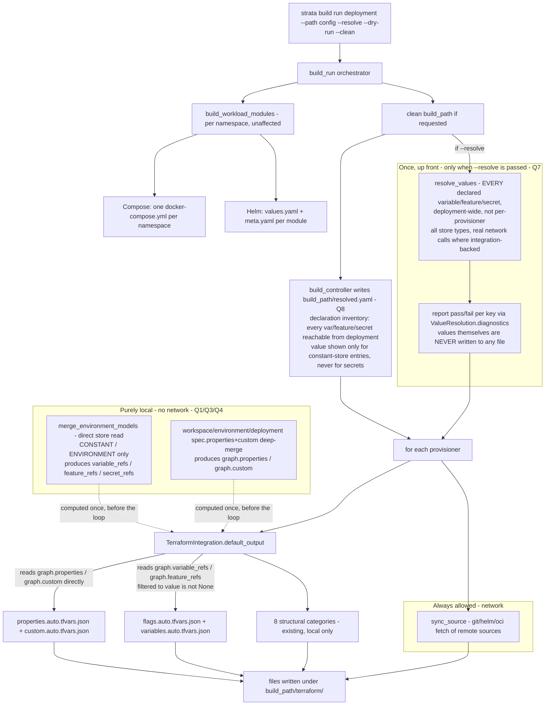
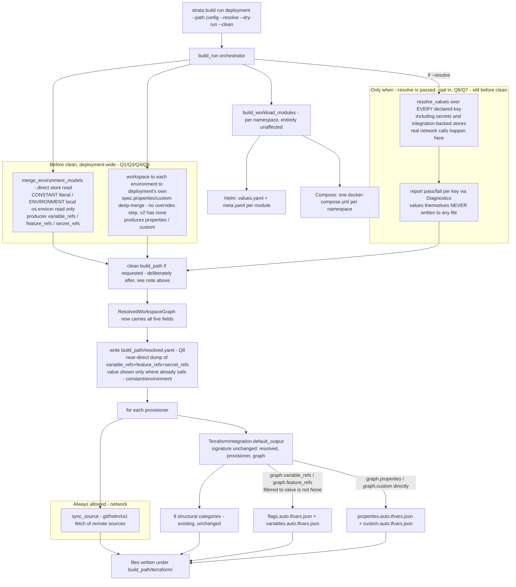

# Build-Time Value Categories (`features`/`variables`/`properties`/`custom`)

Status: implemented

## Overview

`TerraformIntegration.default_output()` is missing four of v1's real output
categories: `features`/`variables`/`properties`/`custom`. Found while
investigating the `OutputProfileModel`/`emits` revisit (see
[build-command.md](../work/build-command.md)'s `default_output()` table), which is
blocked on this: `emits` can't gate categories that don't exist yet.

**Important correction:** the gap is *not* "`resolved.values` is silently
discarded, so wire it in." `default_output()` does `del resolved` today
because `resolved: ValueResolution` is genuinely unused — and per the
Design Principle below, none of the four new categories consume it either.
`ValueResolution`'s only real consumer, ever, is `resolve_expr_tokens()`
(substituting `${var:}`/`${secret:}`/`${feature:}` tokens embedded inside
already-built categories like `dns`/`networks`) — which **does not exist
yet** (a separate, already-tracked item, out of scope here). See the
diagram below. Don't conflate "`resolved` is unused" with "these categories
are missing" — they're unrelated facts that happen to show up in the same
method.

This doc scopes the fix to Terraform's own missing categories only. It does
**not** design `OutputProfileModel`/`emits` itself — see
[output-profile-model.md](../work/output-profile-model.md) for that
separate, not-yet-started step.

### Where each input actually goes


```mermaid
flowchart TB
    CLI["strata build run deployment --path config --resolve --dry-run --clean"]
    CLI --> BR["build_run orchestrator"]
    BR --> CLEAN["clean build_path if requested"]

    subgraph RESOLVEFLAG["Once, up front - only when --resolve is passed - Q7"]
        RVALL["resolve_values - EVERY declared variable/feature/secret,<br/>deployment-wide, not per-provisioner<br/>all store types, real network calls where integration-backed"]
        DIAG["report pass/fail per key via ValueResolution.diagnostics<br/>values themselves are NEVER written to any file"]
    end

    CLEAN -->|"if --resolve"| RVALL --> DIAG
    CLEAN --> MANIFEST["build_controller writes build_path/resolved.yaml - Q8<br/>declaration inventory: every var/feature/secret reachable from deployment<br/>value shown only for constant-store entries, never for secrets"]
    DIAG --> LOOP["for each provisioner"]
    MANIFEST --> LOOP

    subgraph OK["Always allowed - network"]
        SYNC["sync_source - git/helm/oci fetch of remote sources"]
    end

    subgraph LOCAL["Purely local - no network - Q1/Q3/Q4"]
        MEM["merge_environment_models - direct store read<br/>CONSTANT / ENVIRONMENT only<br/>produces variable_refs / feature_refs / secret_refs"]
        SPECM["workspace/environment/deployment spec.properties+custom deep-merge<br/>produces graph.properties / graph.custom"]
    end

    LOOP --> SYNC
    LOOP --> DO["TerraformIntegration.default_output"]

    DO --> EXIST["8 structural categories - existing, local only"]
    DO -->|"reads graph.variable_refs / graph.feature_refs<br/>filtered to value is not None"| FEAT["flags.auto.tfvars.json + variables.auto.tfvars.json"]
    DO -->|"reads graph.properties / graph.custom directly"| PROP["properties.auto.tfvars.json + custom.auto.tfvars.json"]
    MEM -.->|"computed once, before the loop"| DO
    SPECM -.->|"computed once, before the loop"| DO

    SYNC --> WRITE["files written under build_path/terraform/"]
    EXIST --> WRITE
    FEAT --> WRITE
    PROP --> WRITE

    BR --> WORKLOAD["build_workload_modules - per namespace, unaffected"]
    WORKLOAD --> HELM["Helm: values.yaml + meta.yaml per module"]
    WORKLOAD --> COMPOSE["Compose: one docker-compose.yml per namespace"]
```

The point of the diagram: `--resolve`'s validation and the `resolved.yaml`
manifest both run **once, immediately after cleaning**, deployment-wide —
neither depends on which provisioner is being processed, so neither belongs
inside the per-provisioner loop. Only *after* that does `build_run()` iterate
provisioners, each doing its own `sync_source()` (the one legitimate
build-time network call besides `--resolve` itself) and `default_output()`
(now with the four new categories fed entirely by local model reads, never
by `resolved`/`ValueResolution`).

*(This diagram predates the `ValueReference`/`ResolvedWorkspaceGraph`
refinement below — it's kept because the point it makes, "`resolved` has
no arrow into the new work," still holds and explains *why* the design
went this way. For the complete, current, implementation-ready picture,
see "Final design (summary)" below.)*

## Final design (summary)

One coherent read, top to bottom, in execution order — the `## History`
section at the end of this doc has the background reasoning behind the
non-obvious choices below.

1. **`build_run()` starts.** If `--env-file` was passed (repeatable), each file is parsed and merged into the real `os.environ` via `setdefault` (Q9 — a real, already-exported env var always wins over a file's value).
2. **Before cleaning anything** — deployment-wide, not per-provisioner: a new `build_controller.py`-level step resolves the deployment's reachable environments and calls `merge_environment_models()` to get `(variables, secrets, features)` typed dicts (Q1/Q4). From these it builds, purely locally, no network:
   - `variable_refs`/`feature_refs`/`secret_refs: list[ValueReference]` — one entry per declared key. `CONSTANT` stores get their literal value (cast per `VariableValueType` where declared, Q2); `ENVIRONMENT` stores get a local `os.environ` read. Everything else (secrets always; any integration-backed store) gets `value=None` — structurally impossible to populate wrong (Q4/Q5).
   - `properties`/`custom: dict[str, Any]` — deep-merged `workspace.spec.{source}` → each reachable `environment.spec.{source}` → the deployment's own `spec.{source}` (Q3 — a deliberate improvement over v1's actual, docstring-contradicting behavior). **No `overrides.{source}` step** — confirmed while implementing Q3 that v2's `EnvironmentSpecModel` has no `overrides` field at all (deliberately never ported, 0/26 real environment documents used it in v1).
   - **`--resolve` (opt-in, Q6/Q7):** if passed, *additionally* calls `resolve_values()` over **every** declared key (including secrets and integration-backed stores, reusing the same three dicts above — no second reachability walk) — real network calls happen here, reported via `Diagnostics` (`.info()`/`.error()` per key), merged into `build_run()`'s own returned `Diagnostics`. **Resolved values are never written to any file, with or without the flag.** Without `--resolve`, `resolved: ValueResolution` is just an empty placeholder — no network call beyond `sync_source()` happens anywhere in the default path (Q6).

   **Deliberately before `clean`, not after** (implementation detail worth documenting explicitly — this diverged from an earlier draft of this section): if deriving these values or `--resolve`'s validation fails, `build_path` is never touched at all. Cleaning first and failing after would instead leave a wiped, empty build directory behind on the same error — a strictly worse failure mode for no benefit, since none of this step touches the filesystem.
3. **Then `build_path` is cleaned if requested**, and these five values populate new fields on `ResolvedWorkspaceGraph`, built once and handed unchanged to every provisioner (Q4). `build_controller.py` then writes `build_path/resolved.yaml` (Q8) — a plain, non-auto-loaded YAML manifest, essentially a direct serialization of `variable_refs + feature_refs + secret_refs` (+ `properties`/`custom`). Safe to dump wholesale: every field is either a declaration or a value already destined for build output anyway. An optional sixth key, `promotion` (docs/work/promotion.md Phase 4), is written only when the deployment's `spec.version` resolved to a `Version` document tagged with a ring — `{workspace, ring, order, wave?, version}`, read straight off `graph.version.spec.promotion` (no new resolution logic; `graph.version` is the same value already computed for the `remotes` pin overlay). Omitted entirely, not `null`, for the common untagged case.
4. **Then, per provisioner:** `sync_source()` (the one other legitimate build-time network call) followed by `integration.prepare()`. For Terraform, `default_output()`'s signature is **unchanged** (`resolved`, `provisioner`, `graph`) — it now additionally reads `graph.variable_refs`/`graph.feature_refs` (filtered to `value is not None`) to emit `flags.auto.tfvars.json`/`variables.auto.tfvars.json`, and `graph.properties`/`graph.custom` directly to emit `properties.auto.tfvars.json`/`custom.auto.tfvars.json` — alongside the 8 structural categories already built. Zero merge/reachability logic inside the integration itself.
5. **Helm/Compose are untouched** — both already discard `resolved` for the same reason Terraform used to (Phase 3 token substitution, deferred, out of scope here); neither has a category-file convention that these four new categories would map onto.


```mermaid
flowchart TB
    CLI["strata build run deployment --path config --resolve --dry-run --clean"]
    CLI --> BR["build_run orchestrator"]

    subgraph ONETIME["Before clean, deployment-wide - Q1/Q3/Q4/Q6"]
        MEM["merge_environment_models - direct store read<br/>CONSTANT literal / ENVIRONMENT local os.environ read only<br/>produces variable_refs / feature_refs / secret_refs"]
        SPECM["workspace to each environment to deployment's own<br/>spec.properties/custom deep-merge - no overrides step, v2 has none<br/>produces properties / custom"]
    end

    subgraph RESOLVEFLAG["Only when --resolve is passed - opt in, Q6/Q7 - still before clean"]
        RVALL["resolve_values over EVERY declared key<br/>including secrets and integration-backed stores<br/>real network calls happen here"]
        DIAG["report pass/fail per key via Diagnostics<br/>values themselves NEVER written to any file"]
    end

    BR --> MEM
    BR --> SPECM
    BR -->|"if --resolve"| RVALL --> DIAG
    MEM --> CLEAN["clean build_path if requested - deliberately after, see note above"]
    SPECM --> CLEAN
    DIAG --> CLEAN

    CLEAN --> GRAPH["ResolvedWorkspaceGraph now carries all five fields"]
    GRAPH --> MANIFEST["write build_path/resolved.yaml - Q8<br/>near-direct dump of variable_refs+feature_refs+secret_refs<br/>value shown only where already safe - constant/environment"]
    MANIFEST --> LOOP["for each provisioner"]

    subgraph OK["Always allowed - network"]
        SYNC["sync_source - git/helm/oci fetch of remote sources"]
    end

    LOOP --> SYNC
    LOOP --> DO["TerraformIntegration.default_output<br/>signature unchanged: resolved, provisioner, graph"]

    DO --> EXIST["8 structural categories - existing, unchanged"]
    DO -->|"graph.variable_refs / graph.feature_refs<br/>filtered to value is not None"| FEAT["flags.auto.tfvars.json + variables.auto.tfvars.json"]
    DO -->|"graph.properties / graph.custom directly"| PROP["properties.auto.tfvars.json + custom.auto.tfvars.json"]

    SYNC --> WRITE["files written under build_path/terraform/"]
    EXIST --> WRITE
    FEAT --> WRITE
    PROP --> WRITE

    BR --> WORKLOAD["build_workload_modules - per namespace, entirely unaffected"]
    WORKLOAD --> HELM["Helm: values.yaml + meta.yaml per module"]
    WORKLOAD --> COMPOSE["Compose: one docker-compose.yml per namespace"]
```

### Worked example: one shared resource, declared once per tenant

A concrete case for the `properties` deep-merge chain above (Q3) —
accumulating a *map* across every reachable Environment, not just letting a
later one win. Shared Azure Application Gateway WAF policy in front of
several tenants, each contributing its own IP allow-list, plus one
OMP-wide list that applies regardless of tenant:

```yaml
# workspace.yaml — the one shared recipe, never varies per tenant
apiVersion: strata.huybrechts.xyz/v2
kind: workspace
meta:
  name: waf-platform
spec:
  properties:
    omp_gateway:
      ip_addresses: ["20.50.10.5/32", "20.50.10.6/32"]
  # providers/provisioners/execution/resources omitted for brevity
```

```yaml
# customers/c0062/environment.yaml — declares only its OWN entry
apiVersion: strata.huybrechts.xyz/v2
kind: environment
meta:
  name: c0062-env
spec:
  properties:
    tenant_gateway:
      c0062:
        hostname: c0062.apps.example.com
        ip_addresses: ["203.0.113.10/32", "203.0.113.11/32"]
```

```yaml
# customers/c0091/environment.yaml — same shape, different key
apiVersion: strata.huybrechts.xyz/v2
kind: environment
meta:
  name: c0091-env
spec:
  properties:
    tenant_gateway:
      c0091:
        hostname: c0091.apps.example.com
        ip_addresses: ["198.51.100.20/32"]
```

```yaml
# deployments/waf-platform.yaml — a shared/platform deployment (no `tenant:`,
# per DeploymentSpecModel's own docstring), pulling in every tenant whose
# entry must be present in the merged map
apiVersion: strata.huybrechts.xyz/v2
kind: deployment
meta:
  name: waf-platform-deployment
spec:
  workspace: waf-platform
  environments:
    - c0062-env
    - c0091-env
```

`merge_workspace_environment_deployment_properties()` walks Workspace →
`c0062-env` → `c0091-env` → Deployment, deep-merging at each step. Since
every tenant contributes a *different key* under `tenant_gateway`, there is
nothing to overwrite — they accumulate:

```json
{
  "omp_gateway": { "ip_addresses": ["20.50.10.5/32", "20.50.10.6/32"] },
  "tenant_gateway": {
    "c0062": { "hostname": "c0062.apps.example.com", "ip_addresses": ["203.0.113.10/32", "203.0.113.11/32"] },
    "c0091": { "hostname": "c0091.apps.example.com", "ip_addresses": ["198.51.100.20/32"] }
  }
}
```

`properties` is a `FLAT_CATEGORIES` member, so each top-level key becomes
its own Terraform variable with no further strata-side work:
`TF_VAR_omp_gateway` and `TF_VAR_tenant_gateway` (the latter a map a
`dynamic` block can iterate directly, one WAF `custom_rule` per tenant).
Adding a third tenant is one new `environment.yaml` plus one line in the
deployment's `environments:` list — no Terraform change.

## Design Principle: shared inputs, per-integration translation
- change `build_run()`/`build_controller.py`'s orchestration to special-case
  Terraform,
- be confused with lifecycle scripts' own translation of the same source
  data into `STRATA_*` env vars — that's a sibling concern, tracked
  separately in [lifecycle.md](../work/lifecycle.md)'s open Context-contract
  question. Same underlying data, different consumer-owned rendering; do not
  design them together.

Any future provisioner integration (e.g. an Ansible `default_output()`
writing `extra-vars.yml`) gets the same `resolved`/`graph` inputs and does
its **own** translation — it does not depend on or reuse Terraform's tfvars
translation.

### Build vs. deploy: a hard network-call boundary, not just a style choice

The **only** network calls `build run` is allowed to make are `sync_source()`'s
own — fetching remote `git`/`helm`/`oci` sources so they exist locally to
build from (ADR-0022/`remotes.md`). That's fetching *inputs* (source code,
charts), not *resolving values* — a different thing that happens to also be
network I/O.

Resolving a **value** (variable/secret/feature) from an integration-backed
store (`vault`/`consul`/`azure-appconfig`/`flagsmith`/etc.) is a *second*
kind of network call, and it must never happen at build time — only
`CONSTANT` (literal) and `ENVIRONMENT` (local env var) stores belong there.
Per v1's own precedent, integration-backed value resolution is deploy's job:
the deployer resolves those and injects them right before the tool runs
(`TF_VAR_<KEY>` env vars, never a file), because `deploy run` doesn't exist
in v2 yet.

## Real v1 evidence (`terraform_builder.py`)

Four categories, each built by its own method, called from the builder that
assembles `default_output()`'s file set:

**`flags.auto.tfvars.json`** ← `_build_feature_flags_vars(deployment_service) -> Dict[str, bool]`
- Reads `deployment_service.get_environment_service().get_features()` directly — does **not** consume `ResolvedValues` at all.
- Only `FeatureStoreType.CONSTANT` and `.ENVIRONMENT` stores; **integration-backed stores (Flagsmith etc.) are skipped** — docstring: "the deployer writes those from `ResolvedValues` before `terraform init`" (a v1 **deploy-time** mechanism, not build-time).
- Truthiness coercion: bool passthrough; string checked against `("false","0","no","")` case-insensitive; else `bool(raw)`.

**`variables.auto.tfvars.json`** ← `_build_flat_variables(deployment_service) -> Dict[str, Any]`
- Same pattern: reads `get_variables()` directly, `CONSTANT`/`ENVIRONMENT` stores only.
- `_emit_variable_value(var)`: if `var.type` (a `VariableValueType`) is declared, value is emitted as its **native Python type** (bool/int/float/dict/list) — Pydantic already validated type/value consistency. Without `type`, value passes through as-is (string stays string; dict/list also pass through as JSON supports them).

**`properties.auto.tfvars.json`** / **`custom.auto.tfvars.json`** ← `_resolve_merged_properties(deployment_service, source="properties"|"custom") -> Dict[str, Any]`
- **Correction (2026-09-25): the docstring is misleading — checked all three real call sites (single-file mode, multi-source mode, and the main flat-dump emission), not just the function body.** The docstring claims `"workspace → environment → deployment"`, but the real merge chain is **`workspace.spec.{source}` → `environment.spec.{source}`(+`environment.spec.overrides.properties`, `properties` only)** — `deployment_service` is passed in only to fetch the workspace/environment sub-services; the deployment's own `spec.properties`/`spec.custom` is never read anywhere in this function or at any of its call sites. The "→ deployment" clause in the docstring does not correspond to real, working code.
- Uses the same `deep_merge()` utility as elsewhere in v1.

## v2 current state

- `ValueResolution.values` (`value_controller.py`) is a **flat `dict[str, str]`** — every reachable variable+feature key, secrets excluded, all values **stringified** regardless of origin (ADR-0022 D1a). No store-type/origin metadata survives into it.
- `build_time_keys()`/`resolve_values()` already do the reachability + secret-exclusion walk correctly (`_reachable_environments()` → `merge_environment_models()` → per-key resolve). `merge_environment_models()` returns `(variables, secrets, features)` as separate dicts **keyed by `VariableStoreModel`/`SecretStoreModel`/`FeatureStoreModel` objects** — i.e., the origin-preserving data v1's builders read directly is already sitting right there, one layer up from `ValueResolution`, just not threaded to `default_output()`.
- `properties`/`custom` fields exist today on `WorkspaceModel` (`workspace_model.py:177,179`), `EnvironmentSpecModel` (`environment_model.py:77,82` — docstring already documents the intended chain: *"Tenant properties merge in first, then this, then the deployment's own"*), and `DeploymentModel.spec` (`deployment_model.py:261,264`).
- **But only the deployment-level layer is actually merged today**, via `merge_deployment_specs()` (`deployment_service.py`) — a raw-dict deep-merge of tenant-defaults-as-partial-deployment → extends chain → deployment's own (ADR-0024). `merge_environment_models()` handles `variables`/`secrets`/`features` only; it has no `properties`/`custom` handling. **Workspace-level and environment-level `properties`/`custom` are currently dead fields — nothing reads them.**
- `TerraformIntegration.default_output(resolved, provisioner, graph)`: `graph: ResolvedWorkspaceGraph` carries `workspace` + 7 structural collections only — no deployment/environment model references. `InfraIntegration.prepare()` already accepts `**kwargs: Any` but does not forward them to `default_output()` — an unused, ready-made extension point.

### Concrete shape decided for `ResolvedWorkspaceGraph`'s new fields (Q4)

Not raw `DeploymentModel`/`list[EnvironmentModel]` — derived, minimal, and
safe to dump wholesale for debugging/audit (no secret or integration-backed
*value* ever reaches it, only declarations):

```python
@dataclass(frozen=True)
class ValueReference:
    """One declared variable/feature/secret — never a resolved
    integration-backed value."""
    key: str
    store: str                                  # "constant", "environment", "vault", ...
    description: str | None = None
    value_type: VariableValueType | None = None  # variables only
    value: Any = None                            # populated ONLY for constant/environment
                                                  # stores; always None for secrets and any
                                                  # integration-backed store
```

`ResolvedWorkspaceGraph` gains: `variable_refs: list[ValueReference]`,
`feature_refs: list[ValueReference]`, `secret_refs: list[ValueReference]`
(mirrors v1's own naming), plus `properties: dict[str, Any]` and
`custom: dict[str, Any]` (Q3's final merged dicts). All five are computed
**once**, in `build_controller.py`, before the per-provisioner loop —
`default_output()` does zero merge/reachability logic, it just reads
ready-made fields off `graph`. A sixth field, `version: VersionModel | None`
(docs/work/promotion.md Phase 4), carries the deployment's already-
pin-aware resolved `Version` document (the same value `apply_remote_version_pins()`
already consumes) — `write_resolved_manifest()`'s own `_dump_promotion()`
reads `graph.version.spec.promotion` directly from it, no separate lookup.

## Related Decisions

- [ADR-0021](../decisions/0021-integration-layer.md) D5/D6 — integration dispatch pattern (one `prepare()`, per-subclass `default_output()`).
- [ADR-0022](../decisions/0022-strata-build-run.md) D1a — `ValueResolution` contract (flat, stringified, secrets-excluded).
- [ADR-0023](../decisions/0023-build-output-rendering.md) D3/D5 — `default_output()` dispatch, `output.template` escape hatch (later phase).
- [ADR-0024](../decisions/) — tenant-defaults merge (`merge_deployment_specs()`), the only `properties`/`custom` merge that exists today.
- [build-command.md](../work/build-command.md) — tracks the original gap and the `OutputProfileModel` dependency.
- [provisioning-injection-model.md](../work/provisioning-injection-model.md) — Context lifetime, build-time vs. deploy-time split.
- [lifecycle.md](../work/lifecycle.md) — sibling, NOT the same design: same source data, translated to script env vars instead of tfvars JSON.
- [deployment-tier-resource-sizing.md](../work/deployment-tier-resource-sizing.md) — **deferred**: per-deployment SKU/deploy-tier selection. Q3's `properties`/`custom` chain is the only per-deployment merge v2 has, and it deliberately does *not* reach resource `configuration` — so it is not the answer to "how does this deployment get a bigger SKU?". That question is parked there, not here.
- [composite-variable-fragments.md](../how-to/composite-variable-fragments.md) — the how-to guide for the worked example above: composing one variable's value from several per-owner files via this same `properties` deep-merge chain, plus the rules that actually matter (merge order, lists replace rather than concatenate).


## History

- These four categories (`flags`/`variables`/`properties`/`custom`) deliberately bypass `ValueResolution` entirely, mirroring v1's own `_build_feature_flags_vars()`/`_build_flat_variables()` (which never consumed `ResolvedValues` either) - re-derived directly from `merge_environment_models()`'s typed dicts instead, which also gives native type fidelity (bool/int/float/dict/list) for free instead of `ValueResolution`'s flat/stringified contract.
- The `properties`/`custom` merge chain is `workspace.spec.{source}` -> each reachable `environment.spec.{source}` -> the deployment's own `spec.{source}` - a deliberate improvement over v1, whose docstring claims the deployment's own value wins last but whose real `_resolve_merged_properties()` never actually reads it. No `overrides.{source}` step exists: `EnvironmentSpecModel` has no `overrides` field at all (never ported - 0/26 real environment documents used it in v1).
- `ResolvedWorkspaceGraph` gains derived, minimal fields (`variable_refs`/`feature_refs`/`secret_refs: list[ValueReference]`, `properties`, `custom`) rather than raw `DeploymentModel`/`EnvironmentModel` references - keeps the bundle safe to dump wholesale for debugging/audit (a `ValueReference.value` is populated only for `constant`/`environment` stores; secrets structurally never carry one) and leaves `default_output()`'s signature unchanged.
- Integration-backed stores (Vault, AppConfig, Flagsmith, ...) are deliberately skipped by these categories at build time, matching v1 exactly - real secret/integration-backed resolution is deploy-time-only (tracked in [provisioning-injection-model.md](../work/provisioning-injection-model.md)), since `deploy run`'s injection mechanism is a separate concern from these build-time files.
- The old unconditional `build_time_keys()`/`resolve_values()` call (which attempted real network calls to integration-backed stores on every `build run`, with the result silently discarded) was removed as redundant once the local, no-network `merge_environment_models()` walk existed. Replaced by an opt-in `--resolve` flag: without it, `build run` only ever reads `constant`/`environment` stores (no network beyond `sync_source()`); with it, every declared key - including secrets and integration-backed stores - gets a real pass/fail validation via `Diagnostics`, but resolved values are never written to disk either way.
- The declaration inventory (`resolved.yaml`) is deliberately a plain, non-auto-loaded YAML file, not Terraform `*.auto.tfvars.json` like v1 - v1's shape forces every consuming repo to also declare matching `variable "required_variables" {}` blocks (or accept a `terraform plan` error), a coupling strata should not reintroduce.
- `--env-file PATH` (repeatable) was added for local-dev parity with CI (which already exports real `ENVIRONMENT`-store values via the pipeline) - merged into `os.environ` via `setdefault()` so an already-exported real value always wins over a file's value.
- `OutputProfileModel`/`emits`-based category gating is deliberately out of scope here - see [output-profile-model.md](../work/output-profile-model.md) for that separate, not-yet-started design.
- 2026-10-06: `resolved.yaml` gained a sixth, optional `promotion` key (docs/work/promotion.md Phase 4) - `{workspace, ring, order, wave?, version}`, written only when the deployment's `spec.version` resolved to a `Version` document tagged with a ring. Answers "did my deployment land where I meant it to" (deployment-scoped, human-intent) - a different question from `strata validate`'s own cross-document ring/order/wave consistency checks (docs/work/promotion.md Phase 2), which run independently of any one deployment. `ResolvedWorkspaceGraph` gained a `version: VersionModel | None` field to carry the already-pin-aware resolved document through to `write_resolved_manifest()`.
- 2026-10-08: Added a worked example (shared Azure Application Gateway WAF
  policy, one `omp_gateway` list on the Workspace plus one `tenant_gateway`
  map entry per tenant Environment) showing the `properties` deep-merge
  chain accumulating a map across reachable Environments, not just
  letting a later one win — came up directly while brainstorming that
  scenario and found this doc had no concrete, numbers-in example of the
  mechanism it otherwise only describes structurally.
