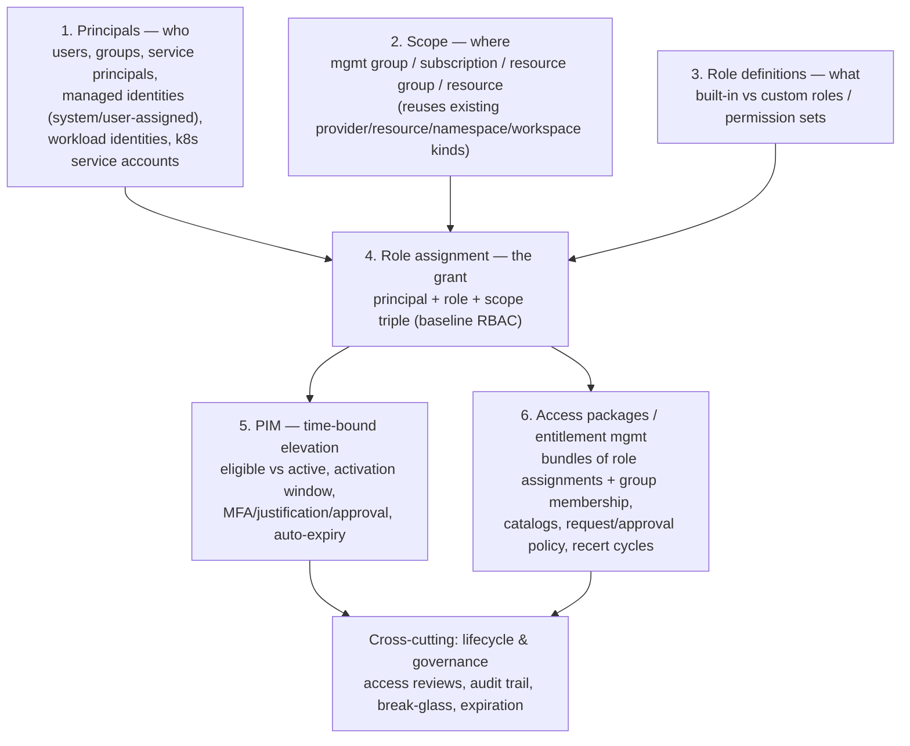

# Access Management — Work

- Status: draft (brainstorm only — no ADR, no implementation, no decided MVP scope)
- Last updated: 2026-10-06

## Overview

Explores whether strata should model access/identity infrastructure (RBAC
role assignments, managed identities/service principals, PIM, Entra
Entitlement Management access packages) as first-class kinds, the same way
it models `provider`/`resource`/`network`/`firewall` today.

**Motivating gap, not a feature request from a real consumer yet:** strata
currently has *zero* identity/access modeling. The only "identity" concept
anywhere in v2 is `integration.spec.authentication.method: managed_identity`
— a bare flag strata uses to authenticate *itself* to Key Vault/App Config,
with no backing object. The concrete gap this leaves: [docs/how-to/azure-certificates.md](../how-to/azure-certificates.md#L17-L59)
documents a user-assigned managed identity *and* an RBAC role assignment
(`Key Vault Secrets User`) that Terraform/Bicep genuinely creates for a real
customer workspace (`config/resources/networking.yaml`'s `app-gateway-waf`
→ `key-vault` relationship) — today that's hand-written Bicep referenced
only as a prose annotation on the `resource` document, entirely outside
strata's schema and validation.

No v1 precedent exists either (checked — v1 has no `identity`/`rbac`/
`access_package`/`pim` concept), and no real consumer (haven,
cfg-int-deployment) currently expresses access requirements in strata at
all. This is forward design, not a port — treat every shape below as
untested against a real customer's actual role/grant set until it is.

## Current Design (brainstormed shape — nothing here is decided)

### Conceptual layers



### Candidate kinds

| Kind (working name)       | Represents                                                                                                                                                                                                                                                                                      | Borrows convention from                                                                                                                                        |
| ------------------------- | ----------------------------------------------------------------------------------------------------------------------------------------------------------------------------------------------------------------------------------------------------------------------------------------------- | -------------------------------------------------------------------------------------------------------------------------------------------------------------- |
| `identity`                | A principal — human (user/group, externally sourced from SSO) or workload (service principal, managed identity, federated/workload identity, k8s service account). `provisioned: bool` decides whether strata creates it or just references it.                                                 | Same `properties` passthrough shape as `resource`                                                                                                              |
| `role` / `roledefinition` | Abstract permission vocabulary, optionally mapped per provider to a concrete native role/policy; raw provider-native strings are a valid, expected fallback.                                                                                                                                    | `providerconfig`/`topologyconfig` registry pattern (ADR-0013/0014)                                                                                             |
| `grant`                   | The triple: `principal` (ref → identity) + `role` (ref → role, or native passthrough) + `scope` (ref → provider/resource/namespace/workspace/**identity**, the last one making group membership just another grant). Carries `assignment.type: permanent \| eligible` (PIM) directly as fields. | Standalone kind, reference-based (ADR-0015) — a many-to-many relationship across independently-lifecycled documents, not an owned inline list like DNS records |
| `accesspackage`           | Entitlement-management bundle: a set of `grant`s requestable as one unit, with approval/expiration/recertification policy.                                                                                                                                                                      | References a list of grants, same as `workspace` references providers/resources                                                                                |

### Field sketches

```yaml
apiVersion: strata.huybrechts.xyz/v2
kind: identity
meta:
  name: appgw-identity
spec:
  type: managed_identity   # managed_identity | service_principal | workload_identity | user | group | k8s_service_account
  provisioned: true        # strata creates this vs. just references something that already exists
  provider: azure-main     # ref -> provider (only for provider-native identity types)
  managed:
    assignment: user_assigned   # user_assigned | system_assigned
  federation:              # only for workload_identity (OIDC federated credential)
    issuer: "https://token.actions.githubusercontent.com"
    subject: "repo:org/repo:ref:refs/heads/main"
    audience: "api://AzureADTokenExchange"
  external_reference:      # only when provisioned: false
    object_id: "<directory-object-id>"
    source: entra-id       # entra-id | okta | github | manual
  properties: {}           # provider-specific passthrough, same role as resource.spec.properties
```

```yaml
apiVersion: strata.huybrechts.xyz/v2
kind: grant
meta:
  name: appgw-keyvault-secrets-user
spec:
  principal: {kind: identity, name: appgw-identity}
  role: {kind: role, name: secrets-reader}    # OR a bare provider-native string
  scope: {kind: resource, name: key-vault}    # resource | provider | namespace | identity (a group)
  managed: true             # strata provisions this grant vs. inventory-only
  assignment:
    type: permanent          # permanent | eligible (eligible = PIM)
    activation:               # only meaningful when type: eligible
      max_duration: "PT8H"
      requires_approval: true
      requires_justification: true
      requires_mfa: true
      approvers: [{kind: identity, name: platform-admins}]
  governance:
    recertify_every: "P90D"
    reviewers: [{kind: identity, name: security-team}]
```

### Cross-provider role abstraction — two-tier compromise

Full abstraction is a trap: Azure RBAC roles, AWS IAM policies, GCP
bindings, and k8s verb/resource pairs don't map 1:1. Mirrors how `resource`
already avoids abstracting the actual cloud resource type (loosely-typed
`category`/`subcategory` + passthrough `properties`):

- **Tier A — `role` registry** (optional, for common cases like reader/
  contributor/secrets-reader): one abstract name mapped per provider,
  `providerconfig`-shaped.
- **Tier B — native passthrough** (the realistic default): `grant.role` is
  just a raw provider-native string. Most real roles are provider-specific
  enough that forcing an abstraction would be busywork, not safety.

### Provision vs. reference

Resolved per-document, not as a global mode:

- `identity.spec.provisioned` — human principals are almost always `false`
  (strata never creates a person's account); managed identities/service
  principals are usually `true`.
- `grant.managed` — lets a standing, externally-managed grant (e.g. a
  break-glass account's access) be *declared for inventory/audit* without
  strata trying to own its lifecycle.
- `role` registry entries are always reference data, never provisioned.

### Composes with existing kinds, not a parallel scope model

- `grant.scope` references an existing `provider`/`resource`/`namespace`/
  `workspace` by `(kind, name)` — no new scope hierarchy needed.
- `integration.spec.authentication` should reference a real `identity`
  document instead of a bare `use_managed_identity: true` flag, so "the
  identity strata authenticates as" and "the identity whose grants we
  track" become the same object.
- `tenant` is the natural home for org-wide identity defaults (break-glass
  accounts, default admin groups), reusing the existing tenant-defaults-merge
  mechanism (ADR-0024).
- `deployment`/`environment` give grants a natural per-stage dimension
  (prod-only elevated access), same shape as per-environment secrets/
  variables.
- Phase 2 reference validation (`grant.principal`/`.scope`, `accesspackage`
  members) falls out of the existing `references.py` walker for free, same
  as every other `Annotated[..., References(kind)]` field.

## How this would map onto Terraform / other provisioners

Checked against the real, current Terraform integration
(`strata/integrations/terraform_projection.py`/`terraform.py`) rather than
assumed — strata's Terraform integration **never generates HCL resource
blocks**. Every existing category (`providers`, `resources_by_category`,
`namespaces`, `firewalls`, `dns`, `networks`, ...) is flattened into a
plain dict and written as its own `*.auto.tfvars.json` file
(`planned_files()`); the *actual* `azurerm_storage_account`/
`azurerm_virtual_network`/etc. resource blocks live in the consuming
Terraform root module (a vendored/remote module, e.g.
`config/vendor/infra/terraform/main`), which declares `variable
"resources_by_category" {}` and loops with `for_each` to create the real
resources. `identity`/`grant` would follow exactly this same division of
responsibility:

- New projection functions `_build_identities_payload()` /
  `_build_grants_payload()`, same shape as `_build_providers_payload()` —
  name → flattened field dict, written to `identities.auto.tfvars.json` /
  `grants.auto.tfvars.json`.
- **Role resolution happens before the payload is written, not in
  Terraform.** A Tier-A abstract `role` name is resolved to its concrete
  per-provider value (`role_definition_id`, IAM policy ARN, ...) at
  projection time — the `.tfvars.json` a Terraform module receives always
  carries a concrete, provider-native value, the same way `providerconfig`/
  `topologyconfig` registries are already used purely for validation and
  never shipped as-is into a build artifact.
- `grant.scope`/`grant.principal` resolve to whatever addressable
  identifier the consuming module's own variables expect (likely each
  category's own `name`, with the Terraform module doing lookups the same
  way it already resolves `workspace_resource.subnet` references) — strata
  still never constructs a cloud-native resource ID itself.
- **PIM is a real, if different, Terraform resource type** — the
  `azurerm` provider has `azurerm_pim_eligible_role_assignment` distinct
  from a plain `azurerm_role_assignment`. The projection would need to
  route `assignment.type: eligible` vs `permanent` grants into separate
  payload groups (or a `type` field the consuming module switches on) so
  the right resource type gets created — not a blocker, just a required
  extra grouping step, same pattern as `resources_by_category` already
  groups by `resource_type`.
- **Access packages have real Terraform support too** — the `azuread`
  provider has `azuread_access_package`/
  `azuread_access_package_resource_package_association` — plausible to
  project the same way, but this is the least-validated path (no evidence
  any real consumer needs it).
- **Helm/k8s RBAC is a different mechanism, not Terraform at all.** The
  Helm integration (`prepare_namespace()`) never writes raw k8s manifests
  either — it writes a per-module `values.yaml` that the chart's *own*
  templates render. A `k8s_service_account`-typed `identity` / namespace-
  scoped `grant` would flow through that same values.yaml projection
  (`serviceAccount.create`, `serviceAccount.annotations` for Azure
  workload-identity federation, `rbac.rules`) — strata still never
  authors `ServiceAccount`/`Role`/`RoleBinding` YAML directly, consistent
  with every other namespace/module value today.
- **Compose has no RBAC equivalent at all.** This whole feature is a
  structural no-op for the Compose provisioner — worth stating as an
  explicit scope boundary (not a gap), the same way DNS/network categories
  already don't apply to a bare Compose service group.

## Related Decisions

- None yet. Prior art this design borrows conventions from:
  [ADR-0003](../decisions/0003-provider-model-design-decisions.md) (provider's
  `properties` passthrough shape), [ADR-0013](../decisions/0013-configuration-topology-registry.md)/
  [ADR-0014](../decisions/0014-provider-topology-config-standalone-kinds.md)
  (registry-kind pattern for `role`), [ADR-0015](../decisions/0015-solution-manifest-and-document-discovery.md)
  (identity-based `(kind, name)` references), [ADR-0021](../decisions/0021-integration-layer.md)
  (how `InfraIntegration`s consume a `ResolvedWorkspaceGraph`, same shape
  a `grant`/`identity` payload would need to fit).

## Remaining Work / Open Questions

- No MVP scope decided yet — this doc deliberately covers the full
  conceptual surface (human + workload identities, PIM, access packages)
  before any scoping-down discussion.
- Cross-provider role abstraction (Tier A/B) only pressure-tested against
  one real example (Key Vault Secrets User) — needs checking against a
  wider real role set before trusting the split holds.
- Whether `identity`/`grant`/`role`/`accesspackage` become standalone
  kinds or get folded into existing kinds as extra fields isn't decided —
  pending if/when this becomes a real ADR.
- AWS/GCP Terraform-provider equivalents for PIM/entitlement-management
  resources not researched (Azure's `azurerm`/`azuread` support confirmed
  only by name, not by reading real provider docs yet).
- Whether this is worth building at all — zero real consumer has asked
  for it yet; the only evidence of need is the azure-certificates.md gap.

## Changelog

- 2026-10-06: Initial brainstorm — conceptual layers, candidate kinds
  (`identity`/`role`/`grant`/`accesspackage`), field sketches, two-tier
  role abstraction, provision-vs-reference semantics, and how each would
  map onto Terraform/Helm/Compose provisioners.
